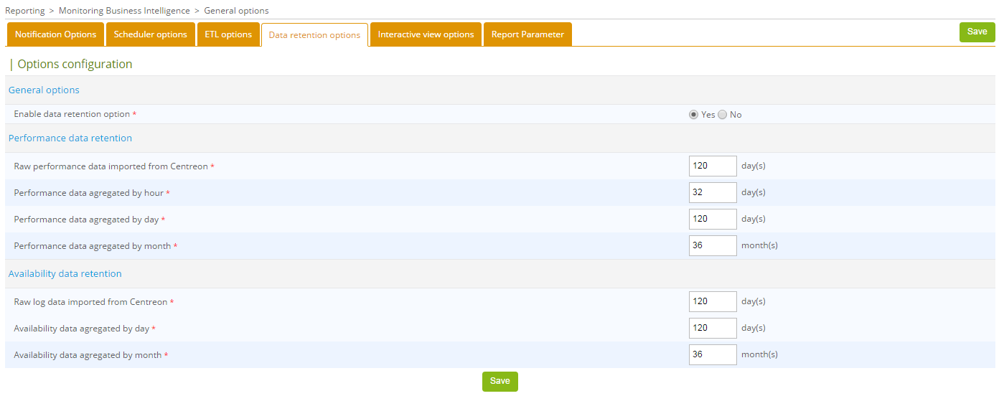

> Centreon MBI is a Centreon **extension** that requires a valid license key. To
> purchase one and retrieve the necessary repositories, contact
> [Centreon](mailto:sales@centreon.com).


Four major steps to installing Centreon MBI:

-   Check the system prerequisites.
-   Install the Centreon MBI interface in the Centreon application (Centreon MBI Server).
-   Install the reporting server (Centreon MBI Reporting Server).
-   Configure Extract, Transform, Load (ETL) in the Centreon MBI.

## Architecture

This chapter describes the Centreon MBI architecture and provides an
overview of how the extension is integrated into Centreon monitoring
software.

The information is addressed to administrators who will be installing or
configuring Centreon MBI.

### Dedicated reporting server

This architecture and prerequisites apply to:

-   Test environnements
-   Pre-production environments
-   Production environments.

The diagram below shows the main components of Centreon MBI:


*The monitoring database can be installed on a server other than the Centreon server.*

-   **ETL**: Process that extracts, transforms and loads data into the
    reporting database.
-   **CBIS**: Scheduler that manages job execution and publication.
-   **Reporting database**: MariaDB database that contains reporting data
    and some raw data extracted from the monitoring database.

### Network flow table

The table below presents the different types of flow, by default,
between the dedicated BI server, Centreon server and databases:

  **Application**  |  **Source**      |       Destination     |   Port |  Protocol
  -----------------|------------------|-----------------------|--------|----------
  ETL/CBIS         | Reporting server |  Centreon Database    | 3306   | TCP
  SSH              | Reporting server |  Centreon             | 22     | TCP
  CBIS             | Centreon         |  Reporting server     | 1234   | TCP
  CBIS             | Reporting server |  Centreon             | 80     |    HTTP\*
  Widgets          | Centreon         |  Reporting server     | 3306   | TCP


\**Only required for Host-Graph-v2 and Hostgroup-Graph-v2 reports that use Centreon API to generate graphs*

### Packages information

Centreon MBI installation requires two RPM packages:

-   Centreon-bi-server: Installs the Centreon MBI interface integrated
    into the Centreon front end and must reside on the Centreon Web
    Server.
-   Centreon-bi-reporting-server: Contains all the components needed to
    run the reporting server -- report scheduler, ETL, standards reports
    -- and must reside on a dedicated server for reporting processes.

You should install the MariaDB database at the same time. We highly
recommand installing the database on the same server for performance &
isolation considerations.

## Prerequisites

### Centreon central server

**Software**

-   Centreon 20.04
-   Check that the parameter `date.timezone` is correctly configured in
    `/etc/opt/rh/rh-php72/php.ini` (same timezone displayed with the
    command `timedatectl status`)

-   Avoid the usage of the following variables in your monitoring MariaDB
    configuration. They halt long queries execution and can stop the ETL
    or the report generation jobs:

    -   wait_timeout
    -   interactive_timeout

**Users and groups**

  User              |         Group
  ------------------|-------------------------------
  centreonBI (new)  | apache, centreon, centreonBI
  apache (existing) | centreonBI

**Description of users, umask and home directory**

  User       | umask  | home
  -----------|--------|------------------
  centreonBI |  0002  | /home/centreonBI


### Reporting dedicated server

**Hardware**

Monitored services       |    CPU                 |         RAM
-------------------------|------------------------|------------------
  < 4 000                | 2 CPU ( 3Ghz ) minimum | 12GB minimum
  < 20 000               | 4 CPU (3GHz) minimum   | 16GB minimum
 >= 20 000 and < 40 000  | 4 CPU (3GHz) minimum   | 24GB minimum
 > 40 000 and < 100 000  | 8 CPU (3GHz) minimum   | 32GB minimum
 > 100 000               | > Contact Centreon     | 

**Storage space**: Use the following [storage estimation file](../assets/reporting/installation/Centreon-MBI-QuickGuide-Storage-Sizing_EN.xlsx)

**File system**

 File system                  |   Size
------------------------------|----------------------------------------------------------------------------------
 /                            | 5GB minimum
 /var (containing MySQl data) | Use the result of the above disk-space simulation file MariaDB data)
 MariaDB temp folder          | We recommand keeping it in /var
 Volume group\*               | 5GB minimum of free space on the **Volume group** hosting the MySQL/MariaDB DBMS **data**

To check the free space use the command below, replacing vg\_data by the
Volume group name:

  vgdisplay vg_data | grep -i free

**Software**

-  OS : CentOS 7 / Redhat 7
-  SGBD :  MariaDB 10.3
-  Firewall :   Désactivé
-  SELinux :   Désactivé

We advise to tune your MariaDB database server on your reporting server in
order to have better performance. You will need at least 12GB on your
reporting server to run the configuration file provided below. Add the
[following file](../assets/reporting/installation/centreon.cnf) on your
reporting server in /etc/my.cnf.d/.

Make sure to have a *tmp* folder in */var/lib/mysql*.

> Do not set these MariaDB optimizations on your monitoring server.

Users and groups :

| User       | Group      |
|------------|------------|
| centreonBI | centreonBI |

Description of users, umask and home directory:

| User       | umask      | home              |
|------------|------------|-------------------|
| centreonBI | 0002       |  /home/centreonBI |

## Install the extension on Centreon

The tasks explained in this chapter must be performed on the Centreon
central server.

Contact the CENTREON service desk to access and install the Centreon MBI
repository on the Centreon central server.

Run the following command: :

    yum install centreon-bi-server

### Activate the extension

The menu *Administration > Extension > Manager* of Centreon enables you to
install the different extension detected by Centreon. Click on the "Centreon MBI" card to install it.

Upload the license sent by the Centreon team to be able to start configuring the General Options.

### Configure the general options

Set the following parameters in the General Options menu *Reporting \>
Monitoring Business Intelligence \> General Options* :


  Tab     |     Option |                   Value
  ------------|-------------------------|--------------------------------
  Scheduler  Options | CBIS Host |                Reporting server IP Address
  ETL Options  | Reporting engine uses a dedicated MariaDB server |  Yes
  Reporting Widgets \* |  Reporting MariaDB database | Reporting database IP Address (default = same as CBIS Host)


\* *The connection test will not yet work at this stage of the
installation process.*

### Centreon central databases access


#### Case #1: MariaDB monitoring database is hosted on the Central monitoring server

Launch the command below to authorize the reporting server to connect to
the monitoring server databases. Use the following option:

**\@ROOTPWD@**: Root MariaDB password of the monitoring databases
server.If there is no password for \"root\" user, don\'t specify the
option **root-password**.

    /usr/share/centreon/www/modules/centreon-bi-server/tools/centreonMysqlRights.pl --root-password=@ROOTPWD@

#### Case #2: MariaDB monitoring database is hosted on a dedicated server

Connect by SSH to the database server, and the run the following
commands: :

    mysql -u root -p
    mysql> CREATE USER 'centreonbi'@'$BI_ENGINE_IP$' IDENTIFIED BY 'centreonbi';
    mysql> GRANT ALL PRIVILEGES ON centreon.* TO 'centreonbi'@'$BI_ENGINE_IP$';
    mysql> GRANT ALL PRIVILEGES ON centreon_storage.* TO 'centreonbi'@'$BI_ENGINE_IP$';

**$BI_ENGINE_IP$**: IP address of the reporting server.

> If you\'re using MariaDB replication for your **monitoring databases**,
> certain views are created during installation of Centreon MBI. You need
> to exclude them from replication by adding the following line in the
> my.cnf file of the slave server.
>
>       replicate-wild-ignore-table=centreon.mod_bi_%v01,centreon.mod_bi_%V01
>
> Then, create the views manually on the slave server by launching the
> following command line:
>
> #mysql centreon < [view_creation.sql](../assets/reporting/installation/view_creation.sql)


Please go to the next chapter to continue the installation.

## Install the dedicated reporting server

### Install the packages

You need the following information available before proceeding with the
installation process:

-   IP/DNS of the monitoring database
-   IP/DNS of the Centreon web interface
-   IP/DNS of the reporting database (localhost highly recommanded)
-   Access (user/password) to the reporting database
-   Knowledge of the SSH password (after defining it) for the Centreon
    BI user on the central monitoring server (to publish reports on the
    interface).

To start installing the reporting server, install the corresponding repository
(sent by Centreon Service Desk) and execute the following command:

    yum install centreon-bi-reporting-server MariaDB-server MariaDB-client

If you installed your reporting server using a fresh CentOS image you
need to add the following GPG key: :

    cd /etc/pki/rpm-gpg/
    wget http://yum.centreon.com/standard/20.04/el7/stable/RPM-GPG-KEY-CES

### Reporting server configuration

#### MariaDB optimization

Make sure you have installed the MariaDB configuration file provided in
the pre-requisites before starting the MariaDB service [following file](../assets/reporting/installation/centreon.cnf)

    systemctl restart mysql

For installation, it is necessary to modify **LimitNOFILE** limitation.
Setting this option in /etc/my.cnf will NOT work.

    mkdir -p  /etc/systemd/system/mariadb.service.d/
    echo -ne "[Service]\nLimitNOFILE=32000\n" | tee /etc/systemd/system/mariadb.service.d/limits.conf
    systemctl daemon-reload
    systemctl restart mysql

Then start the service MariaDB. If this service cannot start, remove the
ib_log files before restarting MariaDB (be sure MariaDB is stopped):

    rm -f /var/lib/mysql/ib_logfile*
    systemctl restart mysql

If you are using a custom MariaDB socket file, modify the `/etc/my.cnf` file
and in the [client] section, add the following variable:

    socket=$PATH_TO_SOCKET$

### Start configuring

First check that the reporting MariaDB is running. Then launch the
following command, answering the questions:

    /usr/share/centreon-bi/config/install.sh

The script handles the SSH exchange key between the monitoring and
reporting servers and configures the default SFTP publication rule in
order to publish reports on the Centreon web interface. Finally, it
activates the backup and starts the CBIS service.

Once installation is complete, go to the next chapter to configure the
ETL.

### ETL: Configuration

Centreon MBI integrates its own extract, transform, load (ETL)
capabilities to:

-   Synchronize raw monitoring data with the reporting server.
-   Calculate availability and performance statistics on the reporting
    server.
-   Manage data retention on the reporting server.

Before following the next steps, you should have read
[the best practice parts](installation.html#best-practices-for-monitoring) to ensure that the Centreon objects (e.g., groups and
categories) are configured according to Centreon MBI requirements.

In the *Reporting > Business Intelligence > General Options > ETL options* menu
of the Centreon server, specify the following options:


| **Options**                                                                               |   **Values**
|-------------------------------------------------------------------------------------------|----------------------------------------
| **General options**                                                                       |                                        |
  Reporting engine uses a dedicated dedicated MariaDB server                                | Yes. You **must** use a reporting server
  Compatibility mode to use report templates from version of Centreon MBI prior to 1.5.0    | No (deprecated)
  Temporary file storage directory on reporting server                                      | 	Folder where dumps will be stored on the reporting server
  Type of statistics to build	                                                            | <ul><li>Select “Availability only” if you only use availability reports.</li><li>Select “Performance and capacity only” if you only want to use capacity and performance reports.</li><li>Select “All” to calculate the statistics for both types of reports.</li></ul> |
  Use large memory tweaks (store MariaDB temporary tables in memory)	                      | Activated only if your MariaDB configuration and allocated physical memory on the server permit.
| **Reporting perimeter selection**                                                         |                                         |
  Hostgroups                                                                                | Select only host groups for which you want to aggregate data.
  Hostcategories	                                                                        | Select only host categories for which you want to aggregate data.
  Service categories	                                                                    | Select only service categories for which you want to aggregate data.
|**Availability statistic calculation**                                                     |                                         |
 Live services for availability statistics calculation                                      |   Select required time periods.
| **Performance and capacity statistic calculation**	                                    |                                         |
 Granularity required for performance data statistics                                       | Select level of granularity required to run the desired performance reports (1).
 Live services for performance data statistics calculation		                            | Select required time periods.
| **Capacity statistic aggregated by month**                                                |                                         |
  Live services for capacity statistics calculation	                                        | Select the “24x7” time period.
  Service categories related to capacity data monitoring	                                | Select the service categories that have been associated with capacity-type services.
  Exclude metrics from service categories that do not return capacity USAGE information	    | Concerns the metrics linked to services which return capacity data. Select the metrics that do not return capacity usage information. but a maximum or total value. (e.g., the metric “size”).
| **Centile parameters**                                                                    |                                         |
 Calculating centile aggregation by	                                                        | Select the desired aggregation level. The standard percentile report provided with BI 2.1 uses Month data.
 Select service categories to aggregate centile on	                                        | Filter on relevant service categories for centile statistics (e.g., Traffic).
 First day of the week	                                                                    | Select the first day of the week for Week aggregation.
 Centile / Timeperiod combination	                                                        | Create a new centile/timeperiod combination on which to perform the calculation.

**(1)** Reports requiring a precise value per hour of performance data
are listed below. If you do not use the following reports, disable the
statistics calculation per hour:

-   Hostgroup-Host-details-1
-   Host-detail-v2
-   Hostgroup-traffic-Average-Usage-By-Interface
-   Hostgroup-traffic-by-Interface-And-Bandwith-Ranges.

### ETL: Data retention

The reporting server contains statistics tables specific to Centreon MBI
in the database "centreon_storage". The storage space used by these
tables increases every day. It is possible to control the size of these
tables by setting data retention rules.

Under *Reporting > Monitoring Business Intelligence > General options > Data retention*,
data retention can be managed by:

-   Type of data (availability, performance).
-   Precision of data (raw data, hourly, daily or monthly values).


> Before enabling the data retention options, check that the **Reporting
> engine uses a dedicated MariaDB server** option is correctly set to
> "Yes" in the *Reporting > Business Intelligence > General options ETL options* menu.

Enable data retention management by selecting \"Yes\", then set the
options in the configuration (example below).



To activate automatic purge of old data, edit the cron file
`/etc/cron.d/centreon-bi-purge` on the reporting server, then uncomment the following line:

    #0 20 * * * root @CENTREON_BI_HOME@/*etl*/dataRetentionManager.pl >> @CENTREON_BI_LOG@/dataRetentionManager.log 2>&1

Avoid periods scheduled for statistical calculations with Centreon MBI
ETL and report generations.

You can run this cron daily or weekly, depending on the execution time of the batch and the load generated on the server.

Then restart the service cron:

    systemctl restart crond

**BEST PRACTICE**: Select different retention periods according to the
granularity of the statistical data:

-   Hourly aggregated values are used to analyze a metric over a short period, they take a
    lot of space on the disk. You may not need to keep these statistics more that two or three months.
-   Beyond five or six months, you may only need to view the trend for
    availability or performance statistics. You could then keep the
    daily aggregated data for a maximum of six months, for example, and
    configure the retention of monthly aggregated data for a period of
    several dozen months.

Please go to the next chapter to continue the installation.


### ETL: Execution


> Before continuing, be sure that you have installed the MariaDB
> configuration file as specified above in the prerequisites. Configure
> and activate data retention so that only the required data is imported
> and calculated.

#### Rebuilding statistics using historical data

Run the following command on the *REPORTING* server, it will:

-   Delete all existing data from the reporting server.
-   Import raw monitoring data from the monitoring server to the
    reporting server (based on retention parameters).
-   Populate the tables containing the availability statistics for hosts
    and services.
-   Populate the tables containing the performance and capacity
    statistics.

        /usr/share/centreon-bi/bin/centreonBIETL -r

#### Activating daily execution (of the script)

Once the rebuild process is finished, you can activate the daily
statistic calculation. On the reporting server, edit the file
*/etc/cron.d/centreon-bi-engine* and uncomment the following line:

    #30 4 * * * root /usr/share/centreon-bi/bin/centreonBIETL -d >> /var/log/centreon-bi/centreonBIETL.log 2>&1

Restart the service cron::

    systemctl restart crond

> Make sure that the batch *centreonBIETL* starts only once the batch
> *eventReportBuilder* has finished on the monitoring server (see the cron
> file \* /etc/cron.d/centreon\* on the monitoring server).

Centreon MBI installation is now complete, check [the tutorial](../getting-started/analyze-resources-availability.html)

#### Register the server

To register your Centreon MBI server to the Centreon Central server, execute the following command:

``` shell
/opt/rh/rh-php72/root/bin/php /usr/share/centreon/bin/registerServerTopology.php -u <API_ACCOUNT> \
-t mbi -h <IP_CENTREON_CENTRAL> -n <REMOTE_SERVER_NAME>
```

Example:

``` shell
/opt/rh/rh-php72/root/bin/php /usr/share/centreon/bin/registerServerTopology.php -u admin -t mbi -h 192.168.0.1 -n centreon-mbi-server
```

> Replace **<IP_CENTREON_CENTRAL>** by the IP of the Centreon server seen by the poller or by the Remote Server if you
> want to link your server to it..

> The **<API_ACCOUNT>** must have access to configuration API. you can use default **admin** account.

> If you need to change the HTTP method or the port, you can use the following format for the **-h** option:
> HTTPS://<IP_CENTREON_CENTRAL>:PORT

Then follow instructions by
1. Entering your password:

``` shell
192.168.0.1: please enter your password
```

2. Define if you use a proxy to connect to Centreon central or the Remote Server:

``` shell
Are you using a proxy ? (y/n)n
```

If you use a proxy, please define credentials:

``` shell
Are you using a proxy ? (y/n)y

proxy host: myproxy.example.com

proxy port: 3128

proxy username (press enter if no username/password are required): myuser

please enter the proxy password:
```

3. Then validate the information:

``` shell
Summary of the informations that will be send:

Api Connection:
username: admin
password: ******
target server: 192.168.0.1

Pending Registration Server:
name: centreon-mbi-server
type: mbi
address: 192.168.0.2
parent server address: 192.168.0.1

Do you want to register this server with those informations ? (y/n)y
```

You will receive the validation of the Centreon central or the Remote Server server:

``` shell
message: The 'centreon-mbi-server' Platform: 'centreon-mbi-server@192.168.0.2.2' linked to '192.168.0.1' has been added
```