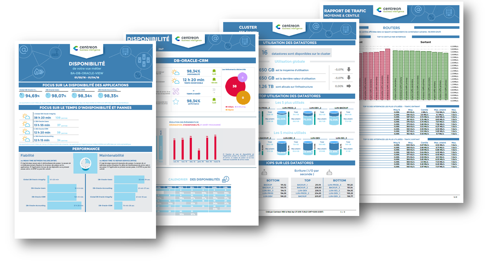
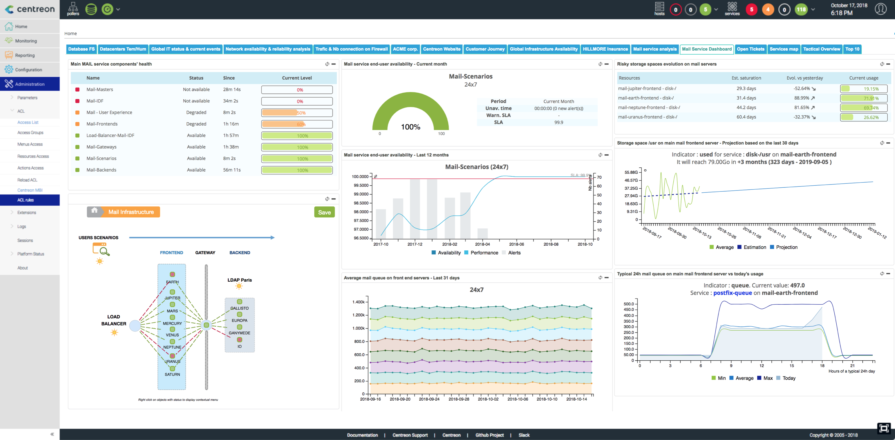

## Complete reporting with Centreon MBI

The reporting capabilities in Centreon relies on the **Centreon Monitoring Business Intelligence (MBI)** extension.
You also have simple reporting capabilities described below.

> Centreon MBI is a Centreon **extension** that requires a valid license key. To
> purchase one and retrieve the necessary repositories, contact
> [Centreon](sales@centreon.com).

Centreon Monitoring Business Intelligence (MBI) is a software tool
designed to help business users make critical decisions and to
facilitate management of an IT environment. Centreon MBI analyzes data
from monitored events, performance counters and capacity accessed from
the Centreon Enterprise Monitoring Solution (EMS), providing you with
full visibility of your infrastructures and application activities
through *ITIL compliant* reporting. 

Generate insightful statistics using our 30+ reports designs\...

Centreon MBI provides a full package of standard reports that address:

-   Capacity planning and management
-   Availability management
-   SLA (Service Level Agreement) management
-   Performance management.

**Here are some examples of reports available in Centreon MBI** : [Reports examples](../assets/reporting/Centreon-MBI-Samples-of-Reports.pdf)

or simply create your own reporting Dashboard using our widgets.

Main features:

-   Scheduling and generation of standalone reports in PDF, Excel, Word
    and Powerpoint formats
-   Visualization of web & interactive statistics using reporting
    widgets that are Centreon-compatible
-   Publication of reports by e-mail and other standard protocols (FTP,
    CIFS, etc.)
-   Access control to reports
-   Administration and user interface integrated into Centreon
-   Report development libraries

## Simple reporting

The availability reports of monitoring objects from Centreon Web interface allows 
to display the availability rate about hosts, hostgroup or servicegroup on a selected period.

To access to availability reports:

- Go into the menu: **Reporting > Dashboard**
- In the left menu, click on **Host**
- Select defined host in **Host** list

- The **Reporting Period** allows to select a predefined period or to define it manually using **From** to **to** fields.
- The **Host state** table displays the availability rates of object.
- The **State Breakdowns For Host Services** table displays the availability of linked objects.
- The timeline allows you to see intuitively the status of the object in short time.

Moreover, clicking on a day in the timeline, you get the report of the day:

It is also possible to view web reports:

* The groups of hosts: Click on **Host Groups** in the left menu
* The groups of services: Click on **Service Groups** in the left menu

The CSV icones makes it possible to export data into CSV file.

> It is also possible to access to availability of a service by clicking on the service name in the host or servicegroup report.