Compatibility: BIRT 4.4.2

This quick start guide presents the best practices for developing
reports using Business Intelligence and Reporting Tools (BIRT). It is
intended for developers who wish to create reports using BIRT and
Centreon MBI. Knowledge of the SQL language is a prerequisite.

This documentation does not describe how to reuse Centreon MBI
development libraries.

This guide introduces:

-   The main concepts of BIRT.
-   The different steps in creating a BIRT report project.

BIRT is a report design tool. It allows you to:

-   Use multiple data sources.
-   Extract relevant data for your report from these sources.
-   Format (graphically design) the report.

BIRT enables you to visualize your business data as statistics in the
form of tables or graphs. Although BIRT allows you to manipulate
different data sources within the same report, we advise against it when
performing heavy calculations or aggregations. Extract Transform Load
(ETL) software is more suitable for the purpose.

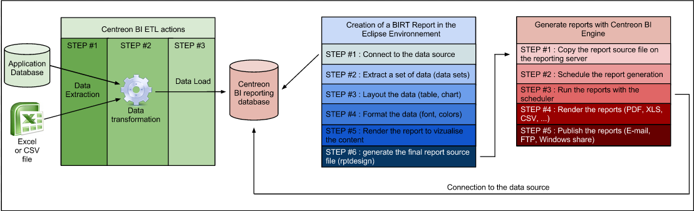

This guide will only describe basic BIRT concepts and methods for
designing reports (blue box in the above diagram).

## BIRT Concepts

### Data sources

When designing a report, you may require several data sources from a
number of storage systems accessible through different protocols:

-   Delimited flat files (CSV).
-   JDBC data sources (MariaDB, etc.).
-   XML files.
-   Web services.

BIRT also allows you to script your own data sources accessed by Java or
Javascript objects.

We highly recommend collecting and consolidating report data into a
single type of data source, and storing it as such (e.g., a MariaDB data).
Multiplying your data sources in a report might have an impact on
performance and maintenance. You are advised not to use more than of two
types of data sources in the same report project (e.g., JDBC and CSV).

Configuration of a data source:


### Data sets

You may want to extract a data sample from an application database or a
large CSV file. The BIRT "data set" allows you to write queries or
select specific data from simple or complex data sources.

The different data sets defined in a report will contain all the
available data to build the visuals in the report (e.g., tables and
charts).

{width="18.401cm"
height="5.117cm"}

### Data binding

Once the data set is created, the selected data must be formatted in the
report. To populate a graph or a table with data, you will need to
perform a "data binding" operation between a data set and a graphic
component, such as a table or chart.

Data binding will copy the structure of the data set into the
configuration of the graphical component. The complete structure
(columns) of a data set does not need to be copied to the layout, only
the required columns.

Data binding is performed when you create a table or chart:


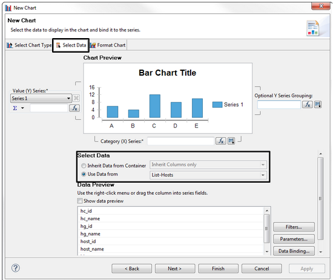

If you modify the structure of the data set, you will need to manually
edit the graphical component and apply this change (e.g., when
extracting a new column from the data set to be used in a previously
created chart):


### Report parameters

Report parameters are global variables that are specific to each report.
Declared before generating the report, they are used instead of static
values to create dynamic content. For example, a report can be generated
for:

-   A specific time period defined using two parameters (types "Date"
    and "Time") identifying the period start and end dates.
-   A specific host group specified by a report parameter.

Therefore, using report parameters will allow you to use the same report
design to display different statistics depending on the parameters
(e.g., the same Centreon Availability report used for different host
groups and different reporting periods).

### Report layout


#### Grid

The grid component is mainly used to organize graphical components on
the report.

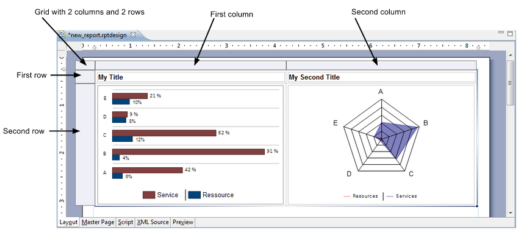

Best practice: Insert each report component (e.g., chart, table, label,
text) into a grid cell.

#### Table

The table is used to display dynamic content in a row-and-column format.
The values of a table vary according to the data set used for the data
binding.

##### Table structure

> 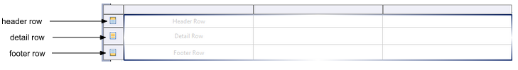

-   **Header:** Displays the column title or dynamic summary information
    calculated according to the listed values in the detail rows. The
    header row can be repeated at the beginning of each section if the
    table is displayed for several pages.
-   **Detail row:** A new detail row will be created to display each row
    of the data set (to which the table is bound).
-   **Footer:** Summary information, such as total or average values
    from the detail rows, can be displayed once in the last line of the
    table.

##### Grouping & aggregating data

A data set can return a large number of rows. You can sort and organize
these rows using the table's grouping function. Each group will add two
rows to the table:

-   **Group header:** Initializes and identifies each entry. Allows
    statistics to be calculated using this data group.

-   **Group footer:** Delimits the end of each entry. Also allows the
    data group to be used for calculations.

    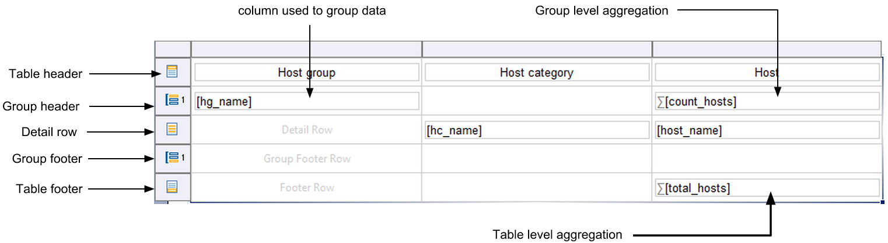

#### Charts

A chart can be created in three steps:

##### Selecting the graph type


##### Binding the data

There are two ways to "bind" data to a chart:

-   Link the data set directly to the chart.
-   Insert the chart into a table cell. This will allow the chart to
    "inherit" the data from the table thus binding it.

The data inheritance from a parent component is required if you decide
to reuse data groups and aggregated data in a chart.


##### Formatting the chart


### BIRT Libraries

A report can contain a large number of components (data sources, data
sets, charts, tables). When stored in a shared library, components
developed for one report can be used in others.

BIRT libraries (.rptlibrary files) store shared components. Libraries
are useful for:

-   Saving time when developing a report.
-   Easy maintenance of reports. A bug fix or modification of a
    component in the library will be applied to every report sharing
    this component.
-   A component from a library can be "overloaded" in a report as an
    override in order to change its appearance or variable parameters.

Operating principle:

-   Each report project has a specific folder that stores all the shared
    resources (e.g., images, BIRT rptlibrary files, CSS files) to be
    accessed in the report through a relative path.
-   You can navigate using the "resource explorer" panel in Eclipse
    BIRT in the resource (rptlibrary) and drag-and-drop the component
    you need to import into the report.
-   Each component imported from a library is marked by a specific icon
    in the report.


### BIRT Templates

The report templates (.rpttemplate) serve a different function than the
report libraries. The purpose of a report template is to provide a
starting point for a new report. A report template can contain the
following:

-   The layout for a new report
-   Master pages (headers and footers)
-   Data sources
-   Data sets
-   Graphical components
-   Scripting.

When you start to develop a new report, you can borrow every reusable
component from a template. Components can also be imported from BIRT
libraries.

A new report has no relationship with the original template whose
content has been borrowed. Therefore, any change made to that template
cannot affect the reports that use it.

## Preparing the development environnement

### Creating a workspace

When you first launch Eclipse BIRT, you will need to create a workspace
to hold your BIRT reporting projects. We recommend that you create a
workspace directory that is separate from the Eclipse BIRT installation
(system) directory. This type of configuration will allow you to change
the BIRT version easily without affecting your project folders.

After creating the workspace and before starting to design any report,
you must create a BIRT project containing two main directories:

-   /reports: Contains all your reports (.rptdesign files).
-   /Resources: Contains any files or components that will be made
    accessible to your reports through relative paths.

### Creating a new project

To create a BIRT report project, select "File > New > Other
projects", then, in the wizard window, select "Report project":

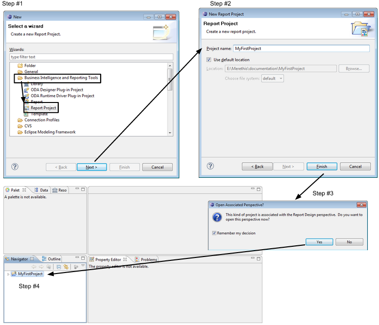

After creating the project, add your two main folders with a right-click
on the project displayed in the "Navigator" tab panel:


Now, copy the contents of the reports *(/usr/share/centreon-bi/reports)*
and Resources *(/usr/share/centreon-bi/Resources)* directories on the
reporting server into the two folders you created in your project.

#### The resources folder

For each BIRT project created in this workspace, you will need to
define, in project properties, the location of the corresponding
Resources folder.

This will allow the shared components (e.g., datasources, data sets,
report parameters and layout components from BIRT libraries, but also
BIRT report templates and image or flat files) to be referenced in
reports through the "Resource Explorer" panel:


Each component imported from "Shared resources" into the report
(.rptdesign file) will be referenced through a relative path. This will
enable you to migrate your project into another workspace or Centreon
MBI reporting server without indicating the full path of your installed
workspace.

For example, if your workspace is located in
C:DocumentsusernameCentreon-Bi-WorkspaceMyFirstProject, only
the subfolders and files in your project "MyFirstProject" need to be
set.

To define the shared-resource folder in the project environment,
right-click on your project in the Navigator panel, then select
Properties. Set the resource folder as "<Current Project
Folder>/Resources/". Because the pattern "<Current Project Folder>"
is a variable that will be set automatically by Eclipse, there is no
need to write the project path explicitly.


> You will have to repeat this procedure every time:
>
> -   You export and import the project into another workspace.
> -   You create a new project.

### Connecting to databases

#### Introduction

Information for connecting to databases are defined in the following two
files:

-   /etc/centreon-bi/cbis-profile.xml
-   /etc/centreon-bi/reports-profile.xml

Copy both of these files to your workstation.

In each of these .xml files, you must update the IP addresses for both
the Centreon database ("Centreon") and for the Centreon storage
database ("Censtorage").

-   cbis-profile.xml file should contain the addresses of the monitoring
    database server.
-   reports-profile.xml should contain the addresses of the reporting
    database server.

Update the username and the password of these files, if necessary.

From your workstation, grant the appropriate privileges for the defined
users to connect to the above servers.

#### Configuring the L2_datasources library

> **Warning**
>
> Never upload the L2_Datasource.rptlibrary file to your reporting
> server. This will delete the configuration for connection to the MariaDB
> server and cause Centreon MBI (for ETL & report generation) to crash.

All standard reports use the library L2_datasources to connect to data.
Therefore, this library must point to the appropriate servers
(monitoring DB and the reporting DB servers).

You must then link the L2_datasource library to the updated profile
files on your workstation.

To do so, double click on the library L2_datasource. The library opens
in your workspace.


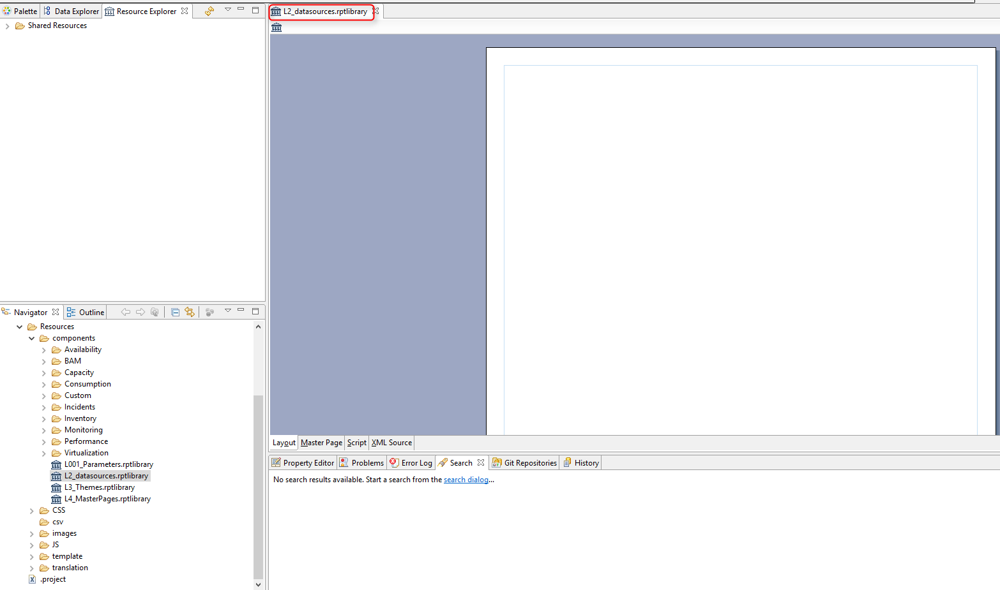

Click on "Outline" and expand the "Datasources".

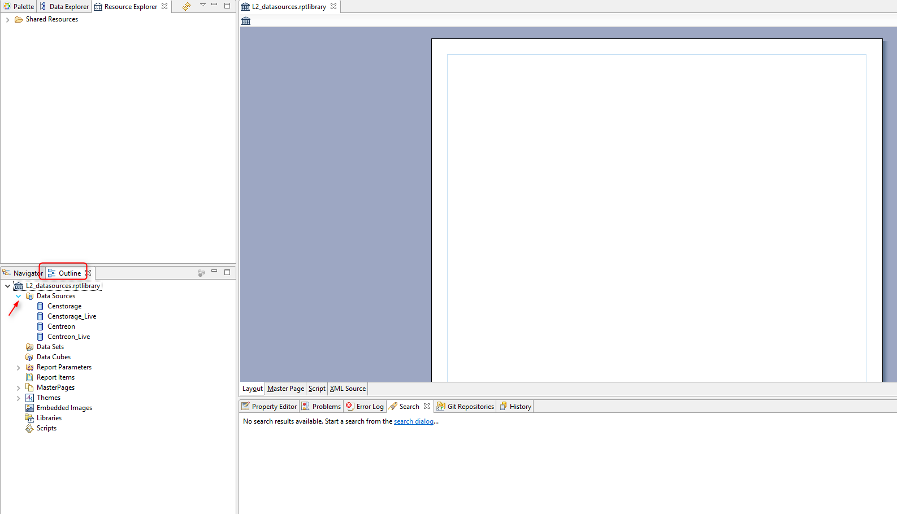

The datasources used in Centreon MBI standard reports are listed.*

Double click on the "Datasource" Centreon, and the below pop-up opens:


In "Connection Profile Store" select the path to the
report-profile.xml file on your workstation, and validate.

The following pop-up opens:

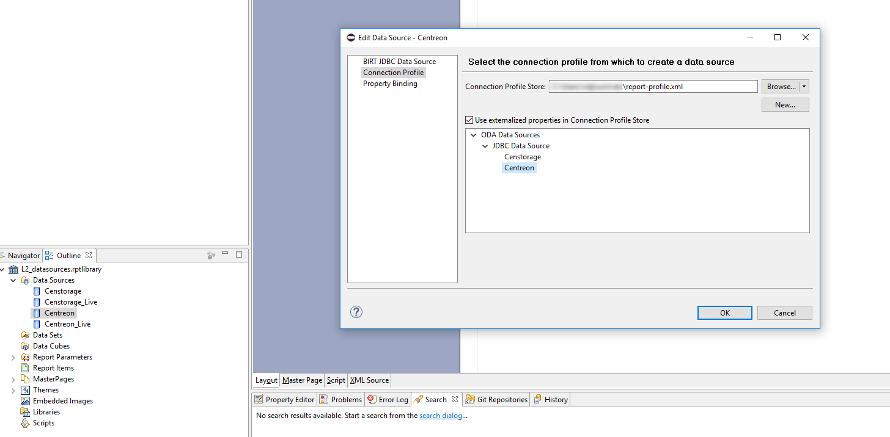

All the datasources present in the file are listed.

In this example, two datasources are listed: - Censtorage - Centreon

Select Centreon then click on the "BIRT JDBC Datasource".


The information defined in the XML file is read.

Click on "Test Connection". A pop-up appears, displaying the message
"Connection successful".


> In case of an error message indicating a missing driver, add the MariaDB
> driver ( .jar) from the "Manage drivers" menu.
>
> 
>
> 

This operation should only be performed once for the project.
:::

**Repeat the same procedure for these datasources: centreon_storage,
centreon_live et centreon_storage_live**.

 Datasource         | Profile file          | Profile to use
--------------------|-----------------------|----------------
| Censtorage        | creports-profile.xml  | Censtorage
| Centreon_Live     | cbis-profile.xml      | Centreon
| Censtorage_Live   | cbis-profile.xml      | Censtorage

### Generating a standard report

To generate a standard report from the interactive development
environnement, double click on the report to open it.

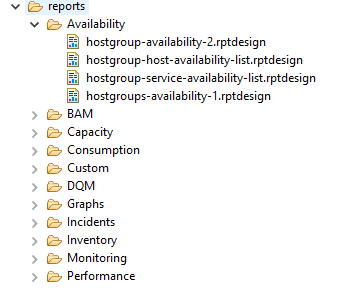

Once the report is open, click on "View report" to select the output
format:


A pop-up opens, asking for the report parameters to be filled in.


The report will be generated according to the parameter criteria
selected, in the desired output format.


## Developing your own reports

### Using Centreon report templates

To make sure the reports you develop with BIRT are compatible with
Centreon MBI, you must use the template provided by Merethis as a
starting point. This template, called
"generic_component_script.rpttemplate", is stored in
/usr/share/centreon-bi/Resources/templates (default template directory).
Using this template is mandatory because it adds certain scripting to
your report that is required for it to function on our platform.

To use this template in your BIRT report:

-   Download the file from the reporting server to the "Resources"
    folder of your BIRT project:
    /Resources/templates/generic_component_script.rpttemplate
-   Click right on the template and select "Register Template with New
    Report Wizard".


-   For each new report you create, select the name and click on *Next*
    to access the template window.
-   Select the template called "Component template" and click on
    "Finish".

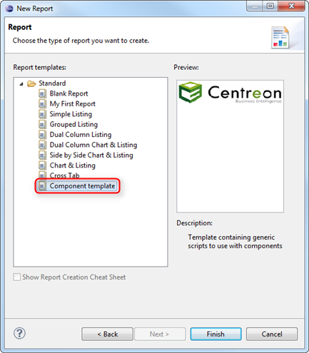

### Define the project structure

We highly recommand defining and applying standard conventions for:

-   Creating a directory tree for reports and resources.
-   Naming directories and files.
-   Naming components in BIRT libraries, templates and reports.

**Naming and organizing files in a consistent and descriptive way will
help you to maintain and update your projects.**

The following information in this chapter discusses the standards
defined by Centreon.

### Report designs (RPTDESIGN)

-   Each report is stored in a folder or subfolder of the main
    "reports" folder. The name of a folder should be defined according
    to the type of statistics processed in the report:
    -   Capacity
    -   Availability
    -   Performance.
-   Reports whose parent folder is the main folder "reports" have been
    deprecated since Centreon MBI version 1.5.
-   All components of a report (e.g., layout, dataset) are imported from
    a BIRT library.
-   Each report must be created from a BIRT report template, which uses
    scripting to manage the multi-select parameters and Cascading Style
    Sheets (CSS).

### Resources

The Centreon MBI shared resource directory (/Resources) contains four
subdirectories:

-   /images: Contains images used in reports.
-   /templates: Contains the BIRT templates used as a starting point for
    any report.
-   /translations: Contains the localization (foreign language
    translation) files.
-   /components: Contains all the BIRT libraries (.rptlibrary) organized
    into subdirectories named meaningfully according to the reports
    (e.g., capacity, performance).

### Libraries

Some libraries are stored directly under the "/components" directory,
without any classification into subdirectories. These libraries contains
components that may be reused in other libraries but also in reports:

-   /datasources: Contains all the datasources that will be used for the
    entire report project. Avoid defining datasources in multiple files
    in order to simplify the maintenance of your project (in case you
    change development or production environments).
-   /parameters: Contains all the report parameters that will be
    required in the reports.
-   /masterpages: Stores the different masters (headers and footers)
    that will be reused in the reports.

The potentially large number of components in the libraries can make
navigating for a specific component complicated. To simplify the way
components are organized, ask yourself the following questions:

-   What kind of statistic are you looking for?
    -   Capacity? Performance? Availability? Open the subfolder named
        according to your requirement.
-   For what type of object do you need when designing your report?
    -   A host? A single host group? Several host groups? You will find
        this information in the descriptive name of the ".rptlibrary"
        file.
-   Do you require a data set? With what kind of parameters?
    -   All the data sets are listed in the "Data explorer" panel.
    -   The name of each data set is prefixed by a code. Each digit in
        this code signifies an object (e.g., hostgroup, host, service
        category, host category, metric, timeperiod) and can vary from 0
        to 2:
        -   0: The object is not used as a parameter.
        -   1: A single value is expected.
        -   2: A list of multiple values is expected.
-   Do you require a graphical component? With which parameters?
    -   All graphical components are listed in the "Outline" panel in
        the menu "Report Items".
    -   The name of each component is prefixed by a code using the same
        naming convention as the data set (see above).
    -   The name of the component is suffixed with the component type
        (e.g., graph, text, table)

**Warning**
>
> Do NOT modify any of the original standard report templates or
> libraries.

## Deploying a report on Centreon MBI

Centreon MBI provides scheduling and publishing functionality for BIRT
reports. Once you have designed your report, you will not need to use
Eclipse BIRT to generate your reports. Non-technical users will be able
to run the reports in a few clicks from the Centreon graphical user
interface (GUI) without having to resort to Eclipse BIRT.

Steps for deploying a report on Centreon MBI:

### Create the XML file describing the required parameters

Each RPTDESIGN file that you create contains different report
parameters. To display them in the Centreon MBI GUI and be able to use
them, you must define an XML file that will dynamically generate a
parameter tab.

When creating a new report design on the interface, you must associate
it with the XML parameter file. Three types of objects can be defined in
this XML file:

> -   Text tags to allow users to type in their own text:
>     <text></text>
> -   Selection tags: <select></select>
> -   Multi-select tags: <multiselect></multiselect>.

Each of these sets of markup tags has several possible attributes:

  Attribute     | Description                                               | text  | select |  multiselect
  --------------|-----------------------------------------------------------|-------|--------|-----------------
  id            |  Name of the parameter in the report (report parameter)   |   X   |   X    |     X
  title         |  Description field displayed next to the parameter        |   X   |   X    |     X
  data          |  Data to display in the parameter                         |   X   |   X
  size          |  Size of the text field                                   |   X

Below are the possible values for the **data** attribute:

  **Value**

- host
- hostgroup
- hostcategory
- servicegroup
- servicecategory
- metric
- businessview
- businessactivity
- liveservice*
- timeperiodBA

\**liveservice corresponds to the business time period (i.e: 24x7)*


> Single- and multiple-selection lists are restricted through Centreon
> ACLs. Users with restrictions on Centreon resources will also be
> restricted on the Centreon MBI interface.

> **Warning**
>
> If you want to use our default date picker and use the date parameter
> (cyclical or on-demand) in your report, you must use the two "known"
> parameters, "dateStart" and "dateEnd".

Below is an example of an XML file (Host-detail-2):

``` XML

    <?xml version="1.0" encoding="iso-8859-1"?>
    <objects>
    <select id="portrait_master_logo" data="logo" title="Portrait master page logo"/>
    <select id="landscape_master_logo" data="logo" title="Landscape master page logo"/>
    <select id="liveserviceID" data="liveservice" title="Select reporting live service" />
    <text id="evolutionInterval"  title="Number of month to show in trend graphs" size="5"/>
    <select id="One-hostID" data="host" title="Select the host to report" />
    <select id="One-servicecategoryID_cpu" data="servicecategorie" title="Service category containing CPU service(s)" />
    <multiselect title="Filter on CPU metrics to INCLUDE" id="metricNAME_cpu" data="metric"/>
    <multiselect id="servicecategoryID_storage" data="servicecategory" title="Service category containing Storage service(s)" />
    <multiselect title="Filter on Storage metrics to EXCLUDE " id="metricNAME_storage" data="metric"/>
    <select id="One-servicecategory_memory" data="servicecategorie" title="Service category containing Memory service(s)" />
    <multiselect title="Filter on Memory metrics to INCLUDE" id="metricNAME_memory" data="metric"/>
    </objects>

```

### Deploy the report

#### On the reporting server

Copy your report design to the reporting server. The "reports" and
"Resources" folders are found in the main Centreon MBI folder. The
directory tree for your reports and resources must be same as in your
Eclipse BIRT project.

#### On the monitoring server

In the "Reporting > Business Intelligence > Report designs" menu on
Centreon, add the new report design, and define the following
properties:

-   A name for the report design
-   The report location on the reporting server (relative path under /usr/share/centreon-bi/reports)
-   An XML source file that will describe the report parameters of the previously created report design.

### Running the report job

In the menu `Reporting > Business Intelligence > Jobs`, define a job
to run your report design, and fill in all the specific report
parameters.
