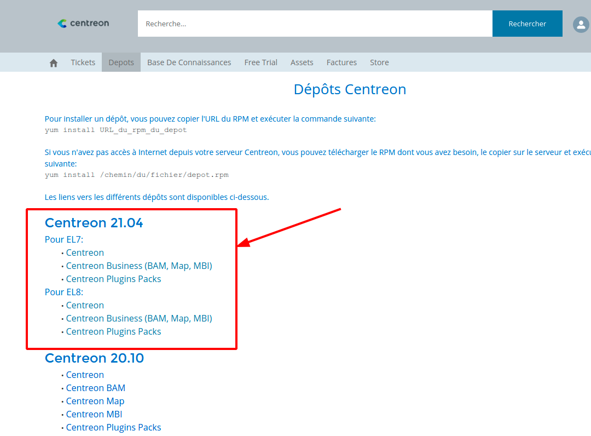

> When updating from version < 18.10 to a version >= 18.10, you need to
>
> - Retrieve a new license from Centreon support
> - Make sure your Centreon MBI server is based on CentOS/RH 7. You may use the
>   following procedure to migrate your server: [Migrate your
>   reporting server](migrate.html)

The upgrade of Centreon MBI consists of 4 steps :

- Updating the repository
- Updating the extension interface
- Updating the reporting server
- Updating the MariaDB database

## Step 1: Update the repository

When you upgrade from a previous major version to 21.04.x, you first need to update the repository on your Central & Reporting servers.

You will find the new "Business" repository on the "Depots" tab in your Centreon Support account on https://support.centreon.com :



## Step 2: Upgrade the extension interface

1. Update the package, run the following commands:

    ```shell
    yum update centreon-bi-server
    ```

2. Update through the interface:  Log on to the Centreon web interface and go to 
the *Administration > Extension > Manager* page and click on the 
AirUpdate button to update the extension and the widgets

## Step 3: Upgrade the reporting server 

1. Connect to your reporting server and stop the scheduler service (CBIS):

    ```shell
    systemctl stop cbis
    ```

2. Then run the following commands: 

    ```shell
    yum clean all
    yum update centreon-bi\*
    ```

3. Start the scheduler service: 

    ```shell
    systemctl start cbis
    ```

## Step 4: Upgrade the MariaDB database

See [Upgrading MariaDB](../upgrade/upgrade-mariadb.html).
