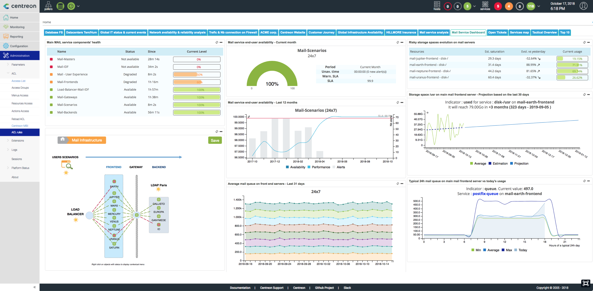
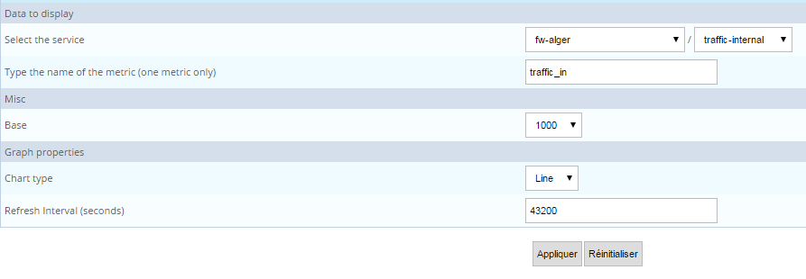
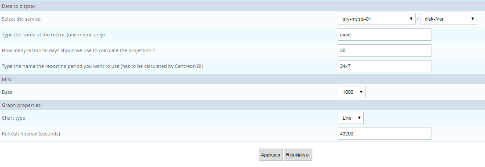

Centreon MBI widgets have been developed for use with the Centreon
dashboard mechanism. You can now use dashboards to create real-time AND
reporting statistics (e.g., for availability, applications,
performance).

A list of available widgets appears below.

> To update ACLs, click on "Update ACL Resources" in the "Report
> Parameters" menu under the Centreon MBI general options.

## Availability & events

### Hostgroups availability by hostgroups by month

#### Description

This widget displays the availability of hosts belonging to a host
group, by month.

#### Parameters

**Menu description**

-   Select the group: Specify host group for displaying statistics.
-   Type the name of host categories to filter on: Indicate one or more
    host categories. Separate multiple entries by a comma \",\".
-   Type the name of the reporting period you want to use (has to be
    calculated by Centreon BI): Make sure the reporting period is
    preconfigured in MBI.
-   Chart type: Indicate type of graph.
-   Min value for graph (leave empty for self-adjustement): Minimum
    value for Y-axis height.
-   Max value for graph (leave empty for self-adjustement): Maximum
    value for Y-axis height.
-   Refresh Interval (seconds): Sets automatic refresh time for widgets.

**Example**

### Hostgroup availability by host by day

#### Description

This widget displays the availability of hosts belonging to a host
group, by day.

#### Parameters

**Menu description**

-   Select the group: Specify host group for displaying statistics.
-   Type the name of host categories to filter on: Indicate one or more
    host categories. Separate multiple entries by a comma \",\".
-   Type the name of the reporting period you want to use (has to be
    calculated by Centreon MBI): Make sure the reporting period must be
    preconfigured in MBI.
-   Select the reporting period.
-   Chart type: Indicate type of graph.
-   Min value for graph (leave empty for self-adjustement): Minimum
    value for Y-axis height.
-   Max value for graph (leave empty for self-adjustement): Maximum
    value for Y-axis height.
-   Refresh Interval (seconds): Sets automatic refresh time for widgets.

**Example**

### Hostgroup availability by host categories by month

#### Description

This widget displays the availability of hosts belonging to a host
group, segmenting the hosts by category and by month.

#### Parameters

**Menu description**

-   Select the group: Specify host group for displaying statistics.
-   Type the name of host categories to filter on: Indicate one or more
    host categories. Separate multiple entries by a comma \",\".
-   Type the name of the reporting period you want to use (has to be
    calculated by Centreon BI): Make sure the reporting period is
    preconfigured in MBI.
-   Chart type: Indicate type of graph.
-   Min value for graph (leave empty for self-adjustement): Minimum
    value for Y-axis height.
-   Max value for graph (leave empty for self-adjustement): Maximum
    value for Y-axis height.
-   Refresh Interval (seconds): Sets automatic refresh time for widgets.

**Example**

### MTBF and MTRS by service {#mbi-hgs-hc-by-service-mtbf-mtrs}

#### Description

This widget provides information on the reliability (MTBF) and
maintenability (MTRS) of your services as well as the level of your
team\'s efficiency when managing downtime (MTTA). Data is shown as a top
N aggregate statistic. Additional information such as current status,
availability, number of events or last state change are also provided to
help in decision-making.

-   MTBF (mean time between failures) represents the average duration
    between two DOWN states. The longer the duration, the more reliable
    the service.
-   MTRS (mean time to restore service) is the average duration between
    two failures. Services with good maintainability have a short MTRS.
-   MTTA (mean time to acknowledge) is the average duration for
    acknowledging DOWN states. The average is calculated only on
    acknowledged events.

#### Parameters

**Menu description**

-   Type name of group(s) (separate with ,): Indicate host group for
    displaying statistics.
-   Type the name of host categories to filter on (separate with ,):
    Indicate one or more host categories.
-   Type the name of service categories to filter on (separate with ,):
    Specify one or more service categories.
-   Number of host-services to display.
-   Select the reporting period.
-   Order By MTBF, MTRS or MTTA.
-   Type the name of the reporting period you want to use (has to be
    calculated by Centreon MBI): Make sure the reporting period must be
    preconfigured in MBI.
-   Display severities/availability/MTBF/MTRS/MTTA/critical
    events/warning events/last change: Shows or hides these columns.
-   Refresh Interval (seconds): Sets automatic refresh time for widgets.

**Example**

### MTBF and MTRS by Host

#### Description

This widget provides information on the reliability (MTBF) and
maintenability (MTRS) of your hosts as well as the level of your team\'s
efficiency when managing downtime (MTTA). Data is shown as a top N
aggregate statistic. Additional information such as current status,
availability, number of events or last state change are also provided to
help in decision-making.

-   MTBF (mean time between failures) represents the average duration
    between two DOWN states. The longer the duration, the more reliable
    the host.
-   MTRS (mean time to restore service) is the average duration between
    two failures. Hosts with good maintainability have a short MTRS.
-   MTTA (mean time to acknowledge) is the average duration for
    acknowledging DOWN states. The average is calculated only on
    acknowledged events.

#### Parameters

**Menu description**

-   Select the group: Specify host group for displaying statistics:
    Separate multiple entries by a comma \",\".
-   Type the name of host categories to filter on: Indicate one or more
    host categories. Separate multiple entries by a comma \",\".
-   Number of hosts to display: Maximum number of hosts displayed.
-   Select the reporting period.
-   Order By MTBF, MTRS or MTTA.
-   Type the name of the reporting period you want to use (has to be
    calculated by Centreon MBI): Make sure the reporting period must be
    preconfigured in MBI.
-   Display severities/availability/MTBF/MTRS/MTTA/down events/last
    change: Shows or hides these columns.
-   Refresh Interval (seconds): Sets automatic refresh time for widgets.

**Example**

## Capacity & Performance

### Typical metric performance day

#### Description

This widget displays a typical 24-hour day of activity for a particular
metric.

#### Parameters

**Menu description**

-   Select the service: Select the host followed by the service.
-   Type the name of the metric (one metric only): Enter metric
    pertaining to a service.
-   Base: Base for division (1000 or 1024).
-   Chart type: Indicate type of graph.
-   Refresh Interval (seconds): Sets automatic refresh time for widgets.

**Example**

### Storage list near saturation

#### Description

Thi widget displays storage space approaching saturation. It also shows
the real-time value and the evolution since the previous day. The
calculation is made comparing J-X and J storage values. Only used
storage space that increases is shown in this widget.

#### Parameters

**Description**

-   Select a hostgroup: Select a host group containing storage services.
-   Type the name of a host category to filter on (separate with ,).
-   Type the name of a service category to filter on (separate with ,).
-   What metric should be used (you can use %): Example: [used]()%
-   Number of hosts to display: Specify for number of lines in table.
-   Display a warning when number of days remaining is less than N:
    Estimate the number of days before saturation. A warning icon
    appears before reaching this \"security\" threshold.
-   Base the speed calculation on the (Days -x) with X =: Specify day to
    compare to current day for calculating the evolution of speed and
    saturation.
-   Type the name of the time period corresponding to 24x7: Indicate
    time period in hours/days.
-   Refresh Interval (seconds): Sets automatic refresh time for widgets.

**Example**

### Metric capacity planning

#### Description

This widget displays the future evolution of a metric in relation to its
history using linear regression.

#### Parameters

**Menu description**

-   Select the service: Select the host followed by the service.
-   Type the name of the metric (one metric only): Enter metric
    pertaining to a service.
-   How many historical days should we use to calculate the projection:
    This period should show the evolution of the metric.
-   Type the name the reporting period you want to use (has to be
    calculated by Centreon BI).
-   Base: Base for division (1000 or 1024).
-   Chart type: Indicate type of graph for availability and performance.
-   Refresh Interval (seconds): Sets automatic refresh time for widgets.

**Example**

### Hostgroups performance metric - TOP X

#### Description

This widget displays a rating of top performance data by metric (i.e.,
current value, average, minimum, maximum, thresholds) for groups and
categories.

#### Parameters

**Menu description**

-   Type name of groups (separate with ,).
-   Type the name of a host categories to filter on (separate with ,).
-   Type the name of a service categories to filter on (separate with
    ,).
-   Metric name (for multiple metrics, separate them with \',\').
-   Type the name the reporting period you want to use (has to be
    calculated by Centreon MBI): Make sure the reporting period is
    preconfigured in MBI.
-   Select the reporting period.
-   Order values by : average, minimum or maximum, ascending or
    descending.
-   Number of metrics to display: Top N to display in terms of metrics.
-   Display Current value: Display / hide the column.
-   Display Average: Display / hide the column.
-   Display Minimum: Display / hide the column.
-   Display Maximum: Display / hide the column.
-   Display warning threshold: Display / hide the column.
-   Display critical threshold: Display / hide the column.
-   Display Hostgroups: Display / hide the column.
-   Display Hostcategories: Display / hide the column.
-   Display ServiceCategories: Display / hide the column.
-   Refresh Interval in seconds: Sets automatic refresh time for
    widgets.

**Example**

### Hostgroups, categories performance analysis by day

#### Description

This widget displays performance data (minimum, average or maximum) by
day over a defined period for groups and categories.

#### Parameters

**Menu description**

-   Type name of groups: Separate multiple entries by a comma \",\".
-   Type the name of a host category to filter on: Separate multiple
    entries by a comma \",\".
-   Type the name of a service category to filter on: Separate multiple
    entries by a comma \",\".
-   Retrieve data with metric name LIKE or IN?: Use this method to
    filter on metric name.
-   Metric name (for multiple metrics, separate them with \',\'): Type
    the name of the metric (if filter mode = like) or multiple metrics
    (if mode = IN).
-   Type the name of the reporting period you want to use (has to be
    calculated by Centreon MBI): Make sure the reporting period is
    preconfigured in MBI.
-   Select the reporting period.
-   What value to display in the graph: Use minimum, average or maximum
    value.
-   Graph height: Graph might need to be resized to include caption.
-   Base: Controls conversion to display G, M, K, etc.
-   Show subchart?: Display or hide the subchart for zooming in.
-   Show legend?: Display or hide the caption.
-   Refresh Interval (seconds): Sets automatic refresh time for widgets.

**Example**

## Business activity monitoring

### Business View Availability,Performance and Alerts by month

*This widget only works with Centreon BAM data.*

#### Description

This widget presents a graph showing the availability, performance and
alerts of one Business View (logical grouping of BAs) by month over the
last 12 months.

#### Parameters

**Menu description**

-   Select a business view from Centreon BAM.
-   Select the reporting period.
-   Chart type: Indicate type of graph.
-   Min value for graph (leave empty for self-adjustement): Minimum
    value for Y-axis height.
-   Max value for graph (leave empty for self-adjustement): Maximum
    value for Y-axis height.
-   Refresh Interval (seconds): Sets automatic refresh time for widgets.

**Example**

### Business Application MTBF & MTRS

*This widget only works with Centreon BAM data.*

#### Description

This widget provides information on the reliability (MTBF) and
maintenability (MTRS) of your critical IT services and applications,
represented in Centreon BAM. Additional information such as current
status, availability, number of events or last state change are also
provided to help in decision-making. Data is shown as a top N aggregate
statistic.

-   MTBF (mean time between failures) represents the average duration
    between two DOWN states. The longer the duration, the more reliable
    the host.
-   MTRS (mean time to restore service) is the average duration between
    two failures. Hosts with good maintainability have a short MTRS.

#### Parameters

**Menu description**

-   Select an application: Select a business view. If left empty, this
    field retrieves all BAs (filtered by the ACLs).
-   Number of business activities to display.
-   Select the reporting period.
-   Order By: Sort the result by MTBF or MTRS.
-   Type the name of the reporting period you want to use (has to be
    calculated by Centreon MBI): Make sure the reporting period must be
    preconfigured in MBI: If this field is left empty the default
    reporting time period for each BA applies.
-   Display XXXXX: Shows or hides the specified columns.
-   Refresh Interval (seconds): Sets automatic refresh time for widgets.

**Example**

### Business Application Availability (Gauge)

*This widget only works with Centreon BAM data.*

#### Description

This widget displays the availability of one BA, its SLAs (if available)
for the selected reporting period and the current BA level. If you
select a reporting period for which there is no data, such as \"Current
month\" on the first day of the month, the current available level is
displayed on the graph.

#### Parameters

**Menu description**

-   Select an application: Select a BA from Centreon BAM.
-   Select the reporting period.
-   Refresh Interval (seconds): Sets automatic refresh time for widgets.

**Example**

### Business Application Availability,Performance and Alerts by day

*This widget only works with Centreon BAM data.*

#### Description

This widget presents a graph showing the availability, performance and
alerts of one BA by day.

#### Parameters

**Menu description**

-   Select an application: Select a BA from Centreon BAM.
-   Select the reporting period.
-   Min value for graph (leave empty for self-adjustement): Minimum
    value for Y-axis height.
-   Max value for graph (leave empty for self-adjustement): Maximum
    value for Y-axis height.
-   Refresh Interval (seconds): Sets automatic refresh time for widgets.

**Example**

### Business Application Availability,Performance and Alerts by month

*This widget only works with Centreon BAM data.*

#### Description

This widget presents a graph showing the availability, performance and
alerts of one BA by month over the last 12 months.

#### Parameters

**Menu description**

-   Select an application: Select a BA from Centreon BAM.
-   Select the reporting period.
-   Min value for graph (leave empty for self-adjustement): Minimum
    value for Y-axis height.
-   Max value for graph (leave empty for self-adjustement): Maximum
    value for Y-axis height.
-   Refresh Interval (seconds): Sets automatic refresh time for widgets.

**Example**

