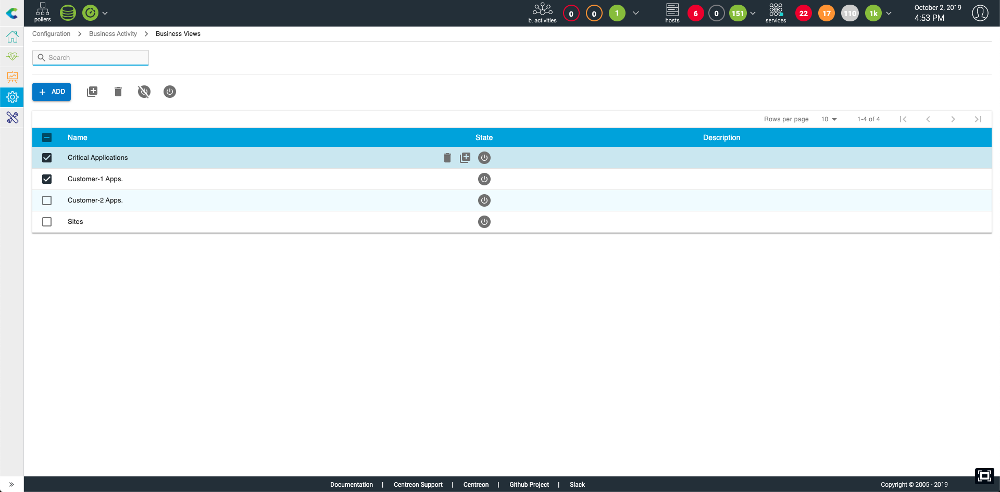
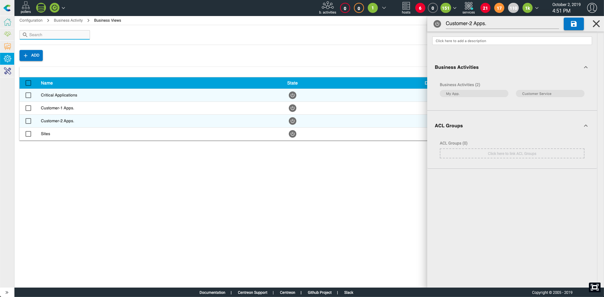
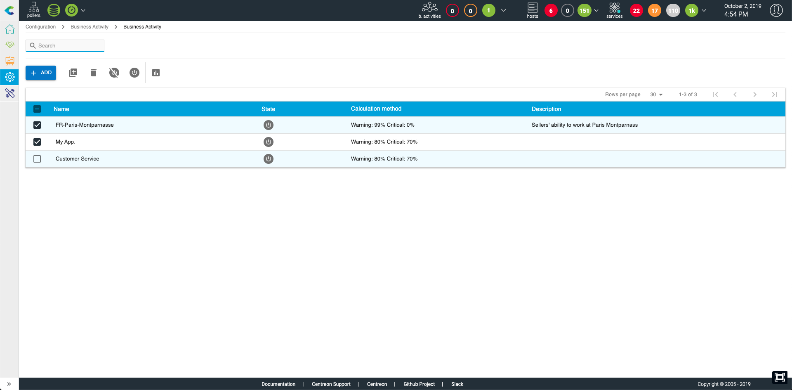
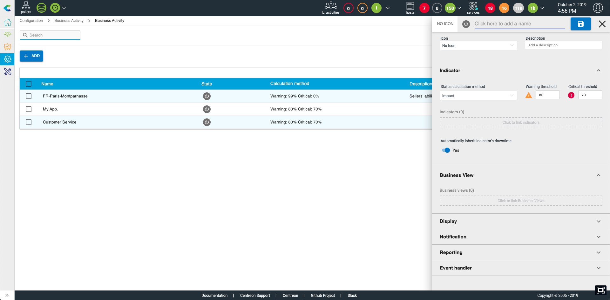
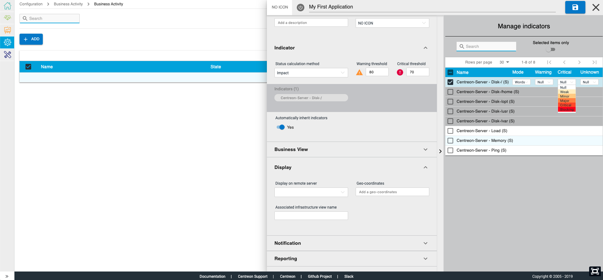
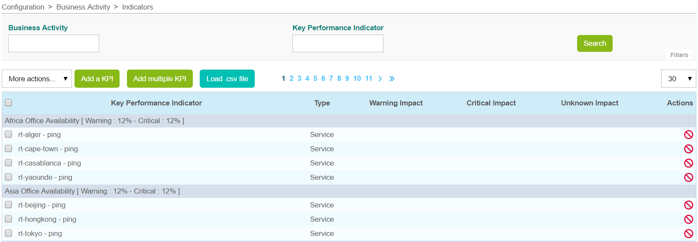
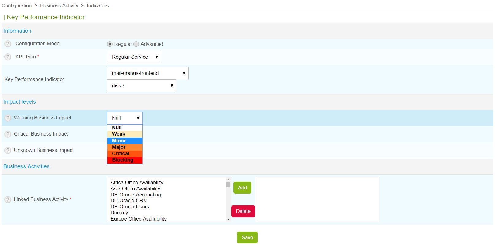
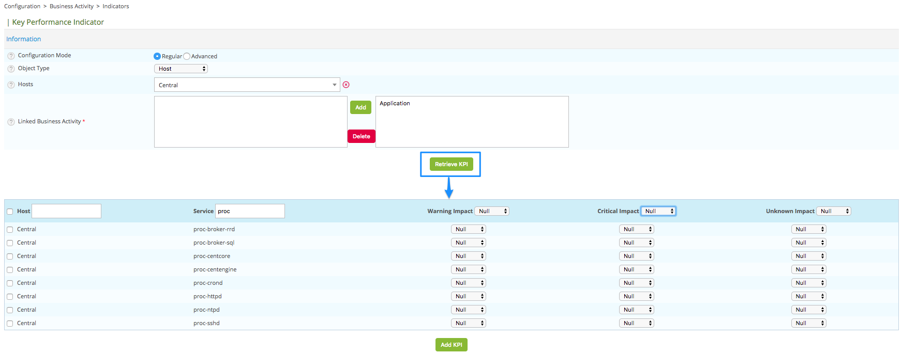
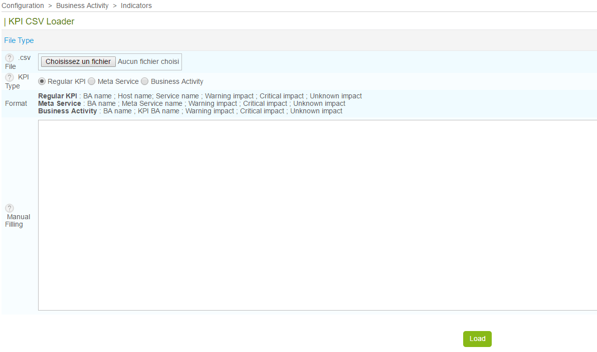

Business Activity Management
============================

Business View (BV)
------------------

### Definition

BVs are used to gather multiple BAs into a single group. Similar to
Centreon host groups, BV groups can be used in different Centreon BAM
screens.

Access restrictions (via ACL) for visualising BAs are managed by linking
them to BVs, which are in turn linked to one or more *Centreon Access
Groups*.

::: {.note}
::: {.title}
Note
:::

For root cause analysis purpose, as soon as you give access to a user to
a business activity, he\'ll see all indicators linked to it, no matter
his restriction concerning resources used in the BA definition
:::

A BV is not an indicator as such by which data can be calculated. The
information in a BV depends on its content and is displayed in real
time.

### List of BVs

Configure a BV in the **Configuration \> Business Activity \> Business
Views** menu.

  ------------- -----------------------------------------------------------
  **Column** \| **Description**

  Name          Business view name

  Description   Brief description of BV

  Displayed     The BV is either displayed or not displayed on the Centreon
                BAM screens (deprecated)

  Actions       List of actions to be performed on the BV
                (modification/display)
  ------------- -----------------------------------------------------------

> Deleting a BV:
>
> -   Does not delete the BAs that are linked to it.
> -   Is permanent.

### Creating a BV

  -----------------------------------------------------------------------
  **Column**             **Description**
  ---------------------- ------------------------------------------------
  Name                   BV name

  Description            Brief description of the BV

  Linked Business        The BA(s) linked to the BV
  Activity               

  Authorized Access      The access group(s) that can consult the BV and
  Groups                 its BA
  -----------------------------------------------------------------------

Business Activities (BA)
------------------------

### Definition

BAs form the core of the Centreon BAM module. As aggregated indicators
they are monitored by the software in real time. Based on a calculated
value called \"level\". The Centreon BAM system is able to notify users
if the level goes under a certain thresholds, revealing a problem with
the IT service or application.

This value between 0 and 100 (%) is often related to a service quality
measurement. A variation in this value is used to determine whether the
modelized IT service or application is in an **OK**, **Warning** or
**Critical** state.

**How does this level vary?**

A BA is linked to one or more indicators that impact the health of the
BA according to their state and the rules defined by the user.

### List

The BA is managed through the **Configuration \> Business Activity \>
Business Activity** menu.

You have inline actions & global action to delete, duplicate,
enable/disable the BA and massively change thresholds.

### Creating a BA

To add a Business Activity, click on the **Add** button. The following
panel appears:

In this configuration panel, after giving a unique name (mandatory),
start by linking indicators to the BA in the \"Indicator section\".

After that you\'ll be able to configure the following properties:

-   Business View: what BV(s) to link the BA to. Mandatory if you want
    to give access to this BA to non-admin users
-   Display: All parameters concerning the way the BA will be accessible
    outside the BA monitoring page
-   Notification: who & when users get notified
-   Reporting: What SLA & timeperiod you want to use to calculate the BA
    availability statistics
-   Event handler: parameters to auto-remediate the BA when state
    becomes non-ok

#### Configuration in detail

Remember that a BA starts with a 100% health level, and indicators can
impact this value depending on their status.

The state and behavior of a BA relies on the following parameters that
are managed in the \"Indicator\" section:

**Indicators**

-   **Status calculation method**: Impact mode is the only available
    method for now, the BA will be impacted based on indicators impact
    configuration.
-   **Warning threshold**: Between 100 and 0, the threshold below which
    the BA will switch to Warning status (orange) and send a
    notification (if configured).
-   **Critical threshold**: Between 100 and 0 (\< the Warning threshold)
    below which the BA will switch to Critical status (red) and send a
    notification (if configured).
-   **Automatically inherit indicator\'s downtimes**: by default the BA
    is automatically sets in downtime whenever an indicators in non-ok
    state is in planned downtime (see
    `here for detailed info<ref_inherit_planned_downtime>`{.interpreted-text
    role="ref"})

To have the BA level & status reflecting IT service or application
availability/performance, you have to link indicators to the BA and
configure the impact for each indicator depending on their status.

The following additional properties can be configured.

**Business View**

Link the BA to one or multiple business view so it becomes available for
non-admin users.

**Display**

-   Display on remote server: If you\'re using a remote server, you can
    send the business activity to it so that it\'s also available for
    remote teams. This is possible only if ALL the indicators under the
    BA (at any level) are visible by the remote server.
-   Geo-coordinates: Geo-coordinate to position the BA on a geoview
-   Associated infrastructure view name: the BA probably corresponds to
    an agregated/customer\'s point of view state of an IT service or
    application that rely on a complexe infrastructure. If this
    infrastructure has been designed in Centreon Map, you can ease
    access from this BA to the corresponding view to help users to drill
    down when a problem occurs on that BA.

**Notification**

Configure when, for what status and who should be notified when the
BA\'s status changes. You can also define escalation that applies to
that BA.

The escalation is the same as with other **Centreon** objects, when you
select an escalation, the service escalation definition will be applied
to the BA.

**Reporting**

-   Default reporting time period: Availability statistics for widgets &
    reports will be automatically calculated using this time period
-   Service Level Agreement in % (SLA): whenever the availability is
    compared to a SLA in %, this will be the value that it will be
    compared to
-   Service Level Agreement in minutes (SLA): whenever the availability
    is compared to a SLA in minutes, this will be the value that it will
    be compared to
-   Service Level Objective in % (SLO): additonnal threshold in % to
    compare the availability. It can be seen as a \"SLA warning\"
    threshold.
-   Service Level Objective in minutes (SLO): additonnal threshold in
    minutes to compare the availability. It can be seen as a \"SLA
    warning\" threshold..
-   Extra reporting time periods: Additionnal time period you may want
    to use in widget & reports

**Event handler**

Activate or not the auto-remediation command that you may execute when
the BA status switches.

::: {#ref_inherit_planned_downtime}
**Inheritance of planned downtime**
:::

This option ignores, and cancels notification of, a status change when
downtime has been planned on the indicators of a BA. Note the following:

-   A BA inherits planned downtime from its indicators only when its
    status is not **OK**.
-   When a BA is in planned downtime due to indicators downtime
    inheritance: If the BA status switches to OK, planned downtime is
    stopped.
-   When a BA is in planned downtime due to indicators downtime
    inheritance: If an impact comes from an indicators that has no
    planned downtime, the BA downtime is stopped.

::: {.warning}
::: {.title}
Warning
:::

In order for the new BA to be calculated and monitored, you must
regenerate the configuration on the scheduler and restart the monitoring
services through the interface in the **Configuration \> Poller** menu.
:::

Indicators
----------

### Definition

An indicator is a resources in the monitoring system that is linked to a
BA. A BA may have multiple indicators & sub-indicators. There are four
types of indicators:

-   *Service* (Service by hostgroups are **NOT** usable as indicators)
-   *Meta service*
-   *Boolean*
-   *Another business activity*

An indicator can only impact a BA when status of its object (e.g., a
service) is *Hard* (validated).

The indicator can impact the health of a BA and change its value
according to the indicator status. We recommend for you to use the
standard impact mode (based on keywords *Minor*, *Major*, etc.) instead
of the advanced mode based on numeric impact values, which involve more
complex calculation.

Any time an indicator status changes, the BA engine evaluates the impact
and subtracts its value from the BA health level. The minimum health of
a BA is 0, even if the sum of its indicators impact is \> 100.

### Indicator List

Indicators can be configured through the **Configuration \> Business
Activity \> Indicators** menu or directly in the business activity
configuration form:

  ------------------------------------------------------------------------
  **Column**   **Description**
  ------------ -----------------------------------------------------------
  Indicator    Indicator or Key Performance Indicator: Name of the
  (KPI)        indicator based on the object used

  Type         Indicator type in(service, meta service, BA, boolean rule)

  Warning      Impact weight in the event of a *Warning* condition, in
  Impact       real-time monitoring Ignored if indicators is a boolean
               rule

  Critical     Impact weight in the event of a *Critical* condition, in
  Impact       real-time monitoring

  Unknown      Impact weight in the event of an *Unknown* condition, in
  Impact       real-time monitoring Ignored if indicator is a boolean rule

  Actions      Actions can be performed (modification,
               activation/deactivation)
  ------------------------------------------------------------------------

The **More Actions** menu allows an action to be applied to several
indicator at once:

-   Activate the indicator within their BA.
-   Update impact types collectively.
-   Deactivate indicator within their BA.
-   Delete indicator.

### Creating an indicators (KPI)

There are several ways to create an indicator:

#### Add an indicator

To add an indicator, click on the **Add a KPI** link, which takes you to
the following form.

**Regular Mode**:

**Advanced mode**:

To be able to manually define an impact:

  -----------------------------------------------------------------------
  **Column**         **Description**
  ------------------ ----------------------------------------------------
  Configuration Mode Configuration mode: regular or advanced

  KPI Type           KPI type (service, meta service, boolean rule or a
                     BA)

  Key Performance    Choice of KPI based on the objects in Centreon
  Indicator          

  Warning Business   Impact weight in the event of a *Warning* condition,
  Impact             in real-time monitoring

  Critical Business  Impact weight in the event of a
  Impact             *Critical* condition, in real-time monitoring

  Unknown Business   Impact weight in the event of an
  Impact             *Unknown* condition, in real-time monitoring

  Linked Business    BA related to KPI
  Activity           
  -----------------------------------------------------------------------

*To add a boolean rule: First create the boolean rule (see below), and
then add the KPI.*

**Boolean Rules**

To create a boolean rule, go to : **Configuration \> Business Activity
\> Boolean Rules**

+----------------------+-----------------------------------------------+
| **Column**           | **Description**                               |
+======================+===============================================+
| KPI name             | Name for identifying KPI                      |
+----------------------+-----------------------------------------------+
| Configuration Mode   | Configuration mode: regular or advanced       |
+----------------------+-----------------------------------------------+
| Expression           | Logical expression                            |
|                      |                                               |
|                      | 1.  Field for editing the logical expression  |
|                      | 2.  Toolbox                                   |
|                      | 3.  Services that compose the logical         |
|                      |     expression                                |
|                      | 4.  Button for evaluating the expression with |
|                      |     real-time monitored status                |
|                      | 5.  Boolean state after evaluation (whether   |
|                      |     it is real-time or simulated)             |
|                      | 6.  Enter simulation mode, thus allowing user |
|                      |     to simulate statuses of the defined       |
|                      |     services                                  |
+----------------------+-----------------------------------------------+
| Impact is applied    | State of logical expression that triggers the |
| when expression      | impact                                        |
| returns              |                                               |
+----------------------+-----------------------------------------------+
| Comments             | Comments regarding the boolean KPI            |
+----------------------+-----------------------------------------------+
| Status               | Enabled or Disabled                           |
+----------------------+-----------------------------------------------+

#### Adding multiple KPIs

In order to add multiple KPIs, click on **Add multiple KPIs** link which
takes you to a data entry form.

  -----------------------------------------------------------------------
  **Colonne**           **Description**
  --------------------- -------------------------------------------------
  Configuration Mode    Configuration mode: Standard or Advanced

  Object Type           Type of object from which the indicators will be
                        loaded

  Hosts, Host Groups,   Depending on the selected object type, a list of
  Service Groups        objects will be automatically loaded

  Linked Business       BA related to indicators
  Activity              
  -----------------------------------------------------------------------

Clicking on the **Retrieve KPI** button, a list of indicators will be
displayed. You can filter and apply thresholds, collectively one by one:

  -----------------------------------------------------------------------
  **Column**    **Description**
  ------------- ---------------------------------------------------------
  Host          Host

  Service       Service

  Warning       Impact weight in the event of a *Warning* condition, in
  Impact        real-time monitoring

  Critical      Impact weight in the event of a *Critical* condition, in
  Impact        real-time monitoring

  Unknown       Impact weight in the event of an *Unknown* condition, in
  Impact        real-time monitoring
  -----------------------------------------------------------------------

#### Load .ssv file

To add several KPIs loading an .ssv file, click on **Load .ssv file**:

  -----------------------------------------------------------------------
  **Column**     **Description**
  -------------- --------------------------------------------------------
  .ssv File      Opens a file browser

  KPI Type       Type of indicator (KPI) to load

  Format         Formats of the SSV file depending on the chosen
                 indicators type

  Manual Filling Possibility to fill the field instead of loading a file
  -----------------------------------------------------------------------

### Events & availability statistics

Events & availability statistics are automatically calculated daily. In
case you modify the default reporting period, add an extra one or change
BV association, you may need to rebuild the previously calculated data.

To do so, run the following script::

    # cd /usr/share/centreon/www/modules/centreon-bam-server/engine
    # ./centreon-bam-rebuild-events --all

It is also possible to rebuild a specific BA::

    # ./centreon-bam-rebuild-events --ba=<id of ba>

For more information regarding this script, run the following command::

    # ./centreon-bam-rebuild-events --help

If you are also using Centreon MBI and wish to use the updated data, run
the following command on the reporting server: :

    /usr/share/centreon-bi/etl/importData.pl -r --bam-only
