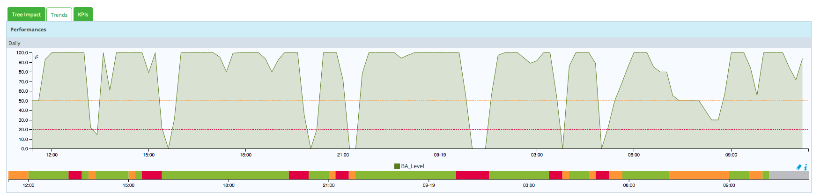

Business Activity Monitoring & Reporting
========================================

After adding, editing or deleting the BAs, KPIs and BVs the objects
linked to Centreon BAM, go to **Configuration \> Poller**, generate the
configuration files and push them to the Centreon central server.

After loading the configuration and checked the services linked to the
KPIs, the BA will be up to date and available under **Monitoring \>
Business Activity \> Monitoring**.

Interpreting real-time data
---------------------------

### Main page

A table on the main page lists all the essential information concerning
live status and health level of the BAs.

Non-admin users can only see the BAs associated with BVs linked to their
access group:

  ------------------- -------------------------------------------
  **Column**          **Description**

  Current Level       Current level in %

  Business Activity   Name of the BA

  Description         Description of the BA

  Duration            Duration of the current status

  Reporting Period    Default reporting period used for that BA
  ------------------- -------------------------------------------

You can visualize the evolution of BA health level by hovering your
mouse over the name or description of the BA and a pop-up appears
displaying all the KPIs and status information.

Click on the name of the BA to bring up a detailed live view.

### Detailed View

The detailed view is divided into seven parts:

1.  List of KPIs that impact the BA level
2.  Table containing the BA health level and alert thresholds
3.  Tab containing the BA impact tree. You can open a sublevel, zoom in
    and out and move the tree.
4.  Tab containing the health level graph of the BA
5.  Tab containing a list of all KPIs.
6.  Dropdown list to change the BA
7.  Link to the reporting page.

The list of KPIs display real-time information on their status and also
their impact on the BA:

The **Trend** tab panel displays four graphs -- daily, weekly, monthly
and annually showing the BA level and status over time:

Interpreting reporting data
---------------------------

You can visualize, at any time, the evolution of archived data on the
reporting and log screens, and on performance graphs. These screens are
similar to those used on the Centreon server.

### Reporting

The reporting page to the \"Reporting \> Dashboard\" one on Centreon.
Select a BA to display operational availability, warning and critical
statistics for a given period:

You can export the data to a .csv file by clicking on the **Export in
CSV format** link.

### Logs

The **Logs** menu displays the evolution of the BA level over time along
with its KPI status when impacting the BA, for a given period. The
maximum historical day is *the last 30 days*.

Only changes in BA status are recorded: you cannot display the status of
KPIs at a specific point in time.

First, select the BA and the time period:

The **Display details** box shows the BA status on a growth curve.

This chart displays the evolution of the BA health level in a given time
frame. Click on each spike to display the KPIs impacting the BA.

The table below details the KPI screen:

  ------------------ ----------------------------------------------------
  **Column**         **Description**

  Key Performance    KPI List
  Indicators         

  KPI Type           KPI type (service, meta service or BA)

  Status             KPI status (Operational, Warning, Critical, Unknown)

  Impact             KPI impact weight on the BA

  In Downtime        Programming or no programming of downtime on the KPI
                     at the time of calculation

  Check Time         Time during which the KPI was verified

  Output             KPI output message during the KPI check
  ------------------ ----------------------------------------------------
