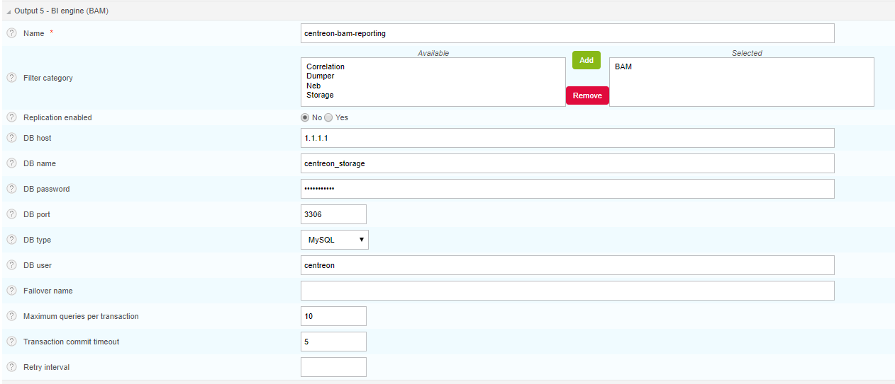

Centreon Broker output configuration {#ref_Conf_Broker_en}
====================================

Installing or updating/upgrading Centreon BAM automatically creates the
various Centreon Broker configurations required.

::: {.note}
::: {.title}
Note
:::

\* This documentation does not describe the standard configuration of
Centreon Broker. \* Configuration names (*outputs*) are not strictly
identical. Besides the configuration name, you should check the
associated type.
:::

The configuration consists of two outputs:

-   **centreon-bam-monitoring** (BAM - Monitoring engine (BAM)-type):
    Inserts all Business Activities status changes into the database.
-   **centreon-bam-reporting** (BAM - BI engine (BAM)-type): Inserts
    availibility data into databases.

Real-time Centreon Broker output
--------------------------------

::: {.note}
::: {.title}
Note
:::

This output will be added to Centreon Broker central server instance.
:::

Go to the following page **Configuration \> Centreon \> Centreon-Broker
\> Configuration**, under the **Output** tab.

Check that the following configuration is correctly set:

The following table describes the fields:

  ------------------------------ --------------------------------------------
  **Fields**                     **Values**

  **Name**                       centreon-bam-monitoring

  **Filter category**            

  **Storage DB name**            centreon\_storage

  **Replication enabled**        No

  **Command file path**          /var/lib/centreon-engine/rw/centengine.cmd

  **DB host**                    localhost (or your monitoring database
                                 address)

  **DB name**                    centreon

  **DB password**                in file conf.pm

  **DB port**                    3306

  **DB type**                    MySQL

  **DB user**                    centreon

  **Failover name**              

  **Maximum queries per          0
  transaction**                  

  **Transaction commit timeout** 

  **Retry interval**             
  ------------------------------ --------------------------------------------

Configuring the Reporting Output
--------------------------------

::: {.note}
::: {.title}
Note
:::

This output will be added to the Centreon Broker central server
instance.
:::

Go to the following page **Configuration \> Centreon \> Centreon-Broker
\> Configuration**, under the **Output** tab.

Check that the following configuration is correctly set:

{.align-center}

The following table describes the fields:

  -----------------------------------------------------------------------
  **Champs**                     **Valeurs**
  ------------------------------ ----------------------------------------
  **Name**                       centreon-bam-reporting

  **Filter category**            BAM

  **Replication enabled**        No

  **DB host**                    localhost (or your monitoring database
                                 address)

  **DB name**                    centreon\_storage

  **DB password**                in file conf.pm

  **DB port**                    3306

  **DB type**                    MySQL

  **DB user**                    centreon

  **Failover name**              

  **Maximum queries per          0
  transaction**                  

  **Transaction commit timeout** 

  **Retry interval**             
  -----------------------------------------------------------------------
