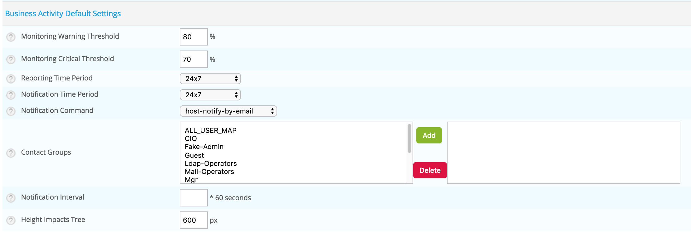

Default settings
================

The default settings are conveniently prefilled to assist you in creating new BAs and indicators (KPIs).

::
 
 Monitoring > Business Activity > Default Settings

Default impact settings
-----------------------

The following parameters correpond to the default values behind the *Weak*, *Minor*, *Major*, *Critical* and *Blocking* impact types when configuring indicators in *Regular* mode.

.. image:: images/list_impacts_basic.png

Impact types have to be defined in percentage.

.. image:: images/impacts_configuration.png

Default impact settings for Business Activities and Boolean rules
-------------------------------------------------------------------

These default parameters are used for prefilling the fields for **Business Activity** or **Boolean rule**-type indicators in *Advanced* mode.

.. image:: images/impacts_ba_boolean.png

Default Settings for Business Activities 
----------------------------------------

The default parameters below define values for BAs.

+--------------------------+-------------------------------------------------------------------------------------------------------+
| **Column**               | **Description**                                                                                       |
+--------------------------+-------------------------------------------------------------------------------------------------------+
| Warning Threshold        | *Warning* threshold: Corresponds to a warning condition of the BA. A notification can then be sent.   |
+--------------------------+-------------------------------------------------------------------------------------------------------+
| Critical Threshold       | *Critical* threshold: Corresponds to a critical condition of the BA. A notification can then be sent. |
+--------------------------+-------------------------------------------------------------------------------------------------------+
| Reporting Time Period    | Default BA reporting time period                                                                      |
+--------------------------+-------------------------------------------------------------------------------------------------------+
| Notification Time Period | Default BA notification time period                                                                   |
+--------------------------+-------------------------------------------------------------------------------------------------------+
| Contact Groups           | Default BA notified contact groups                                                                    |
+--------------------------+-------------------------------------------------------------------------------------------------------+
| Notification Interval    | Default BA notification interval                                                                      |
+--------------------------+-------------------------------------------------------------------------------------------------------+
| Height Impact Tree       | Default height for window showing impact tree                                                         |
+--------------------------+-------------------------------------------------------------------------------------------------------+

To be able to notify user/external solutions (Slack, OpenDuty etc..) belonging to the contact group you defined,
you have to configure the dedicated Business Activity notification section in user's form:

.. image:: images/bam_user_notification.png

User settings
=============

The **User Settings** are personalised options that belong to each user profile.

::
 
 Monitoring > Business Activity > User Settings

Custom Overview
---------------

.. image:: images/user_custom.png

Default Graph Style
-------------------

*Deprecated feature - will be removed in future version*.

Graph colors
------------

*Deprecated feature - will be removed in future version*.

Miscellaneous
-------------

*Deprecated feature - will be removed in future version*.