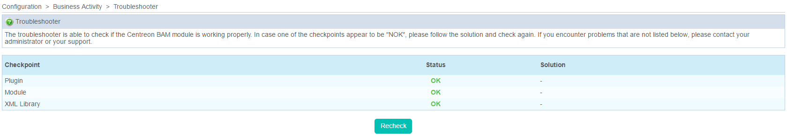

Troubleshooting
================

Troubleshooting specifically concerns Centreon BAM and can help determine whether or not the module is working properly.

::
 
 Monitoring > Business Activity > Help > Troubleshooter

+------------+---------------------------------------------------------------------------------------------------+
| **Column** | **Description**                                                                                   |
+------------+---------------------------------------------------------------------------------------------------+
| Checkpoint | Checkpoint                                                                                        |
+------------+---------------------------------------------------------------------------------------------------+
| Status     | Status of the checkpoint : **OK** or **NOK**                                                      |
+------------+---------------------------------------------------------------------------------------------------+
| Solution   | In the case where a checkpoint appears to be **NOK**, a solution is proposed to solve the problem |
+------------+---------------------------------------------------------------------------------------------------+

