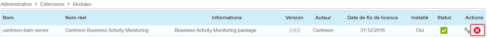

Uninstalling Centreon BAM
=========================

To uninstall the Centreon BAM module, go to the **Administration \>
Extensions** menu.

Click on the Uninstall button:

{.align-center}

Click on the **OK** button to confirm uninstallation.

::: {.warning}
::: {.title}
Warning
:::

Lost data may not be restored unless a database backup has been made.
This procedure is not covered by the maintenance and support of the
Centreon BAM software.
:::

::: {.note}
::: {.title}
Note
:::

All configurations of Centreon Broker have to be manually removed.
:::
