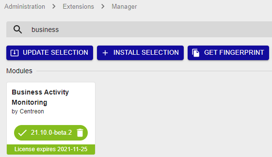

> Centreon BAM is a Centreon **extension** that requires a valid license key. To
> purchase one, contact
> [Centreon](mailto:sales@centreon.com).

## Prerequisites

The central server and Centreon BAM must be installed in the same major versions (i.e. both in 21.10.x).

## Installation

### Install the package

Add the Centreon BAM repository, you can find it on the 
[support portal](https://support.centreon.com/s/repositories).

And install the package using the following command:

``` shell
yum install centreon-bam-server
```

### Upload the license

A license file *bam.license* is provided by Centreon. Go to
**Administration > Extensions > Manager** and upload the license
using the interface.

### Install the interface

Go to the **Administration > Extension > Manager** menu and click on the install
button for the following modules:

- License Manager (if not yet installed)
- Business Activity Monitoring

Once installed and the license added, the module will have a green banner that indicates
the license expiry date:



> If you are using MariaDB replication for your monitoring databases,
> installing Centreon BAM generates a view. You need to exclude it from
> replication by adding the following line on the my.cnf file of the
> slave server:
>
> ``` text
> replicate-ignore-table=centreon.mod_bam_view_kpi
> ```
>
> Create the view manually on the slave server by executing the
> following command line:
>
> ``` shell
> mysql centreon < view_creation.sql
> ```
