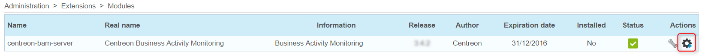
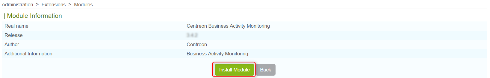
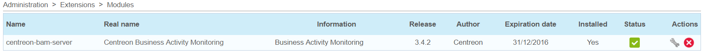

Installation
============

Package installation
--------------------

After checking the prerequisites, proceed with installing the Centreon
BAM module.

Add the Centreon BAM repository provided by Centreon and install the
package:

>     # yum install centreon-bam-server

Licence
-------

A license file *bam.license* is provided by Centreon. Go to
**Administration \> Extensions** and upload the license using the
interface.

Installing from online
----------------------

Log on to the Centreon web interface using an account with privileges
sufficient to install modules. Then go to the **Administration \>
Extensions** menu.

Click on the installation icon corresponding to the Centreon BAM modules
in the Actions column:

{.align-center}

Click on the Install module button:

{.align-center}

Click on **Back**. The module is now installed:

{.align-center}

::: {.warning}
::: {.title}
Warning
:::

If you are using MySQL replication for your monitoring databases,
installing Centreon BAM generates a view. You need to exclude it from
replication by adding the following line on the my.cnf file of the slave
server:
:::

replicate-ignore-table=centreon.mod\_bam\_view\_kpi

> Create the view manually on the slave server by executing the
> following command line:
>
> \# mysql centreon \<
> `view_creation.sql <doc/view_creation.sql>`{.interpreted-text
> role="download"}

Centreon Broker automatic configuration
---------------------------------------

A Centreon BAM installation or upgrade automaticaly creates Centreon
Broker outputs.

::: {.note}
::: {.title}
Note
:::

This documentation does not describe the standard configuration of
Centreon Broker.
:::

The configuration required for deploying the Centreon BAM module
consists of two parts:

-   **centreon-bam-monitoring** (BAM-Monitoring engine (BAM)-type):
    Allows all Business Activities status changes to be added to the
    database.
-   **centreon-bam-reporting** (BAM-BI engine (BAM)-type): Allows
    availability data to be added to the database.
