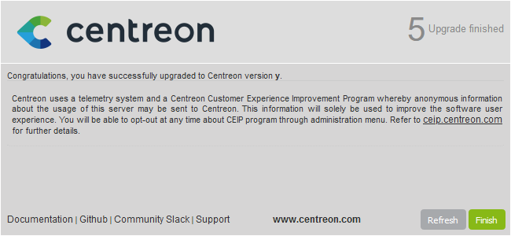

This chapter describes how to update your Centreon 20.10 platform.

## Perform a backup

Be sure that you have fully backed up your environment for the following
servers:

- Central server
- Database server

## Update the Centreon Central server

### Update the Centreon solution

Clean yum cache:

```shell
yum clean all --enablerepo=*
```

Then upgrade all the components with the following command:

```shell
yum update centreon\*
```

### Finalizing the update

Log on to the Centreon web interface to continue the update process:

Click on **Next**:


Click on **Next**:


The release notes describe the main changes. Click on **Next**:


This process performs the various upgrades. Click on **Next**:


Your Centreon server is now up to date. Click on **Finish** to access the login
page:



> If the Centreon BAM module is installed, refer to the
> [update procedure](../service-mapping/update.html).

Deploy Central's configuration from the Centreon web UI by following [this
procedure](../monitoring/monitoring-servers/deploying-a-configuration.html),

Finally, restart Broker, Engine and Gorgone on the Central server by running
this command:

```shell
systemctl restart cbd centengine gorgoned
```

### Update extensions

From `Administration > Extensions > Manager`, update all extensions, starting
with the following:

  - License Manager,
  - Plugin Packs Manager,
  - Auto Discovery.

Then you can update all other commercial extensions.

## Update the Remote Servers

This procedure is the same than to update a Centreon Central server.

> At the end of the update, configuration should be deployed from Central
> server.

## Update the Pollers

Clean yum cache:

```shell
yum clean all --enablerepo=*
```

Upgrade all the components with the following command:

```shell
yum update centreon\*
```

> Accept new GPG keys from the repositories as needed.

Deploy Poller's configuration from the Centreon web UI by following [this
procedure](../monitoring/monitoring-servers/deploying-a-configuration.html),
and choose *Restart* method for Engine process.

Finally, restart Gorgone service if it is used on the Poller:

```shell
systemctl restart gorgoned
```
