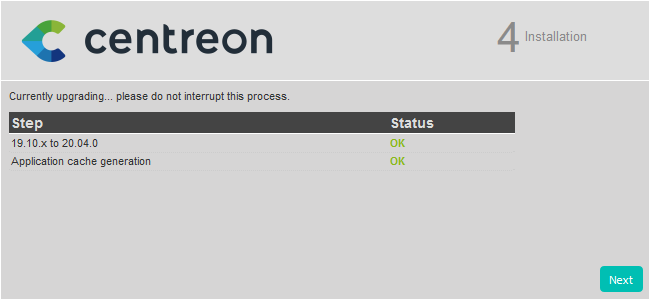
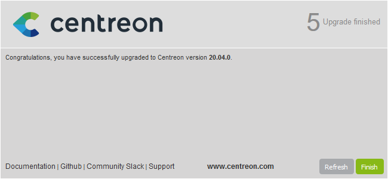

This chapter describes how to upgrade your Centreon platform from version 3.4
(Centreon Web 2.8) to version 21.04.

> This procedure only applies to Centreon platforms installed from Centreon 3.4
> packages on CentOS **version 7** distributions.
>
> If this is not the case, refer to the
> [migration procedure](../migrate/migrate-from-3-4.html).

## Perform a backup

Be sure that you have fully backed up your environment for the following
servers:

- Central server
- Database server

## Upgrade the Centreon central server

> Since 21.04, Centreon uses **MariaDB 10.5**.
>
> This upgrade process will only upgrade Centreon components first.
>
> MariaDB will be upgraded afterwards.

### Install Redhat Software Collections repository

Run the following commands:

```shell
yum install -y http://yum.centreon.com/standard/21.04/el7/stable/noarch/RPMS/centreon-release-21.04-1.el7.centos.noarch.rpm
```

> If you are using a CentOS environment, you must install the *Software
> Collections* repositories with the following command:
>
> ```shell
> yum install -y centos-release-scl-rh
> ```

### Upgrade the Centreon solution

Clean yum cache:

```shell
yum clean all --enablerepo=*
```

Upgrade all the components with the following command:

```shell
yum update centreon\*
```

> Accept new GPG keys from the repositories as needed.

### Additional actions

#### Update the PHP version

Since 20.04, Centreon uses a new version of PHP.

The PHP timezone should be set. Run the command:

```shell
echo "date.timezone = Europe/Paris" >> /etc/opt/rh/rh-php73/php.d/50-centreon.ini
```

> Change **Europe/Paris** to your time zone. You can find the supported list of
> time zone [here](http://php.net/manual/en/timezones.php).

Then, run the following commands:

```shell
systemctl enable rh-php73-php-fpm
systemctl start rh-php73-php-fpm
```

#### Update the Apache web server

Since 20.04, Centreon uses a new version of Apache web server.

> If you made manual configuration, please report it into
> **/opt/rh/httpd24/root/etc/httpd/conf.d/**.

If SSL mode was enabled, execute command:

```shell
yum install httpd24-mod_ssl
```

Then, run the following commands:

```shell
systemctl disable httpd
systemctl stop httpd
systemctl enable httpd24-httpd
systemctl start httpd24-httpd
```

#### Configure Apache API access

If you had a custom apache configuration, upgrade process through RPM did not update it.

> If you use https, you can follow
> [this procedure](../administration/secure-platform.html#securing-the-apache-web-server)

You'll then need to add API access section to your configuration file:
**/opt/rh/httpd24/root/etc/httpd/conf.d/10-centreon.conf**

Only lines with "+" symbol must be taken into account.

```diff
+Alias /centreon/api /usr/share/centreon
Alias /centreon /usr/share/centreon/www/

+<LocationMatch ^/centreon/(?!api/latest/|api/beta/|api/v[0-9]+/|api/v[0-9]+\.[0-9]+/)(.*\.php(/.*)?)$>
+  ProxyPassMatch fcgi://127.0.0.1:9042/usr/share/centreon/www/$1
+</LocationMatch>

+<LocationMatch ^/centreon/api/(latest/|beta/|v[0-9]+/|v[0-9]+\.[0-9]+/)(.*)$>
+  ProxyPassMatch fcgi://127.0.0.1:9042/usr/share/centreon/api/index.php/$1
+</LocationMatch>

ProxyTimeout 300

<Directory "/usr/share/centreon/www">
    DirectoryIndex index.php
    Options Indexes
    AllowOverride all
    Order allow,deny
    Allow from all
    Require all granted
    <IfModule mod_php5.c>
        php_admin_value engine Off
    </IfModule>

+    RewriteRule ^index\.html$ - [L]
+    RewriteCond %{REQUEST_FILENAME} !-f
+    RewriteCond %{REQUEST_FILENAME} !-d
+    RewriteRule . /index.html [L]
+    ErrorDocument 404 /centreon/index.html

    AddType text/plain hbs
</Directory>

+<Directory "/usr/share/centreon/api">
+    Options Indexes
+    AllowOverride all
+    Order allow,deny
+    Allow from all
+    Require all granted
+    <IfModule mod_php5.c>
+        php_admin_value engine Off
+    </IfModule>
+
+    AddType text/plain hbs
+</Directory>

RedirectMatch ^/$ /centreon
```

Then, restart apache service :

```shell
systemctl restart httpd24-httpd
```

### Synchronize the plugins

> Centreon Web 21.04 resource $USER1$ actually points to
> /usr/lib64/nagios/plugins.

To mitigate this issue run the following commands:

```shell
mv /usr/lib64/nagios/plugins/* /usr/lib/nagios/plugins/
rmdir /usr/lib64/nagios/plugins/
ln -s -t /usr/lib64/nagios/ /usr/lib/nagios/plugins/
```

You now have a symbolic link as:

```shell
$ ls -alt /usr/lib64/nagios/
lrwxrwxrwx   1 root root      24  1 nov.  17:59 plugins -> /usr/lib/nagios/plugins/
-rwxr-xr-x   1 root root 1711288  6 avril  2018 cbmod.so
```

### Finalizing the upgrade

Before starting the web upgrade process, reload the Apache server with the
following command:

```shell
systemctl reload httpd24-httpd
```

Then log on to the Centreon web interface to continue the upgrade process:

Click on **Next**:


Click on **Next**:


The release notes describe the main changes. Click on **Next**:


This process performs the various upgrades. Click on **Next**:



Your Centreon server is now up to date. Click on **Finish** to access the login
page:



### Post-upgrade actions

#### Upgrade extensions

From `Administration > Extensions > Manager`, upgrade all extensions, starting
with the following:

  - License Manager,
  - Plugin Packs Manager,
  - Auto Discovery.

Then you can upgrade all other commercial extensions.

#### Start the tasks manager

Since 20.04, Centreon has changed his tasks manager from *Centcore* to *Gorgone*.

To act this change, run the following commands:

```shell
systemctl stop centcore
systemctl enable gorgoned
systemctl start gorgoned
systemctl disable centcore
```

Engine statistics that have been collected by *Centcore* will know be collected
by *Gorgone*.

Change the rights on the statistics RRD files by running the following command:

```shell
chown -R centreon-gorgone /var/lib/centreon/nagios-perf/*
```

#### Restart monitoring processes

Centreon Broker component has changed its configuration file format.

It now uses JSON instead of XML.

To make sure Broker and Engine's Broker module are using new configuration files,
follow this steps:

1. Deploy Central's configuration from the Centreon web UI by following
[this procedure](../monitoring/monitoring-servers/deploying-a-configuration.html),
2. Restart both Broker and Engine on the Central server by running this
command:

    ```shell
    systemctl restart cbd centengine
    ```

### Upgrade MariaDB server

The MariaDB components can now be upgraded.

Be aware that MariaDB strongly recommends to upgrade the server through each
major release. Please refer to the [official MariaDB
documentation](https://mariadb.com/kb/en/upgrading/) for further information.

You must update MariaDB from your starting version (probably 10.1), up to
version 10.5. The version upgrade must be done 1 to 1, for example 10.1 to 10.2,
10.2 to 10.3, etc.

That is why Centreon provides all versions from 10.1 to 10.5 on its stable
repositories.

> Refer to the official MariaDB documentation to know more about this process:
>
> - https://mariadb.com/kb/en/upgrading-from-mariadb-101-to-mariadb-102/#how-to-upgrade
> - https://mariadb.com/kb/en/upgrading-from-mariadb-102-to-mariadb-103/#how-to-upgrade
> - https://mariadb.com/kb/en/upgrading-from-mariadb-103-to-mariadb-104/#how-to-upgrade
> - https://mariadb.com/kb/en/upgrading-from-mariadb-104-to-mariadb-105/#how-to-upgrade

> If you are using a version older than MariaDB 10.1, please update to version
> 10.1 first.

#### Configuration

`innodb_additional_mem_pool_size` parameter has been removed since MariaDB 10.2, so you should remove it
from file **/etc/my.cnf.d/centreon.cnf**

```diff
#
# Custom MySQL/MariaDB server configuration for Centreon
#
[server]
innodb_file_per_table=1

open_files_limit = 32000

key_buffer_size = 256M
sort_buffer_size = 32M
join_buffer_size = 4M
thread_cache_size = 64
read_buffer_size = 512K
read_rnd_buffer_size = 256K
max_allowed_packet = 8M

# For 4 Go Ram
-#innodb_additional_mem_pool_size=512M
#innodb_buffer_pool_size=512M

# For 8 Go Ram
-#innodb_additional_mem_pool_size=1G
#innodb_buffer_pool_size=1G
```

#### Upgrade from 10.1 to 10.2

Follow those summarized steps to perform the upgrade in the way recommended by
MariaDB:

1. Stop the mariadb service:

    ```shell
    systemctl stop mariadb
    ```

2. Uninstall current 10.1 version:

    ```shell
    rpm --erase --nodeps --verbose MariaDB-server MariaDB-client MariaDB-shared MariaDB-compat MariaDB-common
    ```

3. Install 10.2 version:

    ```shell
    yum install MariaDB-server-10.2\* MariaDB-client-10.2\* MariaDB-shared-10.2\* MariaDB-compat-10.2\* MariaDB-common-10.2\*
    ```

4. Start the mariadb service:

    ```shell
    systemctl start mariadb
    ```

5. Launch the MariaDB upgrade process:

    ```shell
    mysql_upgrade
    ```

> Refer to the [official documentation](https://mariadb.com/kb/en/mysql_upgrade/)
> if errors occur during this last step.

#### Upgrade from 10.2 to 10.3

Follow those summarized steps to perform the upgrade in the way recommended by
MariaDB:

1. Stop the mariadb service:

    ```shell
    systemctl stop mariadb
    ```

2. Uninstall current 10.2 version:

    ```shell
    rpm --erase --nodeps --verbose MariaDB-server MariaDB-client MariaDB-shared MariaDB-compat MariaDB-common
    ```

3. Install 10.3 version:

    ```shell
    yum install MariaDB-server-10.3\* MariaDB-client-10.3\* MariaDB-shared-10.3\* MariaDB-compat-10.3\* MariaDB-common-10.3\*
    ```

4. Start the mariadb service:

    ```shell
    systemctl start mariadb
    ```

5. Launch the MariaDB upgrade process:

    ```shell
    mysql_upgrade
    ```

> Refer to the [official documentation](https://mariadb.com/kb/en/mysql_upgrade/)
> if errors occur during this last step.

#### Upgrade from 10.3 to 10.4

Follow those summarized steps to perform the upgrade in the way recommended by
MariaDB:

1. Stop the mariadb service:

    ```shell
    systemctl stop mariadb
    ```

2. Uninstall current 10.3 version:

    ```shell
    rpm --erase --nodeps --verbose MariaDB-server MariaDB-client MariaDB-shared MariaDB-compat MariaDB-common
    ```

3. Install 10.4 version:

    ```shell
    yum install MariaDB-server-10.4\* MariaDB-client-10.4\* MariaDB-shared-10.4\* MariaDB-compat-10.4\* MariaDB-common-10.4\*
    ```

4. Start the mariadb service:

    ```shell
    systemctl start mariadb
    ```

5. Launch the MariaDB upgrade process:

    ```shell
    mysql_upgrade
    ```

> Refer to the [official documentation](https://mariadb.com/kb/en/mysql_upgrade/)
> if errors occur during this last step.

#### Upgrade from 10.4 to 10.5

Follow those summarized steps to perform the upgrade in the way recommended by
MariaDB:

1. Stop the mariadb service:

    ```shell
    systemctl stop mariadb
    ```

2. Uninstall current 10.4 version:

    ```shell
    rpm --erase --nodeps --verbose MariaDB-server MariaDB-client MariaDB-shared MariaDB-compat MariaDB-common
    ```

3. Install 10.5 version:

    ```shell
    yum install MariaDB-server-10.5\* MariaDB-client-10.5\* MariaDB-shared-10.5\* MariaDB-compat-10.5\* MariaDB-common-10.5\*
    ```

4. Start the mariadb service:

    ```shell
    systemctl start mariadb
    ```

5. Launch the MariaDB upgrade process:

    ```shell
    mysql_upgrade
    ```

> Refer to the [official documentation](https://mariadb.com/kb/en/mysql_upgrade/)
> if errors occur during this last step.

#### Enable MariaDB on startup

Execute the following command:

```shell
systemctl enable mariadb
```

## Upgrade the Pollers

### Update the Centreon repository

Run the following command:

```shell
yum install -y http://yum.centreon.com/standard/21.04/el7/stable/noarch/RPMS/centreon-release-21.04-1.el7.centos.noarch.rpm
```

> If you are using a CentOS environment, you must install the *Software
> Collections* repositories with the following command:
>
> ```shell
> yum install -y centos-release-scl-rh
> ```

### Upgrade the Centreon solution

Clean yum cache:

```shell
yum clean all --enablerepo=*
```

Upgrade all the components with the following command:

```shell
yum update centreon\*
```

> Accept new GPG keys from the repositories as needed.

If the Centreon BAM module is installed, refer to the
[upgrade procedure](../service-mapping/upgrade.html).

### Post-upgrade actions

Due to new configuration file format for Engine's Broker module, the
configuration needs to be re-deployed.

Deploy Poller's configuration from the Centreon web UI by following
[this procedure](../monitoring/monitoring-servers/deploying-a-configuration.html),
and choose *Restart* method for Engine process.

## Migrate Centreon Poller Display to Remote Server

If the platform has Pollers with Poller Display module installed, refer to the
[Migrate a platform with Poller Display
module](../migrate/poller-display-to-remote-server.html) procedure.

## Communications

By default, the communication between Central and Pollers or Remote Servers
will still be using SSH protocol.

Consider changing the communication protocol by following the
[Change communication from SSH to ZMQ](../monitoring/monitoring-servers/communications.html#change-communication-from-ssh-to-zmq)
procedure.

## Secure your platform

Don't forget to secure your Centreon platform following our
[recommendations](../administration/secure-platform.html)
