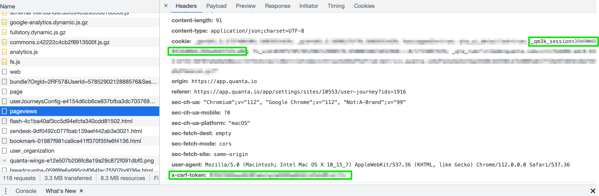

---
id: enable-disable-scenario-or-alert-via-api
title: Automate enabling/disabling a journey or an alert via API
--- 

In some situations it can be useful to modify Experience Monitoring's configuration automatically. Use cases are many, but the most common are:

- disabling or re-enabling a journey (for example disabling it during a site maintenance window so the maintenance period is excluded from downtime statistics)
- changing a variable inside a journey configuration (for instance swapping the journey after a new site release), or changing the e-mail address used by an account creation scenario.

## Example with a simple REST request

In Experience Monitoring, all features are accessible through the API, so you can send requests to Experience Monitoring using tools such as curl or wget by specifying the site ID, the User Journey ID and the authentication parameters (**x-csrf-token** and **_qm3k_session**).

Example: a REST request to disable a journey for which the Experience Monitoring UI edit panel URL is https://app.quanta.io/app/settings/sites/29274/user-journey?ids=2913:

```bash
curl "https://app.quanta.io/api/sites/29274/uj/journeys/2913" -X 'PUT' \
  -H "authority: app.quanta.io" \
  -H "accept: application/json" \
  -H "accept-language: fr-FR,fr;q=0.9" \
  -H "x-csrf-token: XXXXXXXXXXXXXXXXXXXXXXXXXXXXXXXXXXXXXXX=" \
  -H "content-type: application/json;charset=UTF-8" \
  -H "cookie: _qm3k_session=XXXXXXXXXXXXXXXXXXXXXXXXXXXXXXX" \
  --data-raw '{"user_journey":{id:"**2913**","enabled":**false**}}'
```

## Implementation as a shell script

For more flexibility, here is an example shell script that performs these types of modifications.

```bash
#!/bin/bash

# Define CSRF token and _qm3k_session variables
csrf_token="XXXXXXXXXXXXXXXXXXXXXXXXXXXXXXXXXXXXXXX="
qm3k_session="XXXXXXXXXXXXXXXXXXXXXXXXXXXXXXX"

# Show help for the script
function show_help {
  echo "Usage: ./modif-uj.sh <site_id> <journey_id> [--set-variable <var_name>=<value>] [--enable <value>]"
  echo "Example: ./modif-uj.sh 4028 2830 --set-variable example=42 --enable true"
}

# Ensure site and journey IDs are provided
if [ $# -lt 2 ]; then
  show_help
  exit 1
fi

# Read site and journey IDs
site_id="$1"
journey_id="$2"
shift 2

# Parse command-line options
while [[ $# -gt 0 ]]; do
  case $1 in
    --set-variable)
      if [[ "$2" =~ ^[^=]+=.+$ ]]; then
        variable_name="${2%%=*}"
        variable_value="${2#*=}"
      fi
      shift
      ;;
    --enable)
      enable_value="$2"
      shift
      ;;
    *)
      show_help
      exit 1
      ;;
  esac
  shift
done

# API URL
api_url="https://app.quanta.io/api/sites/$site_id/uj/journeys/$journey_id"

# Build request body based on provided options
request_body="{\"user_journey\":{\"id\":$journey_id"
if [ "$enable_value" == "true" ]; then
  request_body+=",\"enabled\":true"
elif [ "$enable_value" == "false" ]; then
  request_body+=",\"enabled\":false"
fi
if [ -n "${variable_name+set}" ]; then
    request_body+=",\"variables\":[{\"name\":\"$variable_name\",\"value\":\"$variable_value\"}]"
fi
request_body+='}}'

# Perform the PUT request using curl
curl "$api_url" -X 'PUT' \
  -H "authority: app.quanta.io" \
  -H "accept: application/json" \
  -H "accept-language: fr-FR,fr;q=0.9" \
  -H "x-csrf-token: $csrf_token" \
  -H "content-type: application/json;charset=UTF-8" \
  -H "cookie: _qm3k_session=$qm3k_session" \
  --data-raw "$request_body"
```

## Authentication tokens

These requests require administrative rights on the targeted site in Experience Monitoring, so you must provide authentication tokens at the top of the script:

```bash
# Define CSRF token and _qm3k_session variables
csrf_token="XXXXXXXXXXXXXXXXXXXXXXXXXXXXXXXXXXXXXXX="
qm3k_session="XXXXXXXXXXXXXXXXXXXXXXXXXXXXXXX"
```

To obtain these values, open Chrome DevTools > Network while loading an Experience Monitoring UI page and look for the **csrf_token** and **qm3k_session** parameters in the browser's HTTP request, like in the screenshot below:



For security, we strongly recommend creating a dedicated Experience Monitoring user account for API usage.

Example: `mylogin+api@mydomain.com`

## Example usage

In the sample script the first two arguments are the site ID and the User Journey ID. Both IDs appear in the journey edit URL in Experience Monitoring.

Once you have these values, use the script like this:

```bash
$ ./modif-uj.sh 29274 2913 --enable false
{"success":"Journey successfully updated!",[...]
$ ./modif-uj.sh 29274 2913 --set-variable variable-to-change=50 --enable true
{"success":"Journey successfully updated!",[...]
$
```

## Next steps

The same logic applies to all Experience Monitoring features, which are accessible via the API. Feel free to inspect requests and adapt this script to your needs.
