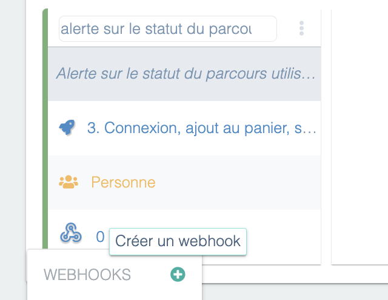
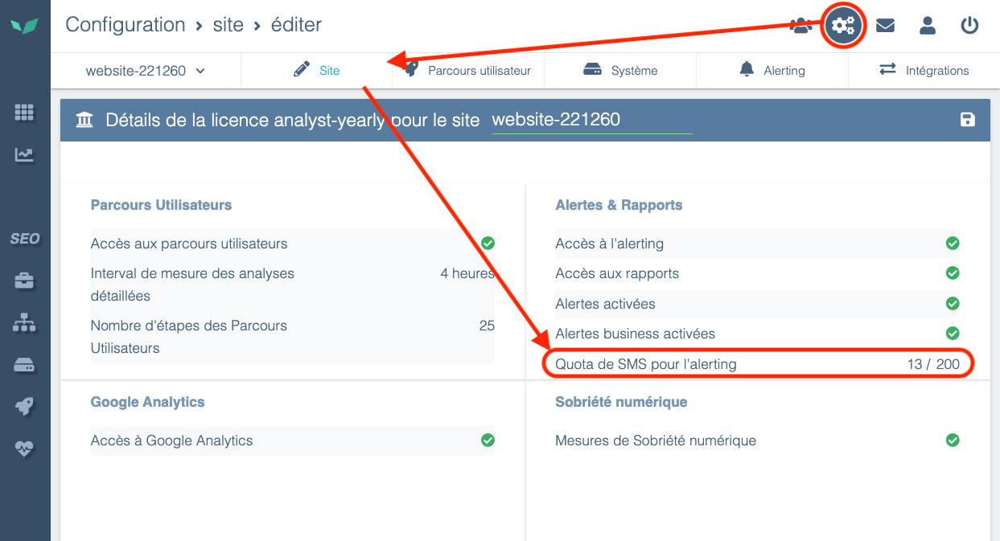

Alerts are available **by email with all licenses**.

Some licenses allow receiving alerts **by SMS, Slack, or webhooks** (Microsoft Teams, Google Chat, Mattermost...). To subscribe to this option, contact your sales representative or support:

[Contact Experience Monitoring support](http://support.centreon.com/)

## Configure communication channels

Notifications are personal. For a user to receive emails, SMS, or Slack messages, simply configure the information on their profile page.


To send a notification to a Teams channel, Google Chat, or other messaging software, you can use webhooks in the alerts.

> If you want to send notifications to a team email address, you can create a user that uses that team email. [See the dedicated page, Manage your users and their rights](./manage-users-and-rights.md)

## Access the alerting and reporting settings screen

You can access the configuration screen by clicking the three dots above a user journey, then **Alerting**.


You can also access the configuration screen by clicking **Configuration** then **Alerting**.


## Set up alerts

### Alert schedule

Users can define periods during which they do not receive alerts.


Additionally, each alert can be enabled/disabled for specific time ranges so it doesn't notify subscribed people regardless of their personal schedule.

### Configure an alert

Select how you want to be alerted (SMS/Email/Slack). Here are some example messages you may receive:

#### Email


#### SMS


#### Webhook

In addition to email or SMS alerts, Experience Monitoring allows users to receive alerts via a **webhook**, giving greater flexibility for integrating with other tools and systems. When an incident is detected on a monitored web application, Experience Monitoring can send an **HTTP POST** request to a URL specified by the user. This URL can be protected by htaccess, and the user can also define **custom headers** if needed.
You can configure this URL by clicking the word “Webhook” for a newly created or existing alert, then clicking the “**+**” icon (**Create a webhook**):



Then simply enter the URL of your choice and any htaccess credentials (if the API is protected by htaccess):


The body of the POST request that will be sent in case of an alert contains a **JSON payload** with detailed information about the alert, allowing automated processing of the data. Here is an example of the format sent:

```json
{
  "start_clock": 1739292540,
  "journey_id": 3682,
  "journey_name": "1. Mon scénario",
  "interaction_id": 19640,
  "interaction_name": "Accueil",
  "interaction_number": 0,
  "incident_id": 5898982,
  "incident_kind": "expectation_failed",
  "traits": {
    "pending_expectations": [
      {
        "kind": "text",
        "details": "vous êtes ici"
      }
    ],
    "details": "50s",
    "current_url": "https://perdu.com/"
  },
  "url": "https://app.quanta.io/app/sites/1390/uj/3682?from=1739292480&to=1739292660",
  "settings_url": "https://app.quanta.io/app/settings/sites/1390/alerting?section=uj&ids=4947",
  "alert_status": "error",
  "site_name": "perdu.com",
  "site_id": 1390,
  "detected_at_clock": 1739292540
}
```

Explanation of the data sent:

- **`start_clock`**: Unix timestamp indicating the start of the incident.
- **`journey_id`** and **`journey_name`**: ID and name of the user journey.
- **`interaction_id`**, **`interaction_name`**, **`interaction_number`**: Information about the specific step in the journey that triggered the alert (e.g., the ID of the homepage).
- **`incident_id`** and **`incident_kind`**: Unique incident identifier and the type of problem detected (e.g., "expectation_failed" if an element was not found on the page).
- **`traits`**:
  - **`pending_expectations`**: List of checks that failed (e.g., a text test).
  - **`details`**: Additional information about the incident (e.g., a 50s wait).
  - **`current_url`**: The URL open in the browser at the time of the incident.
- **`url`**: Direct link to the incident in the Experience Monitoring interface.
- **`settings_url`**: Link to the alert settings for the concerned site.
- **`alert_status`**: Alert status (e.g., "error" for a critical error).
- **`site_name`** and **`site_id`**: Name and ID of the affected site.
- **`detected_at_clock`**: Unix timestamp of when the incident was detected.

When the alert ends (when the site is back to normal), Experience Monitoring will send a new “Recovery” webhook call indicating the issue has been resolved.
The POST body sent when an **alert is resolved** also contains a **JSON payload** with detailed information, like this:

```json
{
  "start_clock": 1739292540,
  "end_clock": 1739293920,
  "duration": 1380,
  "journey_id": 3682,
  "journey_name": "1. Mon scénario",
  "url": "https://app.quanta.io/app/sites/1390/uj/3682?from=1739292540&to=1739293920",
  "settings_url": "https://app.quanta.io/app/settings/sites/1390/alerting?section=uj&ids=4947",
  "alert_status": "recovery",
  "site_name": "perdu.com",
  "site_id": 1390,
  "detected_at_clock": 1739294100
}
```

Explanation of the data sent:

- **`start_clock`**: Unix timestamp indicating when the incident began.
- **`end_clock`**: Unix timestamp indicating when the incident ended (the moment the situation returned to normal).
- **`duration`**: Total duration of the incident in seconds (e.g., **1380s** which is **23 minutes**).
- **`journey_id`** and **`journey_name`**: ID and name of the user journey affected by the incident.
- **`url`**: Direct link to the incident in the Experience Monitoring interface to review the event timeline.
- **`settings_url`**: Link to the alert settings for the concerned site.
- **`alert_status`**: Alert status, here `"recovery"` to indicate the incident is over.
- **`site_name`** and **`site_id`**: Name and ID of the affected site.
- **`detected_at_clock`**: Unix timestamp of the recovery detection, i.e., when Experience Monitoring observed the problem was resolved.

With this feature, technical teams can **automate alert handling** by integrating alerts into their internal systems (Slack, monitoring tools, custom scripts, etc.) or external services (Zapier, PagerDuty, etc.).

## Configure alert thresholds

Once your alert is created, you can configure different thresholds:

- The alert threshold
- The resolution threshold.

You will receive notifications based on these.

Depending on the type of alert, you can control different thresholds:

- **Scenario status alert:** select after how many errors (inaccessible pages, missing string, timeout, dynamic selector not found) you want to be notified. By default the alert threshold is 3 failures within a 5-minute period, and your scenario is considered "repaired" when there are no errors over a 5-minute period.
- **Scenario time alert:** select your tolerance limit for increases in scenario time. By default, if the total time of your scenario exceeds the previous day's time by 15% at least 15 times out of 25 probe runs, you will be notified.

## Frequently asked questions

### What types of errors will trigger an alert?

You will receive an alert for anomalies such as: error codes, site unavailable, excessively long load times (over 20 sec), etc.

Each error is represented by red bars in Experience Monitoring. To know exactly what happened, check the alert message you received — it explains the reason for the incident.

### Are there quotas on alerts?

There are no quotas for emails, webhooks, and Slack notifications, but there are quotas for SMS. The SMS quota is set per site and is replenished monthly.

To see your SMS credit, go to **Configuration**, then the **Site** tab. You will find your quota in the **Alerts & Reports** section.


