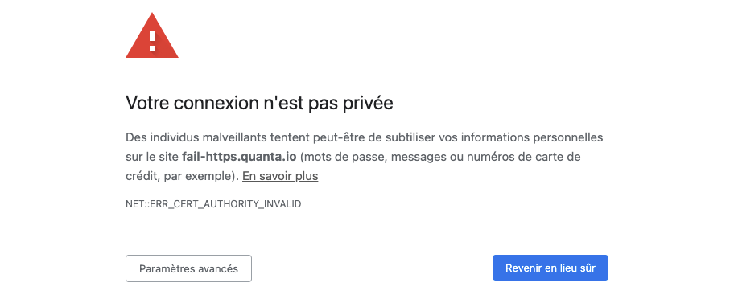

---
id: create-a-scenario
title: Creation of a scenario ("User Journey")
--- 

> You can check that you have enough remaining steps on the Organization page:
> 

You must have Owner or Administrator rights to edit your scenarios. You can check this on your Profile page:


To manage them, see:

[Manage your users and rights](../manage-users-and-rights.md)

## Entering scenario creation/edit mode

The scenario edit mode lets you modify existing user journeys or create new ones. In the left menu bar, click on **User Journeys**. At this point there are two possibilities:

### You don't have any journeys yet

If the site has no User Journey configured, this message will appear:


You can click **Configure your user journey now!** to enter edit mode.

### You already have at least one journey

If a journey exists, you will see a screen similar to this:


Click the three dots and choose **Configure** to enter edit/create mode.

## Create a journey

> Note that if the site you wish to monitor is internal to your organization, you will need to create an [STM zone](stm-zones.md) in addition to the user journey.

At the bottom of the edit page, you'll find a button to create a new journey:


Experience Monitoring generates a new journey with a single step: navigating to the root of your domain.

## Activate the journey

To activate your journey, you must save it. Click the **Save** icon or the button at the bottom of your journey:


You will see a loading indicator in the top-right corner that means your journey is saved but the probe hasn't run since the last changes:


When the probe runs, the content is updated automatically. You will then see the screenshots.

## Configure steps

> **A step contains at least one action** and always ends if a navigation occurs. **You can configure multiple actions in a step**, but a step cannot contain multiple navigation actions.
> For example, you can fill out a form, add a product to the cart, and then click to navigate to the cart all within a single step.

### Configure an action

There are 6 possible actions:

#### Navigate

Choose a URL to navigate to. This action is equivalent to entering a URL in the address bar and going there.

The URL must be within the domain authorized for your Experience Monitoring license.

#### Click

To choose what to click you have two options:

- Search for text
- Search for an element by its CSS selector.

If you search by text, the text must belong to a single HTML tag. Text that appears visually as a single phrase can be split across tags.

```html
<p>Click <span class="emphasis">quickly</span> to see what comes next</p>
```

```html
<p>Click quickly to see what comes next</p>
```

By default, Experience Monitoring will click the first occurrence found. You can choose to:

- click the first occurrence (default)
- click the second, third, etc.
- click randomly among all occurrences.

#### Hover

Hover uses exactly the same conditions as Click but only moves the mouse over the chosen text or CSS element.

This action is useful if elements only load after the mouse has hovered over a portion of the screen.

#### Fill out a form

Filling out a form is possible in Experience Monitoring. The probe relies on HTML standards.

**Form CSS selector**

If a page contains multiple forms, this option will limit the probe to the chosen form.

**Fill fields**

Fields can be selected by their names (the **name** attribute), their placeholders, their label text, or by CSS selectors.

**Submit the form**

By default, Experience Monitoring submits the form once filled. But you can modify this behavior. Your options are:

- Submit automatically (default): equivalent to pressing Enter in a form
- Disabled: do nothing once the form is filled
- Click a text: useful if the form is submitted elsewhere on the page
- Click a CSS element: same idea.

#### Wait

Sometimes there is no better solution than to wait for an action to happen. For example, if elements fade in after 1s, then waiting 1s lets you capture screenshots with those elements visible.

This should be a last-resort option and used rarely.

#### Run a script

If all other actions fail, you can use this option to run JavaScript in the browser to force an action. Avoid using scripts to replace other actions unless necessary. Note that the script guarantees the action is executed, but not that it succeeds, so you should add a verification step after each script:
- DOM: (visible element, class changed)
- Network: expected request (URL, HTTP status...)

Keep your scripts short, simple and with precise specifications.

### Configure a verification

After an action is performed, you can add success verifications.

**The last action must have at least one verification.**

#### Confirm that navigation occurred

> This verification cannot be removed for a Navigate action.

The probe will check that a new HTML document was loaded correctly, meaning:

- The HTML document fully loaded
- The response status code is 200

No content verification is performed.

#### Find text

> We recommend using CSS selectors because they are less sensitive to site changes. If you don't know how to create CSS selectors, contact your agency or Experience Monitoring support (support@quanta.io or the question mark at the bottom-right in Experience Monitoring) so we can help configure your journey.

This verification uses the same logic as the Click and Hover actions. If the text you search for exists on the page after the action, the verification passes.

#### Find the CSS element

This verification finds an element using its CSS selector. **If it's an image, the probe also verifies that the image loads correctly.**

#### Make a request

This verification validates that a request to an address was made at some point after the action. The request must be successful; redirects are allowed.

You can use the * wildcard to match requests. For example, if you need to call a URL to add an item to the cart that looks like **https://my-site.com/add-to-cart?id=my-product-id** you can replace it with **https://my-site.com/add-to-cart** to avoid the verification failing if the product ID changes or if another parameter is added before or after the ID.

## Advanced step configuration

Steps also have their own parameters that influence the actions within. To access this advanced configuration, click the three dots at the end of the desired step line and choose **Advanced**.

### Enabled/Disabled: remove the step from the journey without losing its configuration

You can choose to remove a step without deleting it. The probe will ignore this step and will not play it.

### Measured/Unmeasured: play the step but do not verify results

Unchecking this option lets the step execute without being measured or shown elsewhere in the interface. An example use case would be closing a feedback request form that appears randomly for part of your traffic. Sometimes the probe will encounter and close it; other times the probe will ignore the error caused by not encountering the form.

#### Step timeout

You can set a different timeout for this step, either shorter or longer than the journey's global configuration.

## General journey configuration

Each step has actions, and the journey as a whole has configuration options to set. To access these configurations in edit mode, click the three dots on your journey and choose **Advanced** to open the menu.

### Name

Choose a name to identify this journey in reports and across Experience Monitoring screens.

We recommend using distinct names and a numbering system. For example:

- 1- Guest checkout
- 2- Personal account login

### PHP profiling

> By default, Experience Monitoring enables it when it receives PHP data.

Allows enabling/disabling PHP profiling for this journey if you have the Experience Monitoring system agent and the PHP module installed on your servers.

You can find the agent installation procedure on this page:

[Experience Monitoring installation checklist](../../installation/installation-checklist.md)

### Check SSL certificate

> Enabled by default.

Allows enabling/disabling TLS/SSL certificate validation.

When a site is not secure, users may see a page similar to this:



By default, Experience Monitoring considers the journey failed in case of such a security issue. Disable this option to ignore these errors.

### HTTP Basic authentication (.htaccess)

Some sites, especially preproduction environments, use HTTP Basic authentication (or .htaccess) to protect the site from external access, in addition to user authentication.

Provide a username and password to enable this authentication option. If the fields are empty, the probe will not send requests using HTTP Basic authentication.

### Browser settings (fiber/4G network, desktop or mobile, etc.)

**Enable browser cache**

> Enabled by default

Browsers "cache" content. For example, your site's logo isn't downloaded every time a user opens a new page. The browser recognizes it's the same image and displays it from memory instead of downloading it.

Disable this so the probe downloads all content on each interaction.

**User Agent**

> By default, the probe identifies as a Google Chrome browser.

The User Agent is information the browser sends to your site to indicate which browser it uses so the site can adapt content if needed.

It can be useful to change it to identify the probe differently from regular traffic.

**Bandwidth limit**

Choose a bandwidth representative of your traffic. Choose 3G or 4G when using a mobile format, and ADSL or Fiber when using a desktop format.

**Simulate a device**

Choose a device type such as desktop, tablet, or phone from the list.

> Changing the device type does not change the browser or hardware used but simulates the screen size of the chosen device.

**Orientation**

Choose whether the phone or tablet is used in portrait or landscape mode.

**Cookies**

Add custom cookies to store data or sessions at journey start.

**HTTP headers**

You can add custom HTTP headers.

### Probe settings (measurement interval, timeout)

**Wait for full load**

> Enabled by default

By default, the probe waits for the OnLoad event before moving to the next step, even if verifications are successful. You can disable this behavior and force the probe to advance as soon as verifications complete, even if the page hasn't fully loaded.

**Measurement interval**

> If the journey takes longer than the measurement interval, the probe will not finish the journey and will restart from the beginning.

> A larger measurement interval means less data sent over the network and less work for your servers.

Choose how often the probe should run the journey.

**Step timeout**

If the probe spends this time on a step, consider it failed. A timeout that's too short risks returning false positives. A timeout that's too long risks missing errors and alerts for slow loads.

### Blacklisted URLs (exclude Experience Monitoring from traffic measurement statistics)

By default we exclude the following providers:

- DoubleClick
- Hotjar
- Google Analytics
- Our own RUM
- Google Ads
- Google Maps

To prevent the probe from being counted in some of your tools, you can tell it not to send requests to custom domains.

This has two benefits:

- Not counting the probe in traffic statistics
- Preventing the probe from loading elements that incur a cost per view. For example, Google Maps charges based on the number of requests. If the probe accesses a page containing a map, you will be billed for that. Disabling that domain can save costs.

You can use the * wildcard to easily define a pattern. For example, if you exclude **https://my-traffic-analyzer.fr/api/v*/** then requests to v1, v2, v3, etc. of that API, regardless of content, will be blocked by the probe.

### Variables list

Variables allow you to provide information to the probe such as passwords, or texts to send during the run.

For example, you can define **login** and **password** variables to insert on the login page to access an area.

You cannot vary these variables within the "User Journey" section. Variables are useful in two cases:

- You need different values between regular measurements and daily recommendation audits
- You need different values across different browsers during a load test (simulate multiple users with different logins).
