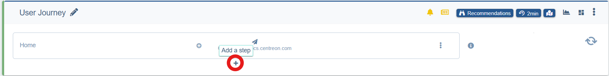
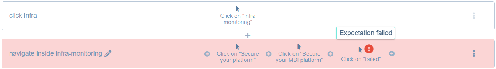

---
id: create-a-scenario
title: Creating a User Journey
description: Configure a user journey probe and its individual steps
---
import Tabs from '@theme/Tabs';
import TabItem from '@theme/TabItem';

> Note that if the site you wish to monitor is internal to your organization, you will need to create an [STM zone](stm-zones.md) in addition to the user journey.

> This page mentions [CSS selectors](../../experience-monitoring-glossary.md) frequently. We recommend reading on this topic before proceeding.

Only users with the **Owner** or **Administrator** role can create or edit user journeys.

User journeys allows you to configure a probe to regularly navigate your site following a pre-established path. This page explains how to configure both the journey as a whole and its individual steps.

For this module to work properly, you may need to whitelist the following IP addresses used by Experience Monitoring:

<details>
  <summary>IP addresses</summary>

- 18.200.8.204
- 34.241.126.134
- 34.242.201.38
- 34.243.127.23
- 34.248.113.181
- 34.250.75.1
- 34.252.162.102
- 34.255.79.251
- 52.17.157.120
- 52.18.157.52
- 52.19.60.226
- 52.30.194.126
- 52.31.137.223
- 52.48.148.3
- 52.48.151.164
- 52.50.31.122
- 52.51.174.216
- 52.208.14.10
- 52.209.27.6
- 52.210.233.251
- 52.212.161.58
- 52.214.41.253
- 54.78.224.201
- 54.154.70.169
- 54.170.78.117
- 54.170.157.253
- 63.34.122.21
- 63.34.67.195
- 99.81.201.50
- 176.34.232.22
- 185.48.122.159

</details>

To create a User Journey, go to the **Settings** page and click on the **User Journeys** tab. Then, click on **Create a User Journey**. A journey is added with a first step named "Home" to navigate to your site's homepage automatically configured.

## User Journey configuration

To access the advanced settings, open your journey in edit mode, click the three dots menu to its right, and select **Advanced**.

Remember to click **Save** after any changes in this window.

<Tabs groupId="journeyConfig" queryString>
<TabItem value="General" label="General">

Give your journey a clear, unique name. This name appears in reports and throughout the Experience Monitoring interface.

To the right of the name you can choose to:

- Enable or disable this User Journey so it is not executed but still saved for later use.
- Enable or disable PHP profiling for this journey if you have the Experience Monitoring system agent and PHP module installed on your servers. Not sure if this applies to you? Check the [Experience Monitoring installation checklist](../../installation/installation-checklist.md).
- Enable or disable the SSL check. The probe will fail the journey if your site presents an invalid or expired SSL certificate. Disable this only if you intentionally run the journey on a non-secure environment.

#### Synthetic Monitoring Zones

If you previously configured [STM Zones](stm-zones.md), you will have the option to select a private zone here. Your public site is selected by default.

#### Daily recommendations audits

In addition to the User Journey probe, a recommendations probe is run once a day to give you personalized advice on how to optimize your site. 
The **Operating mode** options allow you to disable this probe, have it only check your first step or check all steps. 
You can also change the language of the recommendations.

</TabItem>
<TabItem value="HTTP Requests" label="HTTP Requests">

#### HTTP Basic authentication

If your site (or a staging environment) is protected by HTTP Basic authentication (sometimes called `.htaccess` protection), enter the credentials here. Leave the fields empty if no protection of this type is used.

#### Cookies

Add custom cookies to store data or sessions at journey start.

#### HTTP Headers

You can add custom HTTP headers.

</TabItem>
<TabItem value="Simulation" label="Simulation">

#### Enable browser cache

When this option is enabled, the probe stores certain aspects of the site that are reused throughout the different pages to reduce loading times.
For example, the probe may store the logo of your site as it is often present on all pages.
This simulates a returning user. Disable this to simulate a first-time visitor who downloads everything. 

#### Browser version

Determine on which Chromium version the probe will run.

#### User Agent

The User Agent is an HTTP Header string that every browser sends to the page it is viewing. It informs the page what browser and what type of device you are using to access it.
You can input a custom string to simulate a specific browser.

#### Device options

Here you can determine the screen size that the probe will pretend to work with and its orientation if you selected the screen size of a phone or tablet.

You can also determine how powerful would be the device used by user.

</TabItem>
<TabItem value="Timings" label="Timings">

Determine the interval between each execution of the probe. You can also configure how much time the probe waits for a step before determining it a timeout.

Note that the time it takes for the probe to execute the entire journey must be lower than the time between each execution.
For example, do not set an interval of 5 minutes between executions on a user journey that averages 7 minutes per run.

Because of this requirement, it is recommended to set a high interval at first then lowering its value as you figure out how long the probe takes.

#### Wait onLoad

The probe waits for all elements of the page to have fully loaded before moving on to the next action. This better imitates a real user's behavior.

</TabItem>
<TabItem value="Variables" label="Variables">

Variables let you pass dynamic values such as login credentials into a journey at runtime without hardcoding them at the step.

Example: Define a `login` and `password` variable, then reference the variables in the step where the probe fills in a login form.

Variables are particularly useful when you need different values in different contexts:
- Regular monitoring vs. audit runs: use one set of credentials for daily checks, another for recommendation audits.
- Load testing: assign different logins to different browser instances to simulate multiple distinct users.

> Variables are fixed per journey configuration. To use different values, you will need separate variable definitions per context (monitoring vs. load test).

</TabItem>
<TabItem value="Blocked URLs" label="Blocked URLs">

You can tell the probe to skip requests to specific domains or URLs. This is useful when to:

- Keep probe traffic out of your analytics as it prevents the probe from inflating visit counts in tools like Google Analytics.
- Avoiding per-request costs. Some services (such as Google Maps) charge per request. If a page in your journey loads a map, each probe run generates a billable request. Blocking that domain eliminates the cost.

You can use an asterisk `*` as wildcard to avoid all versions of a domain. For example, blocking `https://my-analytics-tool.fr/api/v*/` will exclude all versions of that API (v1, v2, v3, and so on).

The following domains are blocked by default:

- DoubleClick
- Hotjar
- Google Analytics
- Centreon RUM
- Google Ads
- Google Maps

</TabItem>
</Tabs>

## Step or Action configuration

User journeys are composed of steps and actions. 
Steps represent a page while actions are anything a user can do within the same page (clicking on something, opening the search bar, etc.). 
A step can contain multiple actions.

> Each license has a limited number of steps available for use amongst all user journeys. These steps are shared amongst all sites of your organization.
> To see how many steps you have available, go to the **Licenses & Sites** tab in the **Organization** page.

Because navigation actions are always the only or the last action of a step, and a step to navigate to your site's homepage is already configured, you must now create a new step. 
To do so, click on the + icon below the first step.



Give a name to this new step and click the + icon inside the step to choose an action to perform.


### Possible actions in a User Journey

There are 6 possible actions that the probe can perform when following a User Journey:

<Tabs groupId="actions" queryString>
<TabItem value="Navigate" label="Navigate">

Choose a URL to navigate to. This action is the same as entering a URL in the address bar and going there. A User Journey always starts with a navigation action. 
Navigation actions are also always the only or the last action of a step.

The URL must be within the domain authorized for your Experience Monitoring license.

</TabItem>
<TabItem value="Click" label="Click">

Click on an object on the page you are currently in. To choose what to click you have two options:

- Search for an element by its CSS selector.
- Search for text

If you search by text, the text must belong to a single HTML tag. Note that text that appears visually as a single phrase can be split across tags. In some cases, something that looks like text may actually be an image of a text, in this case, you must select the image as an element because the probe does not recognize the contents of an image.

```html
<p>Click <span class="emphasis">quickly</span> to see what comes next</p>
```

```html
<p>Click quickly to see what comes next</p>
```

By default, Experience Monitoring will look for the first occurrence of your selected text or element. You can click the pencil icon below the text field to choose to:

- click the first occurrence (default)
- click the second, third, etc.
- click randomly among all occurrences.

</TabItem>
<TabItem value="Hover" label="Hover">

Hover uses the same conditions as Click but only moves the mouse over the chosen text or CSS element without clicking on it.

This action is useful if elements load after the mouse has hovered over a portion of the screen without needing to be clicked.

If you search by text, the text must belong to a single HTML tag. Note that text that appears visually as a single phrase can be split across tags. In some cases, something that looks like text may actually be an image of a text, in this case, you must select the image as an element because the probe does not recognize the contents of an image.

```html
<p>Click <span class="emphasis">quickly</span> to see what comes next</p>
```

```html
<p>Click quickly to see what comes next</p>
```

By default, Experience Monitoring will look for the first occurrence of your selected text or element. You can click the pencil icon below the text field to choose to:

- click the first occurrence (default)
- click the second, third, etc.
- click randomly among all occurrences.

</TabItem>
<TabItem value="Fill form" label="Fill form">

Fill in text fields with specific content. The probe relies on HTML standards to do this.

**Form's CSS selector**

Necessary if the page contains multiple forms, this option will limit the probe to the chosen form.

**Fill the input named**: fields can be selected by their names, their placeholder text, their label text, or by CSS selectors.
**by**: the text that the probe will input in the field.

Click **Add a field** for each field that the probe must fill

By default, Experience Monitoring submits the form once filled. You can click the pencil icon below **Add a field** to choose to:

- Submit automatically (default): equivalent to pressing Enter in a form
- Disabled: do nothing once the form is filled
- Click a text: useful if the form is submitted elsewhere on the page
- Click a CSS element: same idea.

</TabItem>
<TabItem value="Wait" label="Wait">

Sometimes there is no better solution than to wait for an action to happen. For example, if elements fade in after 1s, trying to add a step without a waiting action will cause the user journey to fail because the probe immediately looks for elements that aren't visible yet.

This should be a last-resort option and used rarely because it slows down your user journey stats.

</TabItem>
<TabItem value="Run a script" label="Run a script">

If all other actions fail, you can use this option to run JavaScript in the browser to force an action. Avoid using scripts to replace other actions unless necessary. Note that the script guarantees the action is executed, but not that it succeeds, so you should add an [expectation step](#adding-an-expectation) after each script:
- DOM: (visible element, class changed)
- Network: expected request (URL, HTTP status...)

Keep your scripts short, simple and with precise specifications.

</TabItem>
</Tabs>

## Adding an expectation

There is a seventh, (sometimes) optional action that the probe can perform after each other action.
This action is not seen among other actions for you to select but appears at the bottom of the action window once the action has been configured.

**Add an expectation** makes the probe verify that the action was properly executed. You can add an expectation after every action.

For example, imagine your user journey mimicks a user making purchases on your site and proceeding to check out. 
Adding an expectation to the step "adding an item to the cart" (i.e. look for text confirming the item was added) lets you confirm the probe is successfully adding items to the cart and not proceeding to check out with an empty cart.

> An expectation action is automatically added for each **Navigate** action to confirm the probe successfully reached the target url. This expectation cannot be removed.
> Additionally, the last action of the user journey must have at least one verification.

#### Confirm that navigation occurred

> This verification is added automatically for a **Navigate** action and cannot be removed.

The probe will check that a new HTML document was loaded correctly, meaning:

- The HTML document loaded fully
- The response status code is 200

No content verification is performed.

#### Find text

> We recommend using CSS selectors because they are less sensitive to site changes.
If you don't know how to create CSS selectors, you can join our [community platform](https://thewatch.centreon.com/) to ask for help configuring your user journey.

This verification uses the same logic as the Click and Hover actions. If the text you search for exists on the page after the action, the verification passes.

#### Find the CSS element

This verification finds an element using its CSS selector. If it's an image, the probe also verifies that the image loads correctly.

#### Make a request

This verification validates that a request to an address was made at some point after the action. The request must be successful; redirects are allowed.

## Failed step or action



When the probe fails to execute a step or an action, the corresponding step is colored red.
The "!" icon indicates where the failure happened.
Click on the icon to view details of what caused this failure with a screenshot of the page where the probe failed.
You can find some information on what caused this step or action to fail, for more information on this, read our [User Journey troubleshooting guide](../../performance-analysis/errors-and-unavailability-front-end.md)