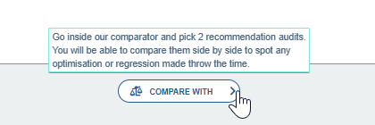

Using the data collected by the [recommendation probe](https://docs.centreon.com/experience-monitoring/configuration/configuration/user-journey/create-a-scenario/#daily-recommendations-audits), Experience Monitoring will make suggestions on how to optimize your website.

Note that these recommendations come from a probe executing the user journeys. You will only obtain recommendations for the pages appearing in the journey's steps.

## Getting the recommendations for each step

1. From the [User Journey **Overview** page](https://docs.centreon.com/experience-monitoring/how-to-articles/user-journey-screen/), scroll down to the list of steps.
2. Click on the magnifying glass to the right of the step you want to optimize.

You will be taken to the tab **Last detailed analysis**.
This tab, as well as the **Last recommendations** tab only appear when you are viewing a specific step of a journey.
These two tabs are hidden when looking at a journey as a whole.

Click on the **Last Recommendations** tab.
The first thing you'll see is a timeline with the metrics for the step you selected.
Below this is a list of recommendations to optimize your site.
The recommendations are listed from most impactful to the least.
Each individual recommendation can be clicked to see what metrics would be impacted, how to implement it and the potential gains.

## How can I tell my changes had a real impact

In the **Last recommendations** page, scroll to the bottom of the page and click the **Compare with** button.

The latest recommendation audit is selected by default. Select an earlier audit to see the impact of your changes.
Remember that the recommendations probe is executed once a day so your changes may not be visible until the next day.
