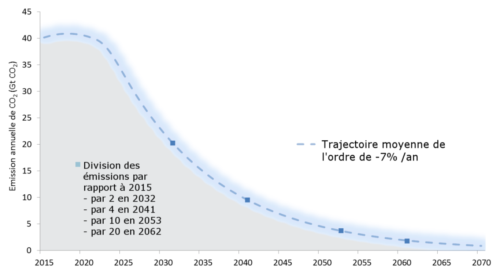
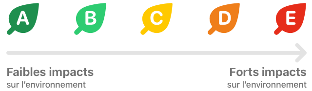
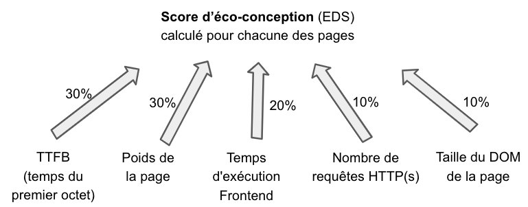
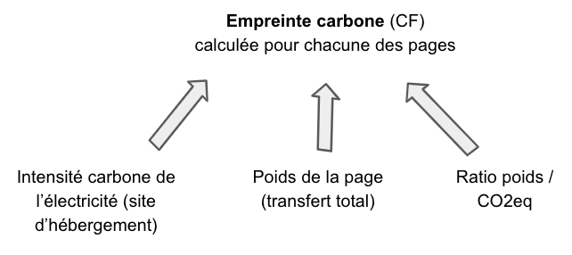
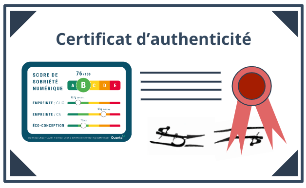

---
id: digital-sobriety-score
title: Digital Sobriety Score
--- 

Specifications v1.1 (April 2023)

## Context: The purpose of the Digital Sobriety Score

At Centreon, we believe the ecological transition requires awareness and accountability from the digital sector regarding its environmental impact.

Today, digital technologies account for roughly 4% of global greenhouse gas emissions and are growing at approximately **+8% per year**. At the same time, the Paris Agreement requires a global annual emissions reduction across sectors of **-7%**:

Although digital technologies can help decarbonize other industries, the digital sector itself cannot avoid a necessary reduction in its own emissions. To improve, however, we first need **reliable and shared measurements**.

To support this transition and align digital activity with planetary limits, we considered it essential to provide a standardized guide shared across the digital ecosystem — this is the purpose of the Digital Sobriety Score.

The Digital Sobriety Score is a general rating that measures the environmental footprint of a website or web application. It can be used without technical expertise while enabling digital and sustainability specialists to inspect the sub-indicators that compose the overall score in greater detail.

With this unified score, Experience Monitoring’s mission is to raise awareness and guide digital stakeholders toward more responsible choices by providing tools to compare and progressively improve the environmental impact of their current and future applications.

## Introduction to the methodology

Existing indicators for measuring the digital environmental footprint are often difficult to interpret without specialist knowledge and tend to cover a limited set of criteria, which makes it hard for organizations to improve across all impact dimensions.

The Digital Sobriety Score is therefore a **composite rating** that aggregates the environmental impacts associated with using a website or mobile application into a simplified score out of 100, also expressed as a grade from A to E, similar to food labeling:

For more precision, the numerical score should be consulted. The correspondence between numeric score and letter grade is:

| Digital Sobriety Score | Letter grade |
| --- | --- |
| 0 to 45 | E |
| 45 to 60 | D |
| 60 to 75 | C |
| 75 to 90 | B |
| 90 to 100 | A |

This grading captures a broad set of impacts while providing simplified visibility for digital and CSR teams so they can:

- compare multiple sites (for example, several sites within the same brand or versus competitors);
- implement action plans to make their applications more sustainable;
- be guided on eco-design best practices when building new digital projects, whether developed internally or externally.

As part of the Digital Sobriety Score, Experience Monitoring commits to delivering actionable measures that respect the principles of the [GHG Protocol](https://www.greenly.earth/fr-fr/blog/guide-entreprise/ghg-protocol-quest-ce-que-cest-comment-ca-marche): Relevance, Completeness, Consistency, Transparency, and Accuracy.

In other words, the calculation methods and measurement processes **will remain transparent and open** under a Creative Commons license ([CC BY-NC-ND 4.0 DEED](https://creativecommons.org/licenses/by-nc-nd/4.0/deed.fr)), allowing teams — especially specialists in responsible digital practices — to compare Experience Monitoring’s results with their own calculations and tools.

This transparency enables stakeholders to:

- perform their own Digital Sobriety Score measurements, including in contexts where Experience Monitoring cannot directly access the application;
- propose improvements to evolve the calculation method as research in GreenIT progresses.

## Calculation method

Calculating the digital environmental footprint is a relatively new and evolving field. New information on the impacts of use, manufacturing, and end-of-life of digital equipment may emerge, so the algorithms estimating these impacts are expected to be refined over time.

For this reason, Experience Monitoring versions the calculation method to ensure its continued relevance and to allow users to benefit from improvements without impairing comparability between sites audited at different times.

Even without changes to measurement methods, median market values are likely to improve over time; Experience Monitoring will naturally update the quantiles used for each parameter in the Digital Sobriety Score calculation to reflect market progress.

This document describes the calculation algorithm updated in April 2023 (**version 1.1**), which is the first public release.

### How is the Digital Sobriety Score calculated?

The Digital Sobriety Score can be evaluated with two types of audits:

1. The simple method
2. The "full audit" method.

One major advantage of these two audit types is they adapt to different resource levels and precision requirements while producing fully comparable scores. The only real difference between the methods is the level of approximation used in the simple method.

Comparison of the two methods and their advantages:

|  | Simple method (see [quanta.green](http://quanta.green)) | Full audit method |
| --- | --- | --- |
| Duration | 3 to 5 minutes | minimum of 7 days so collected data is sufficiently comprehensive |
| Precision | Average based on the 10 most visited pages of the site | Considers 100% of pages, weighted by each page's share of total site traffic |
| Installation required | None | Requires installing a Real User Monitoring tag (Note: Experience Monitoring’s RUM tag enables full audits while remaining GDPR-compatible) |
| Cost | Free on quanta.green | Requires an Experience Monitoring subscription or another tool capable of calculating the Digital Sobriety Score |
| Time-series comparison | Yes, but at quarterly precision (quanta.green stores scores for 3 months). After 3 months, a new analysis shows evolution over time. | Yes, in real time and historized automatically over multiple years in Experience Monitoring |
| Certification | The "Simple audit" certification includes a summary visual that can be displayed on the site to describe its environmental impact. | The "Full audit" certification includes a summary visual that can be displayed on the site to describe its environmental impact. |

Because the site's carbon footprint calculation is thorough and reflects actual traffic, it can be included in a company's overall carbon inventory, giving more accurate data for the digital part.

To compare the environmental impact of web applications of different sizes, the site's footprint is shown relative to its traffic.

The Digital Sobriety Score is a **summary of many evaluation criteria**. Taken alone, it does not answer the question "what is my site's carbon footprint?": its goal is to provide a broader rating than carbon footprint alone and to make web applications comparable regardless of their audience size (100 users or 100,000 users).

Teams focused on CSR who still want an absolute carbon footprint of their site (to refine corporate carbon accounting with a precise CO2eq measure corresponding to site activity) can obtain this via the absolute carbon footprint sub-indicator of the Digital Sobriety Score (see "Global carbon footprint of the site" below for details).

### Detailed algorithm for the Digital Sobriety Score (full audit method, version 1.1 - April 2023)

The Digital Sobriety Score is composed of multiple criteria with a tree-like weighting system that assigns importance to each in the overall score.

Many sub-criteria have independent value for improving an application’s environmental footprint. We recommend that teams include these sub-indicators in their monitoring committees and reports.

The overall score is intended for executive reporting and external communication, such as displaying a certificate on a website.

To explain the diagram above, here is the exhaustive list of underlying indicators used in the Digital Sobriety Score:

## The Eco-Design Score (EDS)

This score accounts for 50% of the Digital Sobriety Score. It is rated 0 to 100 and can be measured for a page using five sub-criteria that evaluate adherence to eco-design principles:

- Time To First Byte (TTFB)

  Often measured and optimized to speed up rendering, this indicator is particularly reflective of server-side execution time. The longer the TTFB, the greater the energy consumption at the hosting center.

  TTFB accounts for 30% of the Eco-Design Score.

- Page weight

  "Page weight" refers to the total amount of data downloaded by a user when navigating to a page or when an interaction triggers a context change in the site.

  Transfers — including HTML, CSS, images, etc. — have a significant impact on network equipment between the datacenter and the user.

  Page weight accounts for 30% of the Eco-Design Score.

- Frontend execution time

  After the page is downloaded, the user’s device (mobile, tablet, or computer) typically executes JavaScript locally. This execution is often invisible to site administrators because the load occurs on the client device rather than in the datacenter; nevertheless, it consumes energy and results in emissions.

  A good estimate of frontend execution time is the interval between Time To First Byte and the OnLoad event (total page load). OnLoad represents when the browser becomes idle after executing JavaScript.

  Frontend execution time accounts for 20% of the Eco-Design Score.

- Number of HTTP(s) requests

  Each HTTP(S) request requires additional data exchanges between server and client, which increases network energy use. Processing many requests also generates additional CPU time on the client device.

  Reducing the number of requests involves optimizing caching, bundling files, or using inlining to avoid extra requests.

  Number of requests accounts for 10% of the Eco-Design Score.

- DOM size

  The DOM (Document Object Model) is the hierarchical representation of page HTML elements. While essential for modern websites, a large DOM increases memory usage and processing time on the client device, leading to higher energy consumption.

  DOM size accounts for 10% of the Eco-Design Score.

Once all indicators are measured, a weighting is applied based on each criterion’s environmental importance:

To convert each sub-indicator into a score (for example: 28 points on the Eco-Design Score for 90 ms TTFB), mapping tables are used. These tables are publicly available so anyone can compute the Digital Sobriety Score end-to-end. Sources for these mapping tables include the [HTTP Archive](https://httparchive.org/) and the [Chrome UX Report](https://developer.chrome.com/docs/crux/). The method uses value quantiles (for instance, to get the full 30 points for TTFB, a site must be within the top 5% fastest sites for that metric).

## Average Eco-Design Score (Average EDS)

To compute a site's average Eco-Design Score, there are two cases:

1. Simple audit

   For a simple audit, we take the site's 10 most popular pages and compute an Eco-Design Score for each. The average of these 10 scores is the Average EDS.

2. Full audit

   In this case, the Average EDS considers all pages viewed on the site and weights them by their share of total traffic, providing a more precise measure. A low-scoring page with little traffic will have minimal impact on the overall score, while a high-traffic low-scoring page will significantly lower the Average EDS.

## Carbon Footprint (CF)

A basic indicator for measuring an application's environmental footprint is the carbon footprint of accessing a web page or performing a click. For this evaluation, Experience Monitoring implements a recognized and transparent algorithm: the [Sustainable Web Design method](https://sustainablewebdesign.org/calculating-digital-emissions/).

This method estimates a page’s carbon impact based on its weight and the carbon intensity of the electricity used by the hosting platform.

Thanks to this method, the same web page accessed in France, Ireland, or the USA will have different impacts due to differences in electricity generation. To account for a host country’s electricity mix, Experience Monitoring relies on the [Ember Climate](https://ember-climate.org/insights/research/global-electricity-review-2022/) dataset (also used by [Our World In Data](https://ourworldindata.org/grapher/carbon-intensity-electricity)).

The resulting calculation, expressed in CO2eq, also allows distinguishing contributions from different scopes (datacenter, network, and end-user devices).

### Average Carbon Footprint Per Click (Average CFPC)

Average carbon footprint per click accounts for 50% of the Digital Sobriety Score. It represents the environmental footprint per page view or click-triggered context change in the web application.

Why measure clicks instead of only page views?

We use "clicks" because Single Page Applications (SPAs) are increasingly common. In an SPA, a click may change the current view without triggering a full page navigation. Each interaction still has an ecological cost and should be included in the environmental assessment.

> Version 1.1 of the Digital Sobriety Score focuses on carbon emissions, the most commonly used metric for corporate environmental management. Other impact criteria (water use, abiotic resource depletion, primary energy consumption) are also relevant and may be incorporated in future versions of the methodology.

To calculate Average CFPC, there are two cases:

1. Simple audit

   For a simple audit, take the site's 10 most popular pages and compute the carbon footprint (CF) for each. The average of these 10 measures gives the Average CFPC.

2. Full audit

   For a full audit, Average CFPC accounts for all pages viewed on the site, weighted by their share of total traffic, producing a more accurate measure. A high CF on a low-traffic page will have little overall effect, but if that page receives more traffic, its weighted CF will increase the site’s Average CFPC accordingly.

Although full audits weight pages by traffic, the Average CFPC is intended to express the footprint of a single page view or click independent of overall traffic, enabling month-to-month comparability despite traffic variations.

For example, comparing November and December, if December traffic spikes due to holidays, Average CFPC accounts for this variation and still allows teams to track the average footprint per click month over month. This view helps responsible digital teams maintain a reliable gauge of eco-design efforts, independent of marketing-driven traffic changes.

## Global Carbon Footprint of the site (Global CF)

To compute the global carbon footprint of a site, consider two main factors:

- the Average CFPC for a given period
- the number of page views during that same period

There are two cases:

1. Simple audit

   Multiply Average CFPC by the number of page views to get a good estimate of the site's traffic-related footprint.

2. Full audit

   Weight each page’s carbon footprint by its individual view count. Since Experience Monitoring’s RUM tag tracks all page views in real time, Experience Monitoring can perform these calculations for high precision.

In both cases, you obtain the site's global carbon footprint for the selected period.

## The Digital Sobriety Score

The overall Numeric Digital Sobriety Score (out of 100) combines the two main sub-indicators:

- Average carbon footprint per click (Average CFPC)
- Average Eco-Design Score (Average EDS)

Each sub-indicator is weighted at 50% to balance low carbon footprints per click with good eco-design practices:

Note: While calculation methods and weightings are the same for simple and full audits, the simple audit considers only the site’s 10 main pages for Average EDS and Average CFPC. See the section "How is the Digital Sobriety Score calculated?" for more information.

**Conditions for obtaining the Experience Monitoring label**

Experience Monitoring can issue a certified Digital Sobriety Score with a summary visual suitable for use on the site or in communications. This certificate is accompanied by a detailed report containing the measurements behind the overall score.

The report both proves the origin of the measurement and guides digital and responsible teams on optimizations to improve the score.

To obtain a certified score:

- an Experience Monitoring Digital Sobriety license must be connected to the target site with Real User Monitoring enabled. The Digital Sobriety Score is then calculated in real time.
- an expert analysis is carried out to produce the full report.

The first certificate for a given site can be based on the previous 30 days of data. It is valid for one year and will be renewed with a certificate based on the following 12 months. From the second year onward, the certificate will reflect the site's full-year traffic and may include the change in score versus the previous year.

## Optional indicator: Carbon Footprint per € of turnover (CFPT)

Not included in the Digital Sobriety Score, the carbon footprint per euro of turnover is an optional metric that relates the site’s carbon footprint to one euro of online revenue. It can be useful to compare the environmental efficiency of e-commerce sites of different sizes.

To compute CFPT, consider:

- the site’s global carbon footprint (Global CF) for a period
- the site’s revenue (€) for that same period.

Like Average CFPC, CFPT enables comparisons between sites of different scales, such as comparing different brand sites, competitors, or regionalized versions of the same site hosted in multiple countries.

## Further reading

More information on calculations mentioned in this document:

- Calculating Digital Emissions [Sustainable Web Design](https://sustainablewebdesign.org/calculating-digital-emissions/)
- Lean ICT - Pour une sobriété numérique ([The Shift Project](https://theshiftproject.org/wp-content/uploads/2018/05/2018-05-17_Rapport-interm%C3%A9diaire_Lean-ICT-Pour-une-sobri%C3%A9t%C3%A9-num%C3%A9rique.pdf))
- **Calculate the Digital Sobriety Score for free (simple audit) on [quanta.green](http://quanta.green)**
- Electricity carbon intensity: [electricity maps](https://app.electricitymaps.com/map)

## License

The algorithm, calculation method, and quantiles used to produce the Digital Sobriety Score are published transparently and freely to serve the public without requiring Experience Monitoring services. The license is [Creative Commons Attribution-NonCommercial-NoDerivatives 2.0 France (CC BY-NC-ND 2.0 FR)](https://creativecommons.org/licenses/by-nc-nd/2.0/fr/), which permits use by individuals, associations, and companies as long as it is not resold.

## Appendix - Quantiles used

To convert each measured value on a website into a score, **mapping tables are required**. So that anyone can calculate their own Digital Sobriety Score outside of [quanta.green](http://quanta.green) or Experience Monitoring's services, the complete mapping tables are available on request via [hello@quanta.io](mailto:hello@quanta.io).
