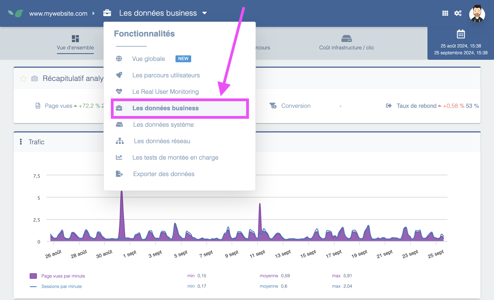

---
id: business-view
title: Business View
---

This section enables analysis of the site's business-related metrics. To access it, open the main menu and select **Business Data**:

Prerequisites:

- a **Business**, **Full**, or **Enterprise** Experience Monitoring license.
- synchronization of your Experience Monitoring account with your Google Analytics account.

The **key benefits** provided by the Business view are:

- an accurate (minute-by-minute), historical measurement of business metrics from Google Analytics 4 or Matomo. For example, the timeline of page views per minute recorded on the site is particularly valuable when correlated with site response times. This typically answers the question “is the slowdown related to a recent traffic spike?” quickly. If the site slows down during a traffic spike, you'll observe simultaneous increases in both metrics, which are visually overlaid in Experience Monitoring.
- measurement of conversion losses and gains related to technical incidents and slowdowns on the site.
- a ranked list of pages that need performance improvements and that have the greatest potential impact if optimized. To calculate this, Experience Monitoring analyzes the traffic each page generates together with each page's response times. The result is a summary table expressing potential gains in additional annual revenue.
