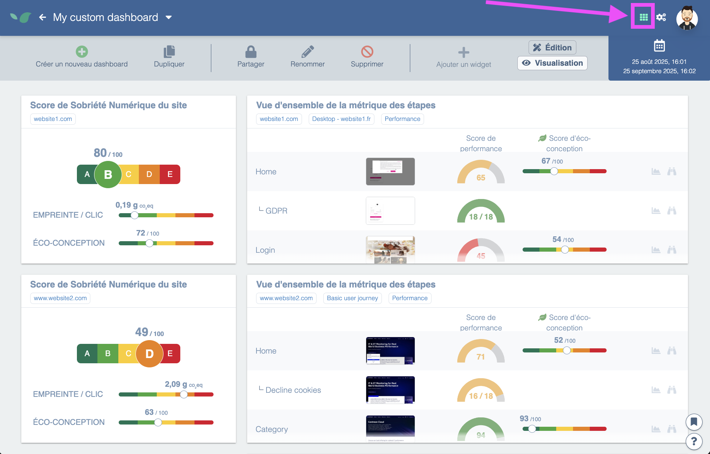

---
id: dashboards
title: Dashboards
---

Dashboards are a way to visualize Experience Monitoring information at a glance.

## Use cases

### 1. Combine information from different sites or organizations

In Experience Monitoring, you can belong to multiple organizations, and each organization can include monitoring access for multiple web applications. In this context, dashboards let you display, on a single screen, any Experience Monitoring cards to which you have access.

Example of cards from two sites in two different organizations:

In this example, the two cards come from two different sites in two different organizations. With dashboards you can keep an eye on all your sites at once!

### 2. Create a shared dashboard

Within your organization, different people will expect different information. For example, your marketing team will only care about traffic measurements and Core Web Vitals for SEO.

You can create dashboards and share them with your organization so everyone in your organization has access.

In your dashboard list, your private dashboards appear first. By clicking the lock icon you access sharing options to choose which organization to share it with.

### 3. Aggregate data from different Experience Monitoring screens

Suppose you want to focus on your site's shopping cart. It's useful to have up-to-date information on that page coming from RUM measurements and User Journeys.

However, that information lives on different screens: user journeys have a tab for Core Web Vitals and another one for performance, and RUM is not on the same page either.

Dashboards let you build custom screens for this purpose.
