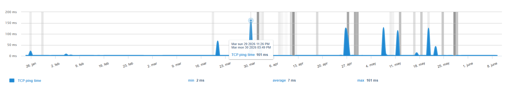

The **Network Data** module allows for an overview of the site's responsiveness over time using a network probe that regularly pings the site.

> At the moment all measurements are performed from our infrastructure in Europe. If your site is hosted on another continent, latency may be higher.

Your site is pinged regularly by a probe to check for a response and measure how long it takes for that response to arrive. This is done using TCP and ICMP pings.

- ICMP ping measures basic network connectivity to the server over the internet. It is common for production machines to be configured to ignore ICMP (because of security concerns for example). To cover cases where ICMP is not allowed, we run a second test that targets a service which is required to respond: a TCP ping.
- TCP ping works on the same principle as ICMP but on port 80. Port 80 is the standard port for HTTP traffic and must be open for your site to be reachable, so a TCP ping is a reliable fallback when ICMP is blocked.

See our [dedicated article](https://docs.centreon.com/experience-monitoring/experience-monitoring/getting-started/network-tab-indicators/) to learn more about this module.