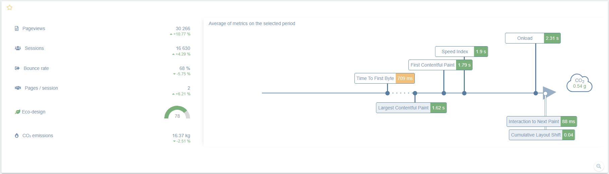

The **Real User Monitoring** (or RUM) module allows you to measure a website's performance directly from the browsers of real users. 
An HTML tag is inserted into the page's code to monitor the loading times experienced by users.
The tag is designed to be very light so it doesn't slow down the user's browsing. It is also loaded separately so its own loading times are not taken into account in the metrics collected.

See our [dedicated article](../rum/rum-intro.md) to learn more about this module.

The key difference with [user journeys](synthetic-monitoring.md) is that while the latter checks the performance of a preestablished navigation of the website, RUM measures the experience of real users.

> RUM records and stores purely technical data that is impossible to identify in compliance with the scope of the European Union's [GDPR](https://gdpr.eu/).