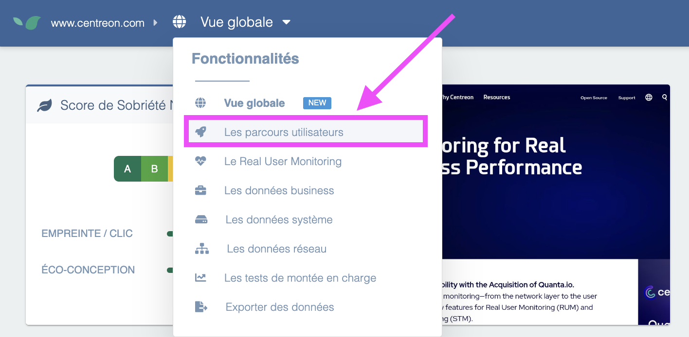
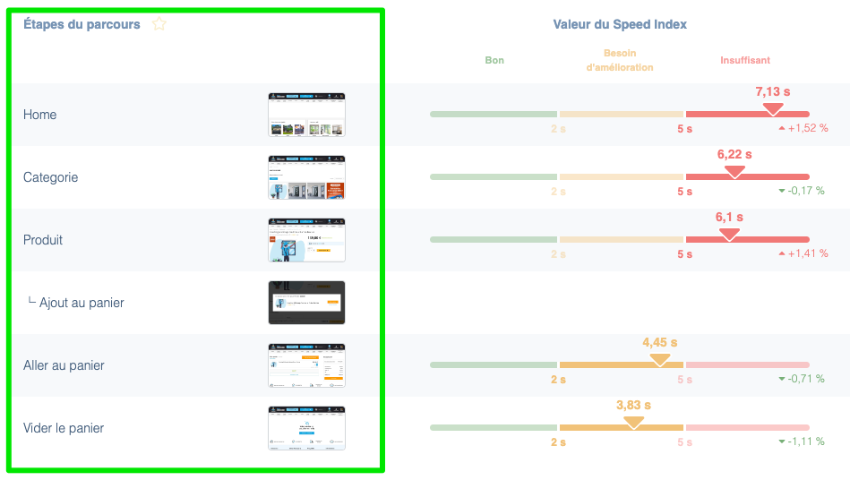

---
id: synthetic-monitoring
title: Synthetic Monitoring (or "User Journeys")
---

Synthetic Monitoring consists of regularly browsing a target site and measuring various web performance indicators.

The application allows you to:

- **Monitor the proper functioning of a typical journey** and calculate its **availability rate** (e.g., "it was possible to browse and purchase on the ecommerce site 99.5% of the time this month")
- **Alert site managers in real time** in case of site malfunction, by sending emails, SMS, or other notifications with a detailed incident report containing both a screenshot of the encountered error and a precise recording of the page load in the browser.
- **Measure and record page load times** according to several key criteria (time to first byte, Speed Index, full page load time, or with respect to Google's [Core Web Vitals](https://web.dev/vitals/))
- Analyze each page with a rule engine that precisely lists **areas for improvement** to make the site faster (e.g., to improve the homepage load time, it is a priority to optimize certain images and reduce the JavaScript code of a specific file, etc.)

As you can see, for a single feature, "User Journeys", Experience Monitoring actually groups at least **4 major features** here, allowing a web application manager to ensure a good experience on their site.

The concept of a "**typical journey**" is central to the use of Synthetic Monitoring. Indeed, to monitor and optimize the site, you must choose **one or more reference scenarios**. In Experience Monitoring, flexibility in creating these scenarios is extremely important. It is possible to perform almost anything a real user could do on the site (e.g., click, move the cursor to a specific spot on the page, change pages, check boxes, add a product to the cart, fill out a form, go to checkout, place an online order, enter a credit card number, etc.).

Here is an example of a typical journey for an ecommerce site:

These journeys can be performed under several different conditions, for example:

- Using a browser in **Desktop or Mobile** mode
- Deciding whether or not to load **third parties** (e.g., Google Analytics tags, AB Tasty, etc.)

In most cases, we recommend choosing one or more scenarios representing **the majority of user actions** performed on the site. For example, if it is an ecommerce site, it will be important to test proper login to a user account as it is an essential step in the sales funnel, or the search engine if it is central to site navigation.

This way, if a structural change to the site (e.g., new deployment, tag addition, etc.) causes an unexpected malfunction at one of these key steps, Experience Monitoring can automatically alert the right people with the corresponding explanations.

The malfunction may not be a functional error, but rather a **severe slowdown** at one of the steps, which would drastically reduce the user experience and potentially cause an immediate loss of conversion. That is why it is crucial to get the information **in real time** in this type of situation.
