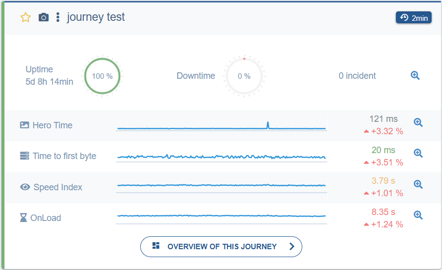

---
id: synthetic-monitoring
title: User Journeys
description: Introduction to the User Journeys synthetic monitoring module
---

**User Journeys** is the synthetic monitoring module of Experience Monitoring.
A probe is configured to regularly browse your site, following a predetermined path on a website to measure various web performance indicators.

**User Journeys** allow you to:

- Monitor the proper functioning of the typical browsing experience and calculate its availability rate.
- Alert site managers in real time in case of site malfunction with notifications containing a detailed incident report.
- Measure and record page load times according to several key criteria (including Google's [Core Web Vitals](https://web.dev/vitals/)).
- Obtain personalized recommendations to make the site faster.

We recommend configuring the user journey to represent common user actions performed on the site.

See our [dedicated article](../configuration/user-journey/user-journey-intro.md) to learn more about this module.