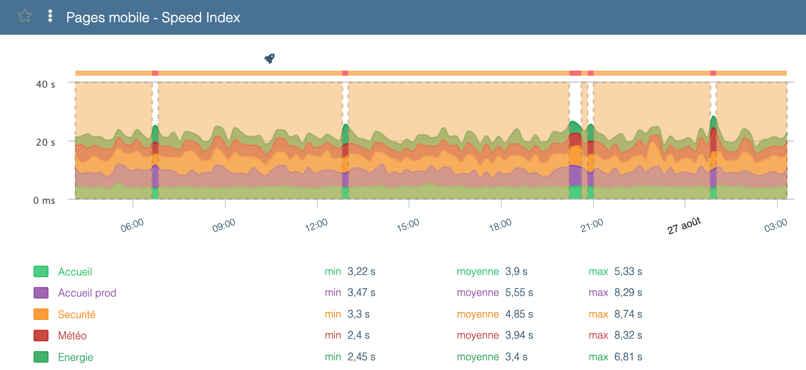
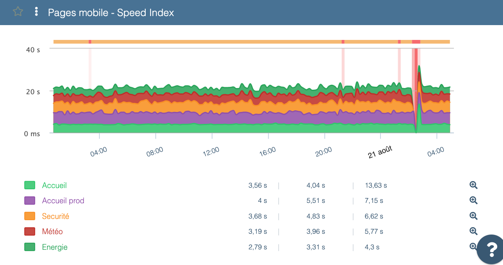

---
id: meaning-of-colors-in-graphs
title: Meaning of green/yellow/red and gray bars in graphs
--- 

## Preamble

While browsing Experience Monitoring graphs you may sometimes see colored bars or shaded areas — red or gray — indicating incomplete data. What do they mean?

## Top summary bar

Above most graphs you’ll find a top summary bar colored green, yellow, or red. Each color has the following meaning:

- Green: result is good
- Yellow: result is acceptable but the site can be improved
- Red: result needs improvement

In the example above, the Speed Index could be improved.

Hovering over segments in this top bar highlights matching segments in the chart.

## Vertical bars

### Red bars

Red vertical bars that appear on your scenarios highlight errors that occurred during execution.

# To view the error details, hover over the red bar — Experience Monitoring will show at which step the scenario stopped and why.

Clicking the bar also often offers a screenshot of the page at the time of the error, which is useful to understand what happened.

### Gray bars

You may also see gray bars on some Experience Monitoring charts. These simply indicate that data could not be received at the measurement time.

This typically happens for two main reasons:

- you are viewing a period when the probe was not scheduled to run (e.g. scenario not yet created or temporarily disabled)
- the site did not respond at all (for example during a server restart or if the server was so overloaded it could not send data)

In general, gray bars appear when the infrastructure was unable to produce measurement data.
