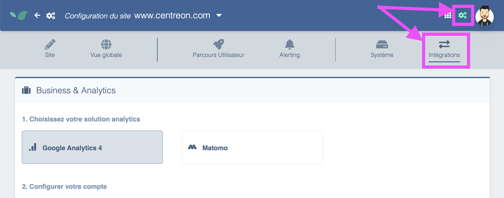
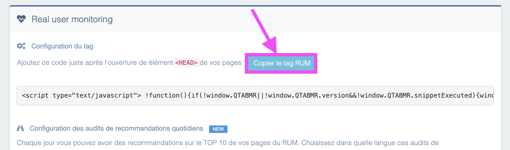

---
id: real-user-monitoring-installation
title: Install Real User Monitoring
---

## GDPR considerations

Although Experience Monitoring uses a cookie, **no consent is required.**

The CNIL (French data protection authority) exempts certain cookies from requiring consent under these conditions:

- they have a limited purpose such as measuring performance, detecting navigation issues, optimizing technical performance or usability...
- they produce only anonymous statistics
- they are not cross-referenced with other datasets
- they are not transmitted to third parties
- they do not enable tracking a user's browsing across other websites.

**Experience Monitoring meets these conditions.**

You can find CNIL's recommendations on [this page](https://www.cnil.fr/fr/cookies-et-autres-traceurs/regles/cookies-solutions-pour-les-outils-de-mesure-daudience).

## Find the tag to insert on my site

Real User Monitoring (RUM) requires installing a JavaScript tag. The tag is available in the application. To retrieve it, go to **Configuration > Integrations**:

You will then find the tag on that screen with a button to copy it easily:

This tag should be inserted into the site's HEAD section. The operation can be done manually by a developer, or alternatively **it can be added to a tag manager such as GTM by following the procedure below**.

### Using GTM to add a RUM tag to your pages

**1 — Create a new tag**

Sign in to your GTM account and select the container for your website. Click "Add a new tag."

**2 — Configure the tag**

Select "Custom HTML Tag" as the tag type.
Paste the script provided into the HTML field.
Ensure the script type is correctly set to "JavaScript" if required. GTM usually handles this automatically, but it's good to check.

**3 — Set triggers**

Choose when you want the script to execute. You can apply it to all pages or to specific pages depending on your needs. Triggers allow precise control over when the script runs.

**4 — Save and test the tag**

After configuring the tag and its triggers, save it and use GTM's preview feature to test whether the script works as expected on your site. This lets you see changes in real time without affecting real visitors.

**5 — Publish the changes**

Once you've checked everything works correctly, remember to publish the changes in GTM so the script is active on your live site.
