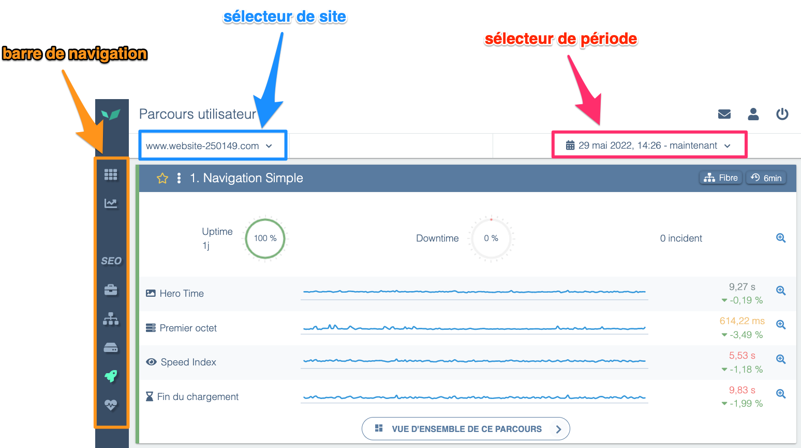

---
id: navigate-in-experience-monitoring
title: Navigate in Experience Monitoring
---

Centreon Experience Monitoring lets you move across several dimensions: switching modules, changing the selected site, or modifying the time range being analyzed.

When you first log into Experience Monitoring you land on the Overview page by default. If you then select [**User Journeys**](../../getting-started/synthetic-monitoring.md) from the menu, you'll notice this screen includes:

- **the horizontal navigation bar** (at the top), which lets you switch between Experience Monitoring modules ([**User Journeys**](../../getting-started/synthetic-monitoring.md), [**System**](../../getting-started/system-view.md), [**Real User Monitoring**](../../getting-started/real-user-monitoring.md), etc.)
- **a site selector** (top-left) that allows a user with access to multiple Experience Monitoring organisations/sites to switch between them (for example: an Enterprise license or an agency managing multiple clients' Experience Monitoring accounts).

	When using Experience Monitoring in multi-site mode you can compare performance data across several Experience Monitoring sites at once or create a custom dashboard that aggregates metrics from multiple Experience Monitoring sites.
	
- **a time range selector** (top-right) that lets you change the analyzed period at any time. This is useful to observe how a site's response times evolve over days, weeks, or months. By default Experience Monitoring shows the last 24 hours and refreshes every minute to surface the latest measurements in near real time.

