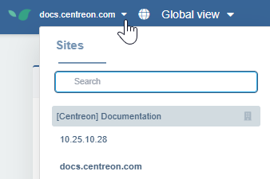
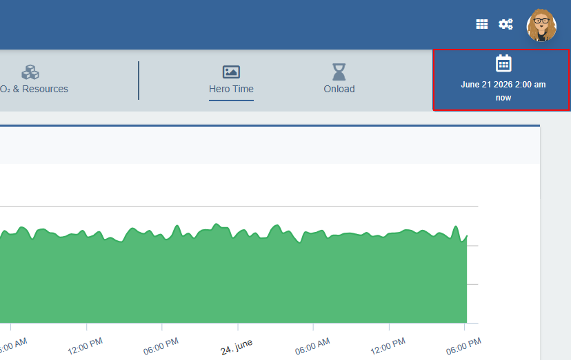

---
id: navigate-in-experience-monitoring
title: Navigating in Experience Monitoring
description: Switch between sites, modules, and time periods in the UI
---

In the Centreon Experience Monitoring interface, you can:

1. [Switch between sites](#switching-between-sites).
2. [Switch between modules](#switching-between-modules) (user journeys, RUM...).
3. Access the [dashboards](../dashboards.md) page, the configuration page for the module you are in, or your [user](../../configuration/manage-users-and-rights.md) profile.
4. [Change the time period covered by the displayed data](#changing-the-time-period-covered-by-the-displayed-data).

## Organizations and sites

The platform lets you organize and monitor multiple websites from a single account.

* Organizations are top-level groupings that contain one or more sites — for example, separate organizations for different business units or clients. [User rights](../../configuration/manage-users-and-rights.md) are defined at organization level.
* Sites are individual websites within an organization. A common setup is separate sites for different environments, such as production and pre-production.

### Switching between sites

* Hover over the site name in the top navigation bar to open the **Sites** panel, then click any site in the list to switch to it.
* If you need to, use the search box to filter sites by name.

   

Multi-site comparisons are only possible from the [dashboards](../dashboards.md). You can compare performance data across several sites side by side, or aggregate metrics from multiple sites into a single view.

### Adding a site to an organization

1. In the navigation bar at the top, hover your site's link to open the **Sites** panel, then click **Go to the organization page** for the organization you want.

   

   You can also access the organization page by clicking your profile icon at the top right of the screen, then clicking **Organizations**.

2. Click the **Licenses & Sites** tab. The number of sites in this organization is displayed on the right.
3. Click **Create a site**.
4. Enter the homepage's URL, then click **Create** and confirm. The site appears in the list of sites on the page, and in the site selector.

## Switching between modules

The **horizontal navigation bar** (top left) lets you switch between Experience Monitoring modules ([**User Journeys**](../../getting-started/synthetic-monitoring.md), [**System**](../../getting-started/system-view.md), [**Real User Monitoring**](../../getting-started/real-user-monitoring.md), etc.).

## Changing the time period covered by the displayed data

A **time range selector** (at the top-right) lets you change the analyzed period at any time. This time period affects all indicators and dashboards (except the **Live** widget in RUM). This is useful to observe how a site's response times evolve over days, weeks, or months. By default, Experience Monitoring shows the last 24 hours and refreshes every minute to show the latest measurements in real time.

Zooming in on a period in a graph (with a click and drag action) automatically updates the time range selector.

## Customizing the Global view page

When you first log into Experience Monitoring, you land on the **Global view** page by default. Select the site you want, then click **Settings** in the top right corner to fine-tune what the page displays for this site.

### User Journeys taken into account in the calculations

This section defines which user journeys are used to calculate the scores in the **Global View**, for the **Performance score** and **Journeys availability** widgets. It also affects the **Digital Sobriety Score** widget [if the calculations are based on user journeys](#data-source-of-calculations-for-the-digital-sobriety-score).

Two modes are available:

- **All user journeys** — every configured user journey contributes to the calculations.
- **Only selected journeys** — manually select which user journeys to include using the checkboxes. This is useful for excluding test journeys or journeys that are not representative of the real user experience.

### Data source of calculations for the digital sobriety score

Select whether you want the **Digital sobriety score** widget to display data based on STM or RUM.

### Site screenshot reference

Select the screenshot you want to appear in the **Global view** page for this site: choose between the thumbnails for your user journeys.
