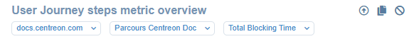

**Dashboards** are a space customizable with widgets to gather the information you need from Experience Monitoring in one place.
While **Global View** offers an overview of the site's general performance, **Dashboards** are about getting specific, detailed information.
The widgets can be freely placed, resized and configured to show different sets of data.

Dashboards can be accessed at any time using the button at the top right of your screen.

In Experience Monitoring, you can belong to multiple organizations, and each organization can include monitoring access for multiple web applications.
**Dashboards** is useful for displaying information of multiple organizations rather than navigating from one to the other to check their status and performance.

Dashboards are created for your private use by default but can be shared with the other members of your organization.

Use the navigation bar to switch between your dashboards.

## Creating dashboards

1. On the **Dashboards** page, click on **Create a new dashboard**
2. Choose a name for the dashboard and click **Save**
3. A window will open for you to select the widgets you want to add to this dashboard, a preview of the widget is shown to the right. You can select multiple widgets at once.
This is just to get started, you can add more widgets later.
4. Click on **Create widget(s)**

Note that to create widgets, the dashboard must be in **Edit** mode. Verify this is the case in the top right: the **Edit** button should be brighter than the **Visualize** button. 
**Visualize** removes the ability to modify or move the widgets for a better view of what your dashboard will look like.

Once the widgets are created, you can freely resize them from the bottom right corner. You can also drag and drop the widgets to reposition them in the dashboard.
Changes to the size and position of the widgets are automatically saved.

### Configuring widgets

Every widget added to the dashboard has a header area.

This area indicates what site the widget relates to and, in some cases, what configuration and metric.
You can click on the corresponding dropdown menu to change the site, the configuration and the metric displayed by the widget.

Additionally, using the buttons in the top right of the widget, you can hide the header to save space, duplicate the widget, or remove it from the dashboard.

On the same row containing the **Create a new dashboard** you will find buttons to duplicate the dashboard you are currently viewing. This will also duplicate all the widgets with their current configuration.

You can also choose to share this dashboard with your organization, rename it or remove it entirely.