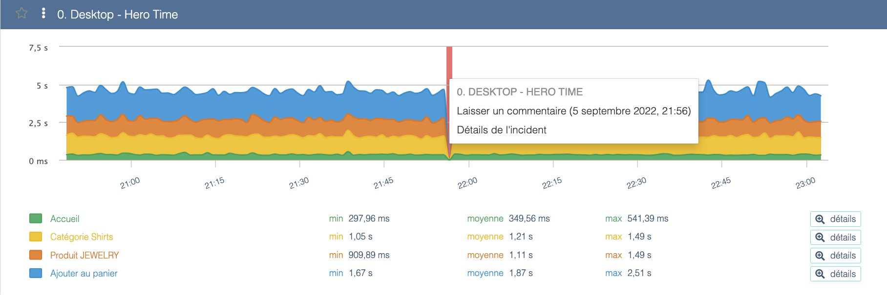
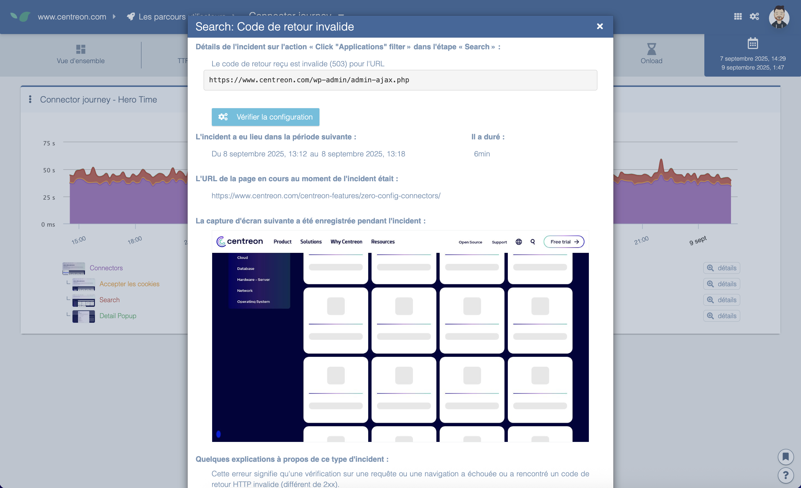

---
id: errors-and-unavailability-front-end
title: Understanding errors & unavailability in Experience Monitoring
--- 

> The HAR for all steps can be found under the incident screenshot to help your developers understand where the incident originated.

## How to view the incident screenshot?

The easiest way to determine what went wrong is to check the screenshot captured at the time of the error. This is available by clicking the red area above the scenario and selecting "Incident details".

When Experience Monitoring probes detect an incident on your web scenario, they attempt to capture a screenshot of the returned page to help you diagnose the issue.

You can view that screenshot by clicking the graph in the red area and selecting the "view screenshot" option.

A window will open and show you the page returned during the incident.

## Why don't I have a screenshot for one of my incidents?

Our probes were not able to capture the screenshot. This commonly happens when the server returned no content (for example during the "Step timed out" error).

## Error types

### Expected string/element not found

At each step of a scenario you can configure an expected string on the page to check that the scenario opened the correct page.

The "Expected string not found" error occurs when the configured string cannot be found on the page.

Possible reasons:

- The page has changed and the string no longer exists on it — update the expected string to match an element on the page.
- The page no longer exists and the scenario was redirected to a different page (e.g. a removed product) — update the scenario to point to an existing page and update the expected string to match the new page.
- Less commonly, the page may not have fully loaded.

### User journey timeout

This means the user journey took longer than the allotted time. A scenario that runs every 3 minutes has a maximum of 3 minutes to complete the entire journey.

So there isn't necessarily anything wrong with the actions — there just wasn't enough time.

### Step timeout

This means the step took longer than the maximum time allowed for it.

This can be caused by several issues:

- The page load time is too long
- The step timeout is too short
- The verification is misconfigured: the step will never find it and will wait indefinitely.

### Invalid return code

When a web page loads, it sends a status code to confirm it loaded correctly; most commonly this is 200. Experience Monitoring verifies that code during scenario execution.

If the page returns a different code (404 for not found or 503 service unavailable, for example), the scenario fails and the received code is displayed.

It may be that the page simply no longer exists (for example a removed product) — in that case, update the scenario to use a still-functioning page.

If it's an actual error and the page does not render correctly, further investigation is required.

### Unable to resolve host

Relatively rare, this indicates that it was not possible to resolve the site's IP address, which usually points to a DNS issue that failed to provide it.
