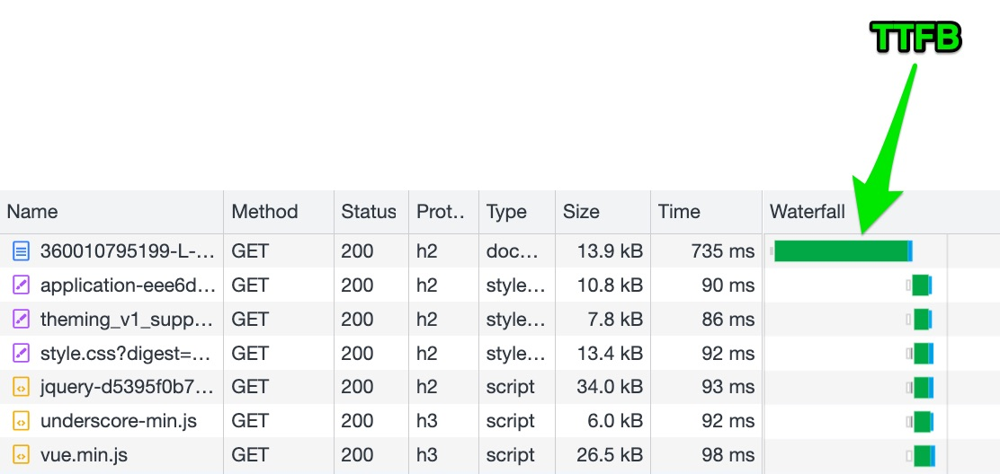

---
id: time-to-first-byte
title: TTFB - Time To First Byte
--- 

Time To First Byte (commonly known as TTFB) measures the interval between the browser's initial HTTP request for a page and the start of the response (i.e. when the first byte of data is received).

This metric therefore reflects a website's ability to quickly produce and deliver the requested HTML.

Optimizing TTFB is critical because when it is slow, it delays everything else during page load. While the browser hasn't received the HTML, it cannot begin loading dependent resources (JavaScript, CSS, images...), so users may be left staring at a blank page.

Keeping TTFB as low as possible is important to ensure:

- a good user experience,
- a good conversion rate,
- good SEO (Google penalizes pages with high TTFB).

Long TTFB usually indicates the application isn't using a full-page cache (for example, Varnish or other full-page caches). In that case, the delay comes from the time the application needs to generate the page. This also consumes server resources (typically CPU), which can impact:

- cloud resource usage,
- the environmental footprint of the application.

> In Experience Monitoring, TTFB is visible in synthetic User Journey analyses and in [Real User Monitoring](../../getting-started/real-user-monitoring.md).

## Scoring

Scoring guideline:

| Good | < 300ms |
| --- | --- |
| Fair | between 300ms and 3s |
| Poor | > 3s |
