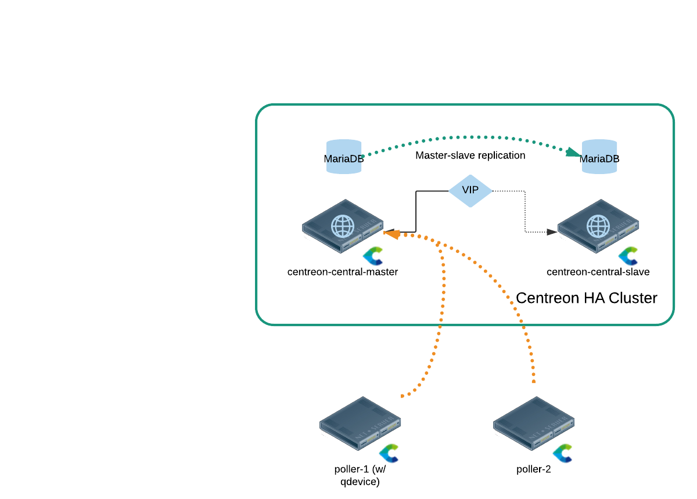
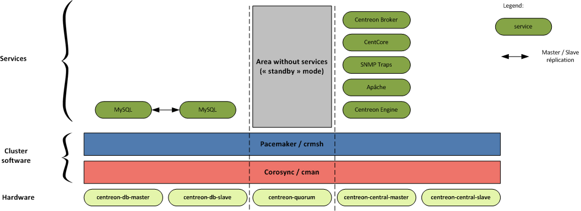
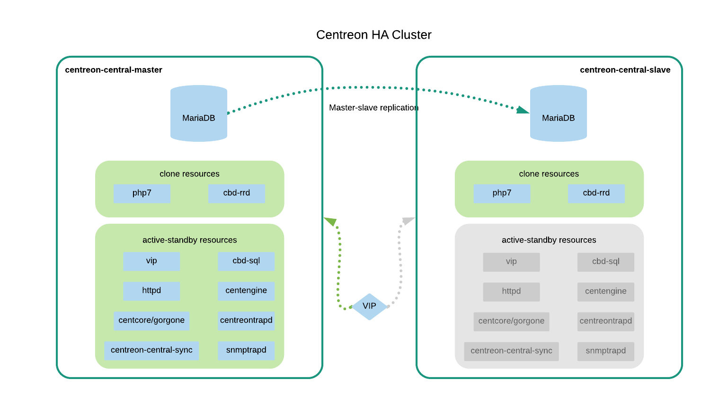
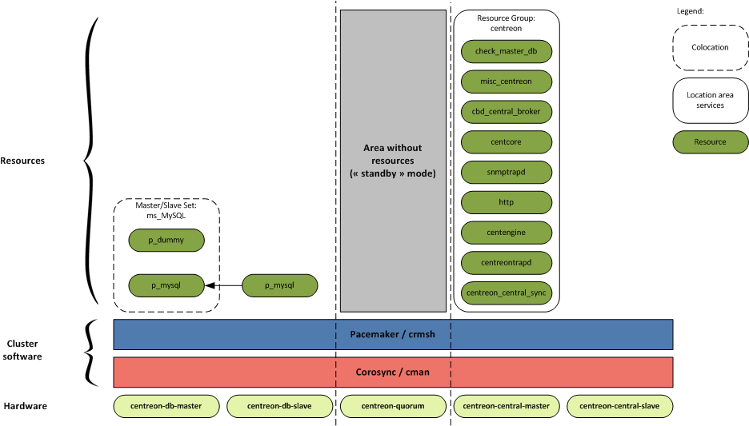

> **Attention:** Pour les utilisateurs ayant un contrat de support Centreon, il est nécessaire de contacter un interlocuteur Commercial et/ou Technique Centreon avant d'entreprendre une migration de votre installation vers la haute-disponibilité. Les Modules additionnels nécessitent une licence particulière pour fonctionner sur chacun des noeuds. 

## Cluster à 2 nœuds

### Présentation

L'architecture de la plate-forme de haute disponibilité Centreon est composée de 4 rôles :

* `centreon-central-master` : serveur hébergeant l'interface web et la base de données de Centreon, serveur actif en mode nominal
* `centreon-central-slave` : serveur hébergeant l'interface web et la base de données de Centreon, serveur passif en mode nominal
* `quorum-device` : serveur tiers permettant de dégager une majorité de votes lors de l'élection d'un `master`
* `poller` : serveur représentant un collecteur distant (les rôles de  poller et de quorum-device peuvent être tenus par le même serveur)

**Remarque :** On relèvera qu'il est question d'au moins 3 serveurs alors que le titre indique "2 nœuds". Il ne s'agit pas d'une coquille, il y a bien deux nœuds centraux, et la supervision **doit** reposer sur un ou plusieurs pollers, pas sur les centraux.

### Description des services du cluster

Le cluster héberge 3 types de services :

* les bases de données MariaDB `centreon` et `centreon_storage` ;
* les processus/services Centreon pouvant être actifs sur les deux nœuds : Centreon RRD Broker, PHP7 ;
* les processus/services Centreon ne devant être actifs que sur un nœud : Centreon Engine, Centreon Central Broker, Apache, Centcore/Gorgone, ...

Les bases de données MariaDB et les services Centreon sont hébergés par les serveurs centraux, `centreon-central-master` et `centreon-central-slave`. Suivant l'état de la ressource sur le cluster, l'un des deux possède le rôle de maître MariaDB, le second est dit esclave et synchronise de manière asynchrone ses bases de données sur le serveur dit maître. Les services Centreon sont lancés sur le serveur dit maître, ainsi, la base de données est toujours locale du point de vue de ces services.

Le serveur supportant le `quorum-device` (parfois noté `qdevice`) quant à lui n'héberge aucun service spécifique mis à part `pcsd`. Son rôle dans le cluster est de permettre de définir une majorité absolue et un quorum (nombre d'électeurs requis lors d'un vote), notamment lors de l'absence d'un des deux membres du cluster.

### Principaux composants Centreon

#### Composants d'un collecteur de supervision

Un collecteur de supervision dispose :

* d'un ordonnanceur de supervision Centreon Engine (`centengine`) ;
* d'un gestionnaire d'évènements Centreon Broker (`cbmod`) qui se connecte au serveur central actif pour transférer les données collectées.

**Note :** Le module `cbmod` est configuré pour se connecter à la VIP Centreon.

#### Composants d'un serveur central Centreon

Un serveur Centreon central dispose :

* d'un ordonnanceur de supervision Centreon Engine (`centengine`) ;
* d'un gestionnaire d'évènements Centreon Broker (`cbmod`) qui se connecte en local pour transférer les données collectées ;
* d'un processus de gestion centralisé des évènements (`cbd_central_broker`) qui : 
    * insère en base de données les informations collectées;
    * transfère en local les données de performance pour générer des graphiques.

* d'un processus de gestion des données de performance (`cbd-central-rrd`) pour créer/mettre à jour les graphiques de performance (`RRD files`);
* d'une interface web Centreon (`centreon`).
* d'un processus de gestion des actions (`gorgoned` à partir de la version 20.04, anciennement `centcore`).

**Note :** Le processus `cbd-central-rrd` est actif sur les deux serveurs centraux afin de ne pas avoir à synchroniser les répertoires hébergeant les fichiers RRD via DRDB. Ce dernier est alimenté par une double sortie du processus `cbd_central-broker` pointant vers chacun des serveurs `centreon-central-master` et `centreon-central-slave`.

#### Composants d'un serveur de gestion de base de donnés

Un serveur Centreon central dispose :

* d'une base de données `centreon` contenant la configuration de la supervision ;
* d'une base de données `centreon_storage` contenant les données collectées.

Les bases de données des serveurs `centreon-db-master` et `centreon-db-slave` sont synchronisées via le processus de réplication asynchrone MariaDB.

#### Schéma global de fonctionnement

### Description des ressources du cluster

Les services du cluster sont répartis en 2 groupes fonctionnels

#### Groupe fonctionnel MariaDB

Le groupe fonctionnel `ms_mysql` est une ressource dite "multi-état". En effet, cette ressource est soit en mode "master" sur le serveur ayant le rôle de "maître", soit en mode "slave" sur le serveur ayant le rôle "esclave". Cette ressource doit être active sur chacun des deux serveurs mais possédant un rôle différent.

#### Groupe fonctionnel Centreon

Le groupe fonctionnel `centreon` permet de regrouper l'ensemble de ressources suivant afin de faciliter leur gestion :

* service `cbd_central_broker` : service permettant de démarrer le démon `cbd` pour le broker central sur le serveur central actif ;
* service `gorgone` (anciennement `centcore`) : service permettant de démarrer le processus `gorgoned` ;
* service `snmptrapd` : service permettant de démarrer le processus `snmptrapd` ;
* service `http` : service permettant de démarrer le processus `httpd24-httpd` ;
* service `centreontrapd` : service permettant de démarrer le processus `centreontrapd` ;
* service `centreon_central_sync` : service permettant de synchroniser un ensemble de fichiers de configuration nécessaire au fonctionnement de Centreon ;
* service `centengine` : service permettant de démarrer le processus `centengine`.

**Note :** Les ressources sont démarrées les unes après les autres en suivant l'ordre de la liste.

#### Description des types de ressources

Le tableau ci-dessous décrit l'ensemble des ressources Pacemaker :

| Nom                     | Type                 | Description                                                |
| ----------------------- | -------------------- | ---------------------------------------------------------- |
| `ms_mysql`              | multi-state resource | Pilote le démarrage du processus `mysql` et la réplication |
| `ms_mysql-master`       | location             | Spécifie où se situe le nœud MariaDB maître                |
| `php7`                  | clone service        | Service FastCGI Process Manager `rh-php73-php-fpm`         |
| `cbd_rrd`               | clone service        | Service Broker RRD `cbd`                                   |
| `centreon`              | group                | Groupe centreon pour les 'primitive service'               |
| `vip`                   | primitive service    | VIP pour centreon                                          |
| `http`                  | primitive service    | Service Apache `httpd24-httpd`                             |
| `gorgone`               | primitive service    | Service Gorgone `gorgoned`                                 |
| `centreon_central_sync` | primitive service    | Service pour la synchronisation de fichiers                |
| `cbd_central_broker`    | primitive service    | Service central Broker `cbd-sql`                           |
| `centengine`            | primitive service    | Service Centreon-Engine `centengine`                       |
| `centreontrapd`         | primitive service    | Service de gestion des traps `centreontrapd`               |
| `snmptrapd`             | primitive service    | Service de réception des traps SNMP `snmptrapd`            |

### Recommandations

#### Rôle du serveur central Centreon

Dans le cas d'une architecture en failover, le serveur hébergeant le rôle `centreon` ne doit pas être considéré comme un collecteur actif de supervision. Ce dernier ne doit superviser qu'un nombre très restreint de ressources, car **un redémarrage trop long de la ressource `centengine` peut entrainer une bascule du groupe fonctionnel `centreon`**.

#### Utilisation de VIP

Centreon préconise l'utilisation de VIP pour l'accès au SGBD actif ainsi qu'à l'interface Web Centreon.

### Contraintes

L'architecture de failover entraîne différentes contraintes :

* Synchronisation via rsync :

  * des "media" (images et sons) du serveur Web ;
  * des fichiers de configuration des serveurs centraux : "centreon-engine", "cbd-central-broker", "cbd-central-rrd".
  * des rapports "centreon-bi" hébergés sur le serveur Web ;

* Les fichiers MariaDB `ibdata*` et `ib_logfile*` doivent se situer dans le répertoire (ou un sous-répertoire) "datadir" (les scripts `centreondb-smooth-backup.sh` et `mysql-sync-bigdb.sh` ne sont pas compatibles avec ce fonctionnement) ;
* Les fichiers MariaDB `log-bin*` et `relay-log*` peuvent se situer dans un répertoire (ou sous-répertoire) différent de "datadir". Ils peuvent aussi se situer sur volume logique ("lvm") différent du "datadir" (Néanmoins, le volume logique doit se situer dans le volume groupe où se situe "datadir").

