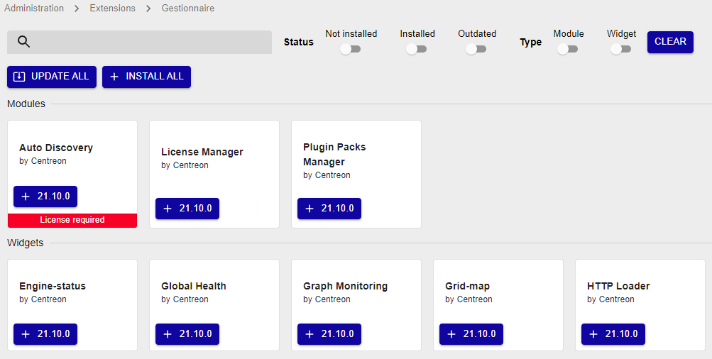

Les extensions permettent d'ajouter des fonctionnalités supplémentaires à
Centreon. Il est possible d'installer des extensions en utilisant le
gestionnaire de paquets ou à partir des fichiers sources (\*.tar.gz).

Les extensions sont regroupées en 3 types :

- **Communautaires**, sous licence GPL v2, développés par la communauté
Centreon,
- **Core**, sous licence GPL v2, développés par l'équipe Centreon,
- **Propriétaires**, soumis à licence, développés par la société
*[Centreon](http://www.centreon.com)*.

Pour installer une extension :

1. Installez l'extension depuis sa documentation associée,
2. Rendez-vous dans le menu **Administration \> Extensions \> Manager**

Pour tout installer en une seule fois cliquez sur **Install all** :

Vous pouvez également mettre à jour toutes les extensions en cliquant sur le
bouton **Update all**, ou gérez extension par extension.

En cliquant sur une extension, il est possible d'accéder à sa description :

