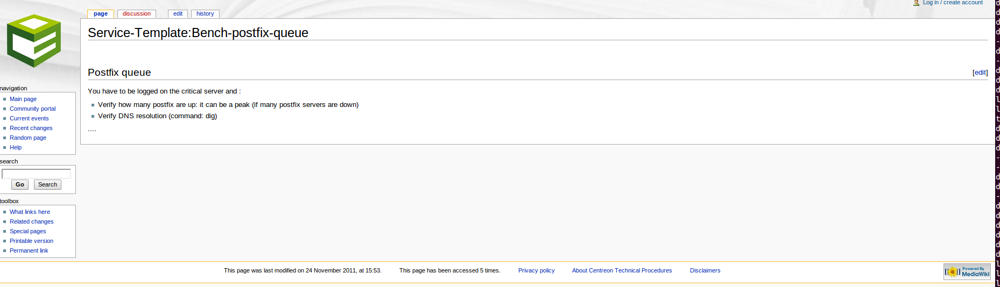

## Introduction

Intégré nativement depuis la version 2.8.0 de Centreon Web, **Knowledge
Base** permet d'interfacer une base de connaissances techniques de procédures
(wiki).

Pour cela, elle crée des liens entre un hôte/service et une procédure spécifique
vers un wiki.

Pour plus de flexibilité, les procédures peuvent être liées directement sur les
modèles.

**Knowledge Base** est la solution idéale pour lier aisément une base
de connaissance avec Centreon Web.

## Pré-requis

**Knowledge Base** requiert que **MediaWiki** (version = 1.31) soit
installé sur un serveur. Un paquet RPM de Mediawiki est disponible sur les
dépôts Centreon.

Alternativement vous pouvez [télécharger MediaWiki
ici](http://www.mediawiki.org/wiki/MediaWiki) et accéder à la [documentation
ici](http://www.mediawiki.org/wiki/User_hub).

## Configuration de l'accès au wiki

Afin d'utiliser **Knowledge Base**, vous devez le configurer pour qu'il
accède à la base de données du wiki.

Pour cela rendez-vous dans `Administration > Paramètres > Base de connaissance` et
renseignez le formulaire.

## Guide utilisateur

### Définition

Une procédure est une documentation technique et/ou fonctionnelle qui met à la
disposition des exploitants un mode opératoire dans le cadre du traitement d'une
alerte.

Le contenu d'une procédure peut être d'ordre général ou spécifique:

  - Décrire les actions nécessaires à la résolution d'un problème.
  - Informer de l'existence d'une consigne particulière (temporaire ou
    permanente).
  - ...

Une procédure peut être associée à un hôte ou un service.

### Algorithme d'affichage : héritage et surcharge

Pour éviter une trop grande charge de travail sur les procédures de déploiement,
cette fonctionnalité permet à l'administrateur de configurer une procédure
simple pour les hôtes/services.

Ainsi une procédure peut être spécifiée pour un hôte/service donné mais aussi
pour un modèle d'hôte et de service.

Si une procédure est définie au niveau d'un modèle, tous les enfants du modèle
parent bénéficieront de cette procédure sauf en cas de surcharge. Ce système est
identique au système de modèle par héritage présent dans Centreon Web.

La fonctionnalité **Knowledge Base** est conçu pour éviter d'ajouter ou
de mettre à jour manuellement plusieurs fois la même procédure dans la base de
connaissances.

Quand un utilisateur clique sur la procédure d'un hôte :

  - si une procédure spécifique est définie pour cet hôte, la page wiki de
    l'hôte s'affichera
  - si aucune procédure spécifique n'est définie mais que le modèle d'hôte a une
    procédure alors c'est la page wiki de cette dernière qui s'affichera
  - si le modèle d'hôte n'a pas de procédure de définie, alors les modèles
    d'hôte parents seront parcourus pour vérifier la présence d'une procédure
  - finalement si aucune procédure n'est définie dans l'arbre des modèles,
    aucune procédure ne sera accessible.

Il en est de même pour les services.

### Création / Mise à jour / Suppression d'une base de connaissances

Naviguer dans l'interface Web de Centreon vers les sous menus de
`Configuration > Base de connaissance` pour :

  - Lister les hôtes / services / modèles d'hôtes / modèles de services avec
    leurs bases de connaissances liées
  - Créer / Visualiser / Editer / Visualiser l'historique pour un hôte / service
    / modèle d'hôte / modèle de service
  - Lister les hôtes / services / modèles d'hôtes / modèles de services sans
    base de connaissances définie.

*Centreon Knowledge Base* utilise un wiki pour stocker sa base de connaissance.
Toutes les créations / modifications sont donc réalisées à travers celui-ci.

### Lien avec l'interface web de supervision

La base de connaissance est accessible depuis l'interface Centreon Web à travers
un icône cliquable (voir ci dessous)

En cliquant sur l'icône, l'utilisateur est redirigé vers la base de connaissance
correspondante.

Si l'icône est situé à gauche du nom de l'hôte, la base de connaissance
concernera l'hôte.

Si l'icône est situé à droite du nom du service, la base de connaissance
concernera le service.

## Synchronisation

Un cron se charge de réaliser les mises à jour de la configuration des hôtes,
des services ainsi que des modèles.

Par exemple, si vous créez une page dans le wiki en utilisant le motif habituel
(ex : `Host:Centreon-Server` ou `Service:Centreon-Server Disk-/`), le cron
ajoutera automatiquement le lien vers la page du wiki correspondante dans le
champ **URL** de la table **Informations étendues**.

### Bonnes pratiques de déploiement

Pour déployer Centreon KnowledgeBase de la meilleure manière, nous vous
recommandons fortement d'utiliser les différents niveaux du système d'héritage.

La bonne pratique est donc de définir les bases de connaissances au niveau des
modèles.

Voici un exemple d'une configuration pour un modèle d'hôte :

  - Linux \> Generic-hosts
  - Windows \> Generic-hosts
  - RedHat \> Linux
  - Debian \> Linux
  - Active-Directory \> Windows
  - LDAP \> Linux

Pour configurer Centreon KnowledgeBase pour le modèle d'hôte **RedHat**, vous
pouvez suivre la démarche décrite dans la section suivante: [Lien avec l'interface web de
supervision](#lien-avec-linterface-web-de-supervision).

Dans l'arbre des modèles, il apparaît que le modèle **RedHat** hérite de deux
autres modèles : **Linux** et **Generic-hosts**.

Dans cet exemple tous les hôtes utilisant le modèle d'hôte *RedHat* auront une
nouvelle base de connaissances disponible.

Vous pouvez configurer une procédure dans un niveau plus élevé dans l'arbre des
modèles.

Par exemple si vous définissez une procédure pour le modèle d'hôte **Linux**, tous
les hôtes utilisant les modèles d'hôtes **RedHat**, **Debian** et **LDAP** hériteront
de cette procédure par héritage.

Le comportement est le même pour les modèles de services.

> Pour suprimmer le lien d'une base de connaissance pour un hôte / service /
> modèle spécifique, editer l'objet et supprimer le contenu du champ **URL**
> dans l'onglet **Informations détaillées**.
>
> Si l'objet hérite d'une base de connaissance d'un modèle, la suppression du
> contenu du champ surchargera la valeur du modèle et supprimera le lien de la
> base de connaissance.
