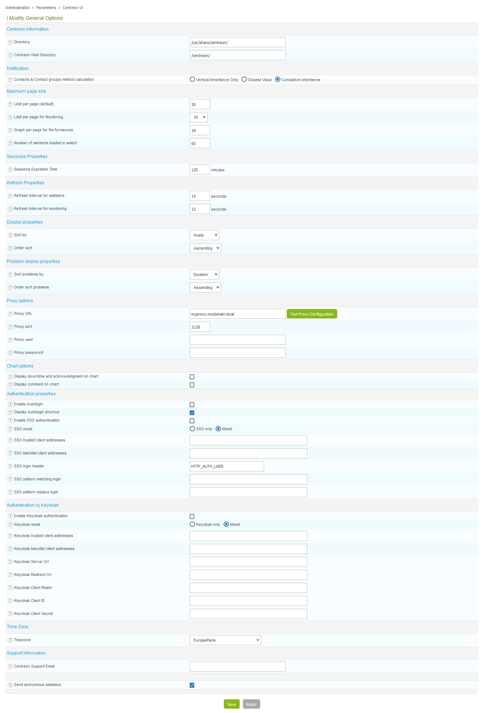
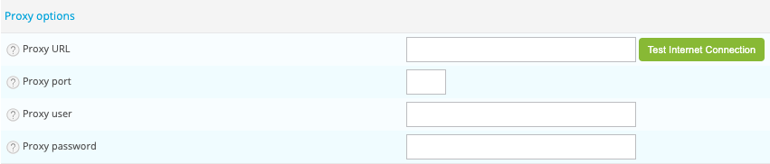
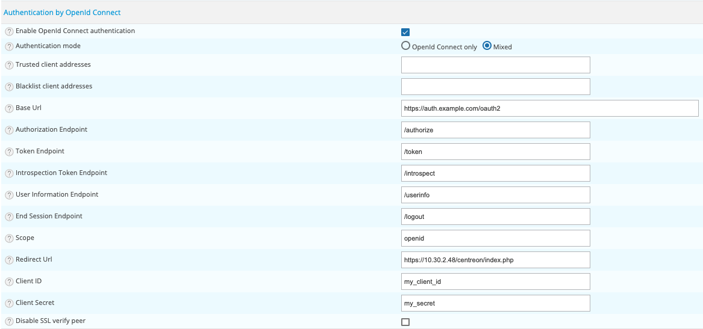

Cette partie traite de la configuration des options générales de l'interface web
Centreon.

Depuis le menu `Administration > Paramètres > Centreon web`.

- Le champ **Répertoire** désigne le répertoire dans lequel Centreon est
installé
- Le champ **Répertoire Web de Centreon** indique le répertoire web sur lequel
est installé Centreon
- Le champs **Contacts & Contact groups method calculation** permet de définir
comment l'héritage des notifications des hôtes et services vont être calculés
- Le champ **Limite par page (par défaut)** définit le nombre d'objet affiché
par page de **Configuration**
- Le champ **Limite par page pour les pages de supervision** définit le nombre
d'objet affiché par page au sein du menu **Supervision**
- Le champ **Graphique de performance par page** définit le nombre maximum de
graphiques affichés sur la page de *Performances*\*
- Le champ **Nombre d'éléments présent** définit le nombre maximum d'éléments
affichés dans chaque boîte de sélection
- Le champ **Durée d'expiration de la session**, exprimé en minutes, indique
la durée maximale d'une session
- Le champ **Intervalle de rafraîchissement pour la page des statistiques**,
exprimé en secondes, indique l'intervalle de rafraîchissement pour les
objets de la page des statistiques
- Le champ **Intervalle de rafraîchissement pour la page de supervision**,
exprimé en secondes, indique l'intervalle de rafraîchissement pour les
objets de la page supervision
- Le champ **Trier par** indique le tri par défaut pour les pages de
supervision des hôtes et des services.
- Le champ **Choix de tri** indique l'ordre par défaut de tri pour les pages
de supervision des services et des hôtes.
- Le champ **Trier les problèmes par** permet de choisir comment trier les
différents incidents dans le menu **Supervision**
- La champ **Ordre de tri des problèmes** indique l'ordre d'affichage des
incidents par ordre de gravité croissant ou décroissant
- Le champ **Afficher les temps d'arrêts et les acquittements sur les
graphiques** permet d'afficher ou non ces éléments
- Le champ **Afficher les comentaires sur les graphiques** permet d'afficher
ou non ces éléments
- Le champ **Timezone par défaut de l'hôte** permet de définit un timezone par
défaut pour application du décalage horaire
- Le champ **Adresse mail de contact du support (de la plate-forme de
supervision)** indique l'adresse email de support **Centre des services du
client** pour la plate-forme Centreon. Cette adresse mail sera affichée en
bas de page sur le lien **Centre des services**
- **Send anonymous statistics** définit si oui on non la plateforme enverra des
des données anonymes pour le programme **Centreon Customer Experience
Improvement**

### Configuration du proxy

La configuraiton du proxy est nécessaire pour bénéficier de l'offre Centreon IT Edition.

Renseigner les différents champs:

- **URL du proxy web**
- **Port d'accès au proxy internet**
- **Proxy user**
- **Proxy password**

Pour valider la configuration, cliquez sur le bouton **Test Proxy Configuration**. Si le message **Connection Successful**
apparaît, votre configuration est valide, sinon modifiez vos paramètres.

## Autologin

- La case **Activer la connexion automatique** autorise les utilisateurs à se
connecter à l'interface web via le mécanisme de connexion automatique
- La case **Afficher le raccourci de connexion automatique** permet d'afficher
le raccourci de connexion en haut à droite

## SSO

- La case **Activer l'authentification SSO** active l'authentification SSO
- Le champ **Mode SSO** indique si l'authentification doit avoir lieu
uniquement par SSO ou bien en utilisant l'authentification locale également
(Mixte). Le mode mixte nécessite l'adresse des clients de confiance.
- Le champ **Adresses des clients SSO de confiance** indique quelles sont les
adresses IP/DNS des clients de confiance pour le SSO (correspond à l'adresse
du reverse proxy). Chaque client de confiance est séparé par une virgule.
- Le champ **Adresses des clients de bloqués** indique quelles sont les
adresses IP/DNS des clients qui seront refusés.
- Le champ **Entête HTTP SSO** indique la variable de l'en-tête qui sera
utilisée comme login/pseudo.
- Le champ **Chaine de recherche (pattern) pour l'authentification (login)**
indique l'expression rationnelle (pattern) de recherche pour l'utilisateur.
- Le champ **Chaine de remplacement (pattern) pour l'authentification
(login)** indique la chaine de remplacement.

> La fonctionnalité SSO doit être activée seulement dans un environnement dédié et
> sécurisé pour le SSO. Les accès direct des utilisateurs à Centreon Web doivent
> être désactivés.

## OpenId Connect

Centreon est compatible avec l'authentification OAuth 2.0 / OpenId Connect.

Il est possible d'utiliser un fournisseur d'identité (IdP) tel que Keycloak, LemonLDAP::NG ou tout autre IdP compatible
avec le flux d'autorisation via un code (Authorization Code Grant).

- La case **Enable OpenId Connect authentication** permet d'activer ou de désactiver l'authentification OpenId Connect.
- Le champ **Authentication mode** indique si l'authentification doit avoir lieu uniquement par OpenId Connect ou en
  utilisant également l'authentification locale (mixte).
- Le champ **Trusted client addresses** indique quelles sont les adresses IP/DNS des clients de confiance (correspond à
  l'adresse du reverse proxy). Chaque client de confiance est séparé par une virgule.
- Le champ **Blacklist client addresses** indique quelles sont les adresses IP/DNS des clients qui seront refusés.
- Le champ **Base Url** définit l'URL de base de l'IdP pour les points de terminaison OpenId Connect (obligatoire).
- Le champ **Authorization Endpoint** définit le point de terminaison d'autorisation, par exemple `/authorize` (obligatoire).
- Le champ **Token Endpoint** définit le point de terminaison du jeton, par exemple `/token` (obligatoire).
- Le champ **Introspection Token Endpoint** définit le point de terminaison du jeton d'introspection, par exemple `/introspect` (obligatoire).
- Le champ **User Information Endpoint** définit le point de terminaison des informations utilisateur, par exemple `/userinfo`.
- Le champ **End Session Endpoint** définit le point de terminaison de déconnexion, par exemple `/logout`.
- Le champ **Scope** définit la portée de l'IdP, par exemple «openid». Portée séparée par espace.
- La case **Redirect Url** définit l'URL de redirection après connexion pour accéder à votre serveur Centreon, par exemple
  `http://192.168.0.1/centreon/index.php`.
- **Client ID** défini l'ID client.
- **Client Secret** défini le secret client.
- **Disable SSL verify peer** permet de désactiver la validation des pairs SSL, ne doit être utilisé que pour le test

> Selon le fournisseur d'identité, il est nécessaire de saisir plusieurs étendues (scope), ceci est indiqué dans la
> documentation de configuration du fournisseur.

> Pour que l'authentification soit fonctionnelle, la réponse à l'appel de jeton d'introspection doit renvoyer une
> variable `preferred_username` contenant le login de l'utilisateur qui sera comparé aux utilisateurs définis dans Centreon.
> Si ce n'est pas le cas, vous devrez configurer votre fournisseur pour envoyer des revendications supplémentaires
> (extra claims) à une portée supplémentaire (scope). Dans ce cas, il sera nécessaire de configurer le point de terminaison
> des informations utilisateur et d'ajouter la portée supplémentaire à la définition de la portée.

> Si vous souhaitez importer automatiquement l'utilisateur après la connexion, vous pouvez configurer un serveur LDAP
> et activer l'importation automatique.
