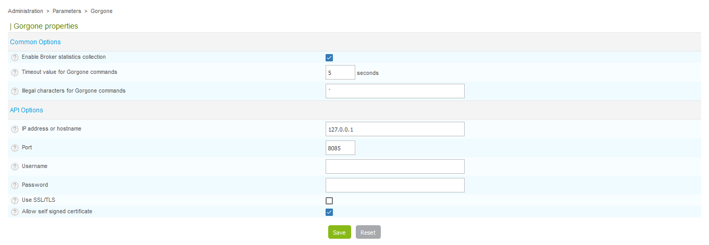

Cette partie permet de définir les paramètres nécessaire à Centreon pour
intéragir avec Gorgone.

Rendez-vous dans le menu `Administration > Paramètres > Gorgone`.

- Le champ **Activer la récupération des statistiques de Centreon Broker**
active la récupération des statistiques de Centreon Broker.
- Le champ **Temps maximum d'exécution des commandes Gorgone** permet de
définir un temps de d'exécution maximal des commandes lancées par Gorgone.
- Le champ **Caractères illégaux pour les commandes Gorgone** permet de
définir les caractères non autorisés qui seront supprimés des commandes
transférées par le processus.
- Le champ **Adresse IP ou nom d'hôte** permet de définir l'adresse IP ou le
nom d'hôte pour communiquer avec l'API de Gorgone.
- Le champ **Port** permet de définir le port pour communiquer avec l'API de
Gorgone.
- Le champ **Utilisateur** permet de définir l'utilisateur utilisé pour se
connecter à l'API de Gorgone.
- Le champ **Mot de passe** permet de définir le mote de passe utilisé pour se
connecter à l'API de Gorgone.
- Le case **Utiliser SSL/TLS** permet de définir si SSL/TLS doit être utilisé
pour communiquer avec l'API de Gorgone.
- Le case **Autoriser les certificats auto-signés** permet de définir si les
certificats auto-signés sont autorisés.
