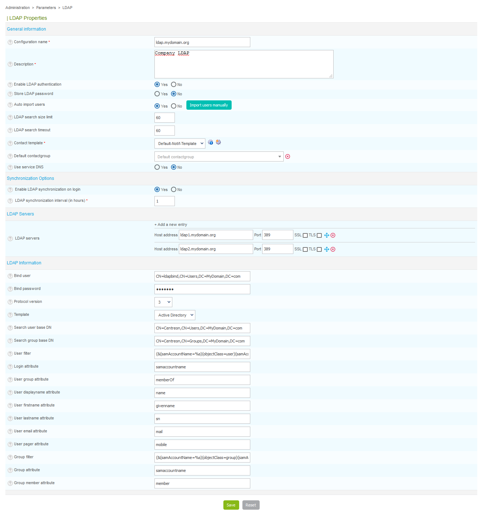

> Si vous souhaitez implémenter une authentification SSO, suivez
> [cette procédure](centreon-ui.html#sso).

Cette partie permet de configurer la connexion au(x) annuaire(s) LDAP.

Rendez-vous dans le menu `Administration > Paramètres > LDAP` et cliquez
sur **Ajouter**.



- Les champs **Nom de la configuration** et **Description** définissent le nom
et la description du serveur LDAP
- Le champ **Activer l'authentification LDAP** permet d'activer
l'authentification à travers le serveur LDAP
- Le champ **Sauvegarde du mot de passe LDAP** permet de stocker le mot de
passe des utilisateurs en base de données, utile en cas de perte de
connexion avec l'annuaire pour authentifier les utilisateurs
- Le champ **Import automatiques des utilisateurs** permet d'importer
automatiquement les utilisateurs de l'annuaire LDAP dans Centreon. En
cliquant sur **Importer les utilisateurs manuellement**, vous pouvez choisir
les utilisateurs que vous souhaitez importer

> Si l'option **Import automatiques des utilisateurs** est cochée, alors pour
> toute nouvelle personne qui se connecte à l'interface Centreon, ses paramètres
> LDAP seront automatiquement importés dans Centreon (nom, prénom, adresse mail,
> ...). Les profils ACL seront appliqués lors de l'accès (voir *[ACL](../access-control-lists)*).
> Par contre, si cette option n'est pas cochée, seuls les utilisateurs
> importés manuellement pourront s'authentifier.

- Le champ **Taille limite de la recherche LDAP** permet de limiter la taille
de la recherche des utilisateurs
- Le champ **Temps maximum d'exécution de la recherche LDAP** permet de
définir le temps maximum de la recherche LDAP
- Le champ **Modèle de contact** définit le modèle de contact qui sera lié
pour tous les utilisateurs importés depuis cet annuaire LDAP
- Le champ optionnel **Groupe de contacts par défaut** permet d'ajouter à un
groupe de contact les contacts importés
- Le champ **Utiliser le service DNS** indique s'il faut utiliser le serveur
DNS pour résoudre l'adresse IP de l'annuaire LDAP
- Le champ **LDAP servers** permet d'ajouter un ou plusieurs annuaires LDAP
vers lequel Centreon va se connecter.
- Lorsque l'option **Synchronisation LDAP lors du login** est activée, une
mise à jour des données de l'utilisateur provenant du LDAP sera effectuée
lors de sa connection et ses ACL seront re-calculées.
- Le champ **Intervalle (en heures), entre les synchronisations LDAP** est
affiché si la précedente option est activée. Il permet de spécifier une
durée minimale entre deux synchronisation avec le LDAP.

> Les données provenant du LDAP ne seront mises à jour que lorsque cet intervalle
> sera écoulé.
>
> Une synchronisation manuelle est possible sur les pages
> `Administration > Sessions` et `Configuration > Utilisateurs > Contacts /
> Utilisateurs`.
>
> L'intervalle est exprimé en heures. Par défaut, ce champs est initié avec la
> plus basse valeur possible : 1 heure.

> Nous sauvegardons en DB, un timestamp comme date de référence et c'est le CRON
> CentAcl qui le met à jour.
>
> Cette référence temporelle permet de calculer la prochaine synchronisation avec
> le LDAP.
>
> Si vous modifiez l'un de ces deux champs, la base temporelle sera réinitialisée
> à l'heure de la sauvegarde du formulaire.
>
> Cette reférence temporelle n'est pas affectée par les modifications apportées
> sur les autres champs du formulaire.

- La section **Serveurs LDAP** permet d'ajouter un ou plusieurs annuaires LDAP
auxquels Centreon se connectera.

Le tableau ci-dessous résume les différents paramètres à insérer pour ajouter un
serveur LDAP :

| Colonne            | Description                                                          |
| ------------------ | -------------------------------------------------------------------- |
| Adresse du serveur | Contient l'adresse IP ou nom DNS du serveur LDAP                     |
| Port               | Indique le port de connexion pour accéder à l'annuaire LDAP          |
| SSL                | Indique si le protocole SSL est utilisé pour la connexion au serveur |
| TLS                | Indique si le protocole TLS est utilisé pour la connexion au serveur |

- Les champs **Utilisateur du domaine** et **Mot de passe** définissent le nom
d'utilisateur et le mot de passe pour se connecter au serveur LDAP
- Le champ **Version du protocole** indique la version du protocole à utiliser
pour se connecter
- La liste **Modèle** permet de préconfigurer les filtres de recherches des
utilisateurs sur l'annuaire LDAP. Ces filtres permettent de proposer par
défaut une recherche sur un annuaire de type MS Active Directory, Okta ou
de type Posix.

> Avant tout import, vérifiez les paramètres par défaut proposés. Si vous n'avez
> sélectionné aucun modèle, vous devez définir manuellement les filtres de
> recherches en complétant les champs.

> Il est possible d'utiliser l'annuaire **Okta** avec le [plugin
> SWA](https://help.okta.com/en/prod/Content/Topics/Apps/Apps_Configure_Template_App.htm) :
>
> - le champ **Utilisateur du domaine** est du type
> **uid=\<USER\>,dc=\<ORGANIZATION\>,dc=okta,dc=com**
> - et le champ **Base de recherche de groupe DN** du type
> **ou=\<OU\>,dc=\<ORGANIZATION\>,dc=okta,dc=com**

Sous CentOS 7, on peut définir de ne pas vérifier le certificat serveur avec la
procédure suivante:

Ajouter la ligne suivante dans le fichier "/etc/openldap/ldap.conf" :

```shell
TLS_REQCERT never
```

Puis redémarrez le serveur Apache :

```shell
systemctl restart httpd24-httpd
```
