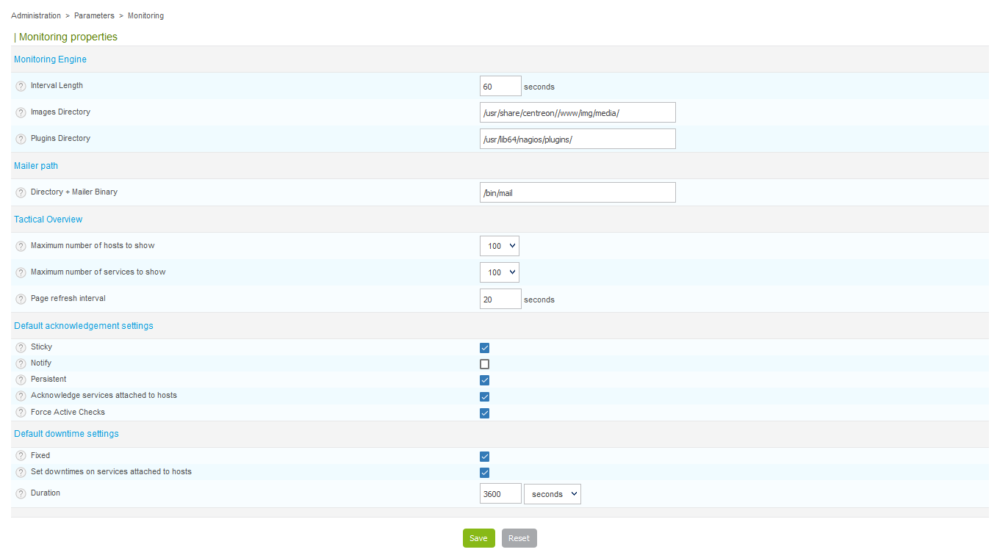

Cette partie traite des options générales de l'interface de supervision temps
réel.

Rendez-vous dans le menu `Administration > Paramètres > Supervision`

- Le champ **Unité de temps de référence** indique l'intervalle de temps en
seconde utilisé pour planifier les contrôles et les notifications
- Le champ **Répertoire des images** définit le répertoire d'image dans lequel
sont stockés les médias
- Le champ **Répertoire des sondes** définit le répertoire où se situent les
sondes de supervision
- Le champ **Script de démarrage du broker** contient le chemin vers le script
de démarrage du broker
- Le champ **Chemin complet de l'exécutable** contient le chemin vers
l'exécutable permettant d'envoyer des mails
- Les listes **Nombre maximum d'hôtes à afficher** et **Nombre maximum de
services à afficher** contiennent le nombre maximal d'hôte ou de services à
afficher dans la vue d'ensemble (menu **Accueil \> Accueil**)
- Le champ **Intervalle de rafraîchissement de la page** définit l'intervalle
de rafraîchissement des données dans la vue d'ensemble
- Les cases contenues dans les catégories **Options d'acquittement par
défaut** et **Options de temps d'arrêt par défaut** définissent les options
par défaut qui seront cochées ou non lors de la définition d'un acquittement
ou d'un temps d'arrêt
- Le champ **Durée** permet de définir la durée par défaut d'un temps d'arrêt
