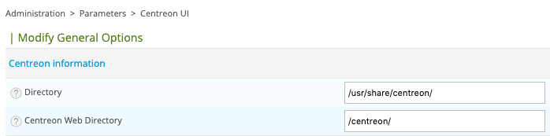

Ce chapitre vous propose de sécuriser votre plateforme Centreon.

## Renforcez la sécurité des comptes utilisateurs

Après l'installation de Centreon, il est nécessaire de changer les mots de passe par défaut des utilisateurs suivants:

- root
- centreon
- centreon-engine
- centreon-broker
- centreon-gorgoned

Pour cela, utilisez la commande suivante avec un compte privilégié (par exemple sudo) ou avec root (non recommandé - vous devez
avoir un utilisateur dédié) :

```shell
passwd <account_name>
```

De plus, il est important de vérifier que le compte Apache ne dispose pas de droits de connexion au terminal. Exécutez
la commande suivante :

```shell
cat /etc/passwd | grep apache
```

Vous devez avoir **/sbin/nologin** tel que :

```shell
apache:x:48:48:Apache:/usr/share/httpd:/sbin/nologin
```

> Pour rappel, la liste des utilisateurs et des groupes se trouve [ici](../installation/prerequisites.html#utilisateurs-et-groupes)

## Sécurisez l'installation du SGBD

[MariaDB](https://mariadb.com/kb/en/mysql_secure_installation/) propose une procédure par défaut pour sécuriser
l'installation du SGBD. Veuillez exécuter la commande suivante et suivre les instructions :

```shell
mysql_secure_installation
```

## Sécurisez le serveur web Apache

Par défaut, Centreon installe un serveur Web en mode HTTP. Il est fortement recommandé de passer en mode HTTPS en
ajoutant votre certificat.

Il vaut mieux utiliser un certificat validé par une autorité plutôt que d'utiliser un certificat auto-signé.

Si vous ne disposez pas d'un certificat validé par une autorité, vous pouvez en générer un sur des plateformes telles
que [Let's Encrypt](https://letsencrypt.org/).

Une fois votre certificat obtenu, effectuez la procédure suivante pour activer le mode HTTPS sur votre serveur Apache :

1. Installez le module SSL pour Apache

<!--DOCUSAURUS_CODE_TABS-->
<!--RHEL / CentOS / Oracle Linux 8-->
```shell
dnf install mod_ssl mod_security openssl
```
<!--CentOS 7-->
```shell
yum install httpd24-mod_ssl httpd24-mod_security openssl
```
<!--END_DOCUSAURUS_CODE_TABS-->

2. Installez vos certificats

Copiez votre certificat et votre clé sur le serveur en fonction de votre configuration; par défaut:

- /etc/pki/tls/certs/ca.crt
- /etc/pki/tls/private/ca.key

3. Sauvegardez la configuration actuelle du serveur Apache pour Centreon

<!--DOCUSAURUS_CODE_TABS-->
<!--RHEL / CentOS / Oracle Linux 8-->
```shell
cp /etc/httpd/conf.d/10-centreon.conf{,.origin}
```
<!--CentOS 7-->
```shell
cp /opt/rh/httpd24/root/etc/httpd/conf.d/10-centreon.conf{,.origin}
```
<!--END_DOCUSAURUS_CODE_TABS-->

4. Éditez la configuration Apache pour Centreon

> Centreon propose un fichier de configuration d'exemple HTTPS disponible dans le répertoire:
> **/usr/share/centreon/examples/centreon.apache.https.conf**

<!--DOCUSAURUS_CODE_TABS-->
<!--RHEL / CentOS / Oracle Linux 8-->
Éditez  le fichier **/etc/httpd/conf.d/10-centreon.conf** tel que :
<!--CentOS 7-->
Éditez  le fichier **/opt/rh/httpd24/root/etc/httpd/conf.d/10-centreon.conf** tel que :
<!--END_DOCUSAURUS_CODE_TABS-->

```apacheconf
Alias /centreon/api /usr/share/centreon
Alias /centreon /usr/share/centreon/www/

<LocationMatch ^/centreon/(?!api/latest/|api/beta/|api/v[0-9]+/|api/v[0-9]+\.[0-9]+/)(.*\.php(/.*)?)$>
    ProxyPassMatch fcgi://127.0.0.1:9042/usr/share/centreon/www/$1
</LocationMatch>

<LocationMatch ^/centreon/api/(latest/|beta/|v[0-9]+/|v[0-9]+\.[0-9]+/)(.*)$>
    ProxyPassMatch fcgi://127.0.0.1:9042/usr/share/centreon/api/index.php/$1
</LocationMatch>

ProxyTimeout 300

<VirtualHost *:80>
    RewriteEngine On
    RewriteCond %{HTTPS} off
    RewriteRule (.*) https://%{HTTP_HOST}%{REQUEST_URI}
</VirtualHost>

<VirtualHost *:443>
#####################
# SSL configuration #
#####################
    SSLEngine On
    SSLProtocol All -SSLv3 -SSLv2 -TLSv1 -TLSv1.1
    SSLCipherSuite ECDHE-ECDSA-AES256-GCM-SHA384:ECDHE-ECDSA-AES128-GCM-SHA256:ECDHE-ECDSA-CHACHA20-POLY1305:ECDHE-RSA-CHACHA20-POLY1305:DHE-DSS-AES256-GCM-SHA384:DHE-DSS-AES128-GCM-SHA256:ECDHE-ECDSA-AES256-SHA:ECDHE-ECDSA-AES128-SHA:ECDHE-ECDSA-AES256-SHA384:ECDHE-ECDSA-AES128-SHA256:ECDHE-RSA-AES256-GCM-SHA384:ECDHE-RSA-AES128-GCM-SHA256:AES256-GCM-SHA384:AES128-GCM-SHA256:!aNULL:!eNULL:!LOW:!3DES:!MD5:!EXP:!PSK:!DSS:!RC4:!SEED:!ADH:!IDEA
    SSLHonorCipherOrder On
    SSLCompression Off
    SSLCertificateFile /etc/pki/tls/certs/ca.crt
    SSLCertificateKeyFile /etc/pki/tls/private/ca.key

    <Directory "/usr/share/centreon/www">
        DirectoryIndex index.php
        Options Indexes
        AllowOverride all
        Order allow,deny
        Allow from all
        Require all granted
        <IfModule mod_php5.c>
            php_admin_value engine Off
        </IfModule>

        RewriteRule ^index\.html$ - [L]
        RewriteCond %{REQUEST_FILENAME} !-f
        RewriteCond %{REQUEST_FILENAME} !-d
        RewriteRule . /index.html [L]
        ErrorDocument 404 /centreon/index.html

        AddType text/plain hbs
    </Directory>

    <Directory "/usr/share/centreon/api">
        Options Indexes
        AllowOverride all
        Order allow,deny
        Allow from all
        Require all granted
        <IfModule mod_php5.c>
            php_admin_value engine Off
        </IfModule>

        AddType text/plain hbs
    </Directory>
</VirtualHost>

RedirectMatch ^/$ /centreon
```

> N'oubliez pas de changer les directives **SSLCertificateFile** et **SSLCertificateKeyFile** avec les chemins d'accès 
> vers votre clé et votre certificat.

5. Activez les flags HttpOnly et Secure et cachez la signature du serveur

<!--DOCUSAURUS_CODE_TABS-->
<!--RHEL / CentOS / Oracle Linux 8-->
Éditez le fichier **/etc/httpd/conf.d/10-centreon.conf** et ajouter la ligne suivante :

```apacheconf
Header always edit Set-Cookie ^(.*)$ $1;HttpOnly;Secure
ServerSignature Off
ServerTokens Prod
```

Éditez le fichier **/etc/php.d/50-centreon.ini*** et désactivez le paramètre `expose_php` :

```phpconf
expose_php = Off
```
<!--CentOS 7-->
Éditez le fichier **/opt/rh/httpd24/root/etc/httpd/conf.d/10-centreon.conf** et ajouter la ligne suivante :

```apacheconf
Header set X-Frame-Options: "sameorigin"
Header always edit Set-Cookie ^(.*)$ $1;HttpOnly;Secure
ServerSignature Off
ServerTokens Prod
TraceEnable Off
```

Éditez le fichier **/etc/opt/rh/rh-php73/php.d/50-centreon.ini** et désactivez le paramètre `expose_php` :

```phpconf
expose_php = Off
```
<!--END_DOCUSAURUS_CODE_TABS-->

6. Cacher le répertoire par défaut /icons

<!--DOCUSAURUS_CODE_TABS-->
<!--RHEL / CentOS / Oracle Linux 8-->
Éditez le fichier **/etc/httpd/conf.d/autoindex.conf** et commentez la ligne suivante :

```apacheconf
#Alias /icons/ "/usr/share/httpd/icons/"
```
<!--CentOS 7-->
Éditez le fichier **/opt/rh/httpd24/root/etc/httpd/conf.d/autoindex.conf** et commentez la ligne suivante :

```apacheconf
#Alias /icons/ "/opt/rh/httpd24/root/usr/share/httpd/icons/"
```
<!--END_DOCUSAURUS_CODE_TABS-->

7. Désactiver les boundary mod_security pour autoriser l'upload de license

Éditez le fichier **/opt/rh/httpd24/root/etc/httpd/conf.d/mod_security.conf** et commentez la ligne suivante :

```apacheconf
#SecRule MULTIPART_UNMATCHED_BOUNDARY "!@eq 0" \
#"id:'200003',phase:2,t:none,log,deny,status:44,msg:'Multipart parser detected a possible unmatched boundary.'"
```

8. Redémarrez le serveur web Apache et PHP pour prendre en compte la configuration

<!--DOCUSAURUS_CODE_TABS-->
<!--RHEL / CentOS / Oracle Linux 8-->
```shell
systemctl restart php-fpm httpd
```

Puis vérifiez le statut :

```shell
systemctl status httpd
```

Si tout est correct, vous devriez avoir quelque chose comme :

```shell
● httpd.service - The Apache HTTP Server
   Loaded: loaded (/usr/lib/systemd/system/httpd.service; enabled; vendor preset: disabled)
  Drop-In: /usr/lib/systemd/system/httpd.service.d
           └─php-fpm.conf
   Active: active (running) since Tue 2020-10-27 12:49:42 GMT; 2h 35min ago
     Docs: man:httpd.service(8)
 Main PID: 1483 (httpd)
   Status: "Total requests: 446; Idle/Busy workers 100/0;Requests/sec: 0.0479; Bytes served/sec: 443 B/sec"
    Tasks: 278 (limit: 5032)
   Memory: 39.6M
   CGroup: /system.slice/httpd.service
           ├─1483 /usr/sbin/httpd -DFOREGROUND
           ├─1484 /usr/sbin/httpd -DFOREGROUND
           ├─1485 /usr/sbin/httpd -DFOREGROUND
           ├─1486 /usr/sbin/httpd -DFOREGROUND
           ├─1487 /usr/sbin/httpd -DFOREGROUND
           └─1887 /usr/sbin/httpd -DFOREGROUND
```
<!--CentOS 7-->
```shell
systemctl restart rh-php73-php-fpm httpd24-httpd
```

Puis vérifiez le statut :

```shell
systemctl status httpd24-httpd
```

Si tout est correct, vous devriez avoir quelque chose comme :

```shell
● httpd24-httpd.service - The Apache HTTP Server
   Loaded: loaded (/usr/lib/systemd/system/httpd24-httpd.service; enabled; vendor preset: disabled)
   Active: active (running) since mar. 2020-05-12 15:39:58 CEST; 25min ago
  Process: 31762 ExecStop=/opt/rh/httpd24/root/usr/sbin/httpd-scl-wrapper $OPTIONS -k graceful-stop (code=exited, status=0/SUCCESS)
 Main PID: 31786 (httpd)
   Status: "Total requests: 850; Idle/Busy workers 50/50;Requests/sec: 0.547; Bytes served/sec: 5.1KB/sec"
   CGroup: /system.slice/httpd24-httpd.service
           ├─ 1219 /opt/rh/httpd24/root/usr/sbin/httpd -DFOREGROUND
           ├─31786 /opt/rh/httpd24/root/usr/sbin/httpd -DFOREGROUND
           ├─31788 /opt/rh/httpd24/root/usr/sbin/httpd -DFOREGROUND
           ├─31789 /opt/rh/httpd24/root/usr/sbin/httpd -DFOREGROUND
           ├─31790 /opt/rh/httpd24/root/usr/sbin/httpd -DFOREGROUND
           ├─31802 /opt/rh/httpd24/root/usr/sbin/httpd -DFOREGROUND
           ├─31865 /opt/rh/httpd24/root/usr/sbin/httpd -DFOREGROUND
           ├─31866 /opt/rh/httpd24/root/usr/sbin/httpd -DFOREGROUND
           ├─31882 /opt/rh/httpd24/root/usr/sbin/httpd -DFOREGROUND
           ├─31903 /opt/rh/httpd24/root/usr/sbin/httpd -DFOREGROUND
           └─32050 /opt/rh/httpd24/root/usr/sbin/httpd -DFOREGROUND
```
<!--END_DOCUSAURUS_CODE_TABS-->

## URI personnalisée

Il est possible de modifier l'URI de Centreon. Par exemple, **/centreon** peut être remplacé par **/monitoring**.

> Au moins un niveau de chemin est obligatoire.

Pour mettre à jour l'URI Centreon, vous devez suivre les étapes suivantes:

1. Rendez-vous dans le menu `Administration > Paramètres > Centreon web` et modifiez le champ **Centreon Web Directory**



2. Éditez le fichier de configuration Apache pour Centreon

<!--DOCUSAURUS_CODE_TABS-->
<!--RHEL / CentOS / Oracle Linux 8-->
```shell
vim /etc/httpd/conf.d/10-centreon.conf
```
<!--CentOS 7-->
```shell
vim /opt/rh/httpd24/root/etc/httpd/conf.d/10-centreon.conf
```

et modifiez le chemin **/centreon** par le nouveau.

## Activation du http2

Il est possible d'activer le protocole http2 pour améliorer les performances réseaux de Centreon.

Pour utiliser http2, vous devez suivre les étapes suivantes:

<!--DOCUSAURUS_CODE_TABS-->
<!--RHEL / CentOS / Oracle Linux 8-->
1. [Configurer le https pour Centreon](./secure-platform.html#securisez-le-serveur-web-apache)

2. Installer le module nghttp2:

```shell
dnf install nghttp2
```

3. Enable http2 protocol in **/opt/rh/httpd24/root/etc/httpd/conf.d/10-centreon.conf**:

```apacheconf
...
<VirtualHost *:443>
    Protocols h2 h2c http/1.1
    ...
</VirtualHost>
...
```

4. Modifier la méthode utilisée par apache pour le module multi-processus dans **/etc/httpd/conf.modules.d/00-mpm.conf** :

```diff
-LoadModule mpm_prefork_module modules/mod_mpm_prefork.so
+#LoadModule mpm_prefork_module modules/mod_mpm_prefork.so

-#LoadModule mpm_event_module modules/mod_mpm_event.so
+LoadModule mpm_event_module modules/mod_mpm_event.so
```

5. Redémarrer le processus Apache pour prendre en compte la nouvelle configuration:

```shell
systemctl restart httpd
```
<!--CentOS 7-->
1. [Configurer le https pour Centreon](./secure-platform.html#securisez-le-serveur-web-apache)

2. Installer le module nghttp2:

```shell
yum install httpd24-nghttp2
```

3. Enable http2 protocol in **/opt/rh/httpd24/root/etc/httpd/conf.d/10-centreon.conf**:

```apacheconf
...
<VirtualHost *:443>
    Protocols h2 h2c http/1.1
    ...
</VirtualHost>
...
```

4. Modifier la méthode utilisée par apache pour le module multi-processus dans **/opt/rh/httpd24/root/etc/httpd/conf.modules.d/00-mpm.conf**:

```diff
-LoadModule mpm_prefork_module modules/mod_mpm_prefork.so
+#LoadModule mpm_prefork_module modules/mod_mpm_prefork.so

-#LoadModule mpm_event_module modules/mod_mpm_event.so
+LoadModule mpm_event_module modules/mod_mpm_event.so
```

5. Redémarrer le processus Apache pour prendre en compte la nouvelle configuration:

```shell
systemctl restart httpd24-httpd
```
<!--END_DOCUSAURUS_CODE_TABS-->

## Authentification des utilisateurs

Centreon propose plusieurs méthodes pour authentifier les utilisateurs :

- localement (MySQL)
- [LDAP](./parameters/ldap.html)
- [Generic SSO](./parameters/centreon-ui.html#sso) ou [OpenId Connect](./parameters/centreon-ui.html#openid-connect)

## Créer des profils d'utilisateurs

Centreon propose de gérer les autorisations d'accès aux différents menus, ressources et actions possibles sur ces ressources
via la gestion de [liste de contrôle d'accès](./access-control-lists.html).

## Communications sécurisées entre les serveurs

Il est fortement recommandé de sécuriser les communications entre les différents serveurs de la plateforme Centreon si
certains serveurs ne sont pas dans un réseau sécurisé.

> Le tableau des flux réseau est disponible [ici](../installation/architectures.html#tableau-des-flux-réseau).

### Communication Centreon Broker 

#### Centreon Broker et pare-feu

Parfois, il n'est pas possible d'initialiser le flux Centreon Broker depuis le collecteur (ou Remote Server)
vers le serveur Centreon Central ou le Remote Server.
[Voir la configuration suivante pour inverser le flux](../monitoring/monitoring-servers/advanced-configuration.html#centreon-broker-and-the-firewall).

#### Authentification des flux Centreon Broker

Si vous devez authentifier des collecteurs qui envoient des données, vous pouvez utiliser le mécanisme d'authentification
Centreon Broker, qui est basé sur des certificats X.509.
[Voir la configuration suivante pour authentifier les collecteurs](../monitoring/monitoring-servers/advanced-configuration.html#authentification-avec-centreon-broker).

#### Compressez et chiffrez la communication Centreon Broker

Il est également possible de compresser et de chiffrer la communication de Centreon Broker. Allez dans le menu
`Configuration > Pollers > Broker configuration`, modifiez votre configuration Centreon Broker et activez les entrées
et sorties **IPv4**:

- Enable TLS encryption: Auto
- Enable negotiation: Yes
- Compression (zlib): Auto

### Communication Centreon Gorgone

La [documentation officielle de Centreon gorgone](https://github.com/centreon/centreon-gorgone/blob/master/docs/configuration.md#gorgonecore) vous permettra de sécuriser la communication entre les processus Gorgone.

## Gestion des informations sur les événements de sécurité - SEIM

Les journaux des événements Centreon sont disponibles dans les répertoires suivants :

| Répertoires des journaux  | Central server | Remote Server | Poller | Centreon Map server | Centreon MBI Server |
|---------------------------|----------------|---------------|--------|---------------------|---------------------|
| /var/log/centreon         | X              | X             |        |                     |                     |
| /var/log/centreon-broker  | X              | X             | X      |                     |                     |
| /var/log/centreon-engine  | X              | X             | X      |                     |                     |
| /var/log/centreon-gorgone | X              | X             | X      |                     |                     |
| /var/log/centreon-bi      | X              | X             |        |                     |                     |
| /var/log/centreon-map     | X              | X             |        | X                   | X                   |

> De plus, toutes les actions de modification de la configuration de Centreon effectuées par les utilisateurs sont
> disponibles via le menu [`Administration > Logs`](./logging-configuration-changes.html).

# Sauvegardez votre plateforme

Centreon propose de sauvegarder la configuration de la plateforme. Pour ce faire, accédez au menu
[`Administration  >  Parameters  >  Backup`](./backup.html).
