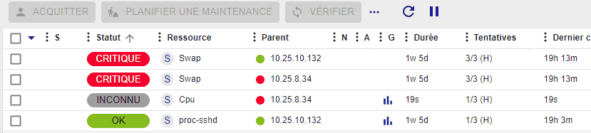
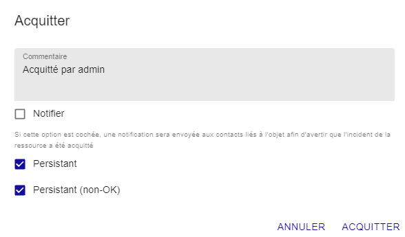

## Acquitter un problème

### Principe

Lorsqu'un hôte ou un service présente un incident et que ce dernier est
validé, le processus de notification est enclenché, pouvant générer une
notification envoyée à un contact. Si le problème persiste et suivant la
configuration réalisée (relancer une notification à intervalle de temps
régulier, escalade de notification) il est possible que d'autres alertes
soient émises.

L'acquittement d'un incident permet de stopper le processus de
notification (envoi de notifications), jusqu'à ce que l'hôte ou le
service retrouve un statut nominal.

Exemple d'utilisation :

Un service est chargé de vérifier la santé des disques durs d'une baie
de disque. Un disque dur physique tombe en panne sur une baie de disque,
une notification est envoyée. L'opérateur de supervision acquitte le
service en précisant qu'une équipe est en train de régler le problème.
Les notifications ne sont plus envoyées. Le service reprendra son état
nominal après changement du disque.

> L'acquittement d'un incident signifie la prise en compte du problème
> par un utilisateur de la supervision (et non la résolution de ce
> dernier qui ne pourra être effective que lorsque le contrôle sera
> revenu dans son état nominal).

### En pratique

Pour acquitter un incident, plusieurs solutions sont possibles :

<!--DOCUSAURUS_CODE_TABS-->
<!--Page Statut des ressources-->

1. Allez à la page **Supervision > Statut des ressources**.
2. Utilisez une des méthodes suivantes :
    - Sélectionnez le ou les objets que vous souhaitez acquitter, puis cliquez sur le bouton **Acquitter** au-dessus de la liste des ressources.
    - Survolez la ressource désirée, puis cliquez sur l'icône **Acquitter** qui apparaît à gauche :

    

    La fenêtre suivante apparaît :

    

    - Le champ **Commentaire** est généralement utilisé pour fournir la raison de l'acquittement et est obligatoire.
    
    - Si la case **Notifier** est cochée, alors une notification est envoyée aux contacts liés à l'objet pour les avertir que l'incident sur la ressource a été acquitté (dans le cas où le filtre de notification d'acquittement est activé pour ce contact).

    - Si la case **Persistant** est cochée, alors l'acquittement sera conservé en cas de redémarrage de l'ordonnanceur. Sinon, l'acquittement disparaît et le processus de notification est réactivé.

    - Si la case **Persistant (non-OK)** est cochée, alors l'acquittement sera conservé en cas de changement de statut non-OK (Exemple DOWN à UNREACHABLE ou bien WARNING à CRITICAL). Sinon, l'acquittement disparaît et le processus de notification est réactivé.

<!--Supervision temps réel-->

1.  Rendez-vous dans le menu **Monitoring > Status Details > Hosts** (ou
    **Services**)
2.  Sélectionnez le ou les objets que vous souhaitez acquitter.
3.  Dans le menu **More actions** cliquez sur **Hosts: Acknowledge** ou sur
    **Services: Acknowledge**

La fenêtre suivante s'affiche :

-   Si la case **Sticky** est cochée, alors l'acquittement sera conservé
    en cas de changement de statut non-OK (Exemple DOWN à UNREACHABLE ou
    bien WARNING à CRITICAL). Sinon, l'acquittement disparaît et le
    processus de notification est réactivé.
-   Si la case **Notify** est cochée, alors une notification est envoyée
    aux contacts liés à l'objet pour les avertir que l'incident sur la
    ressource a été acquitté (dans le cas où le filtre de notification d'acquittement est activé pour ce contact).
-   Si la case **Persistent** est cochée, alors l'acquittement sera
    conservé en cas de redémarrage de l'ordonnanceur. Sinon,
    l'acquittement disparaît et le processus de notification est
    réactivé.
-   Le champ **Comment** est généralement utilisé pour fournir la raison
    de l'acquittement et est obligatoire.
-   Si la casee **Acknowledge services attached to hosts** est cochée,
    alors tous les services liés à l'hôte seront acquittés (option
    visible uniquement si vous acquittez un hôte).
-   Si la case **Force active checks** est cochée, alors une commande
    sera envoyée à l'ordonnanceur pour recontrôler la ressource dans les plus brefs
    délais.

<!--Page de détail d'un objet-->

A partir de la page de détail d'un objet, cliquez sur l'icône activé
associé au champ **Acknowledged** dans le cadre **Options**.

La fenêtre suivante s'affiche :

-   Si la case **Sticky** est cochée, alors l'acquittement sera conservé
    en cas de changement de statut non-OK (Exemple DOWN à UNREACHABLE ou
    bien WARNING à CRITICAL). Sinon, l'acquittement disparaît et le
    processus de notification est réactivé.
-   Si la case **Notify** est cochée, alors une notification est envoyée
    aux contacts liés à l'objet pour les avertir que l'incident sur la
    ressource a été acquitté (dans le cas où le filtre de notification d'acquittement est activé pour ce contact).
-   Si la case **Persistent** est cochée, alors l'acquittement sera
    conservé en cas de redémarrage de l'ordonnanceur. Sinon,
    l'acquittement disparaît et le processus de notification est
    réactivé.
-   Le champ **Comment** est généralement utilisé pour fournir la raison
    de l'acquittement et est obligatoire.
-   Si la casee **Acknowledge services attached to hosts** est cochée,
    alors tous les services liés à l'hôte seront acquittés (option
    visible uniquement si vous acquittez un hôte).
-   Si la case **Force active checks** est cochée, alors une commande
    sera envoyée à l'ordonnanceur pour recontrôler la ressource dans les plus brefs
    délais.

<!--END_DOCUSAURUS_CODE_TABS-->

### Supprimer un acquittement

Pour supprimer l'acquittement d'un incident sur un objet :

<!--DOCUSAURUS_CODE_TABS-->

<!--À partir de la page Statut des ressources-->

1. Allez à la page **Supervision > Statut des ressources**.
2. Sélectionnez le ou les objets à désacquitter.
3. Dans le menu **Plus d'actions**, cliquez sur **Désacquitter**.

<!--À partir de la supervision temps réel-->

1.  Rendez-vous dans le menu **Monitoring > Status Details > Hosts** (or
    **Services**) menu
2.  Sélectionnez les objets auxquels vous souhaitez supprimer
    l'acquittement
3.  Dans le menu **More actions**, cliquez sur **Hosts: Disacknowledge**
    ou sur **Services: Disacknowledge**

<!--END_DOCUSAURUS_CODE_TABS-->