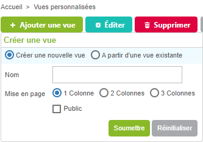

Les vues personnalisées sont des tableaux de bord, créés à l'aide de widgets. Vous pouvez partager des vues avec les autres utilisateurs. Voir aussi notre [tutoriel](../getting-started/create-custom-view.html) sur les vues personnalisées.

## Créer une vue personnalisée
 
1. Allez à la page **Accueil > Vues personnalisées**.

2. Cliquez sur l'icône **Afficher/cacher le mode édition** en haut à droite de la page : 

    La barre d'édition apparaît:

    

3. Cliquez sur **Ajouter une vue** : une pop-up apparaît.

    

4. Sélectionnez **Créer une nouvelle vue** :
    - entrez un nom
    - sélectionnez le nombre de colonnes désiré (c'est-à-dire le nombre de widgets disposés horizontalement sur la page)	
    - sélectionnez **Public** pour [partager votre vue](#partager-une-vue-personnalisée) en lecture seule aux autres utilisateurs.
    
5. Cliquez sur **Soumettre**. La vue apparaît, vide.

6. Cliquez sur **Ajouter widget** : 
    - entrez un titre (il sera affiché dans la vue au-dessus du widget) 
    - sélectionnez le type de widget souhaité.

7. Cliquez sur **Soumettre**. Le widget apparaît. Certains widgets demandent un paramétrage supplémentaire (par exemple, sélectionner un collecteur) : cliquez sur l'icône clé à molette en haut à droite du widget pour [l'éditer](#éditer-un-widget).

8. Une fois la vue créée et tous les widgets ajoutés, cliquez à nouveau sur l'icône **Afficher/cacher le mode édition** : 

## Éditer une vue personnalisée

Dans la barre d'édition, cliquez sur le bouton **Éditer**. 

Vous pouvez renommer la vue, changer la disposition en colonnes, et [partager la vue](#partager-une-vue-personnalisée) en lecture seule avec d'autres utilisateurs. Vous pouvez également éditer ou déplacer les widgets.

### Éditer un widget

Pour éditer un widget, cliquez sur l'icône clé à molette en haut à droite du widget : 

### Déplacer les widgets/rearranging widgets
Pour déplacer un widget, cliquez sur la barre de titre du widget et faites un glisser-déposer jusqu'à la position désirée.

## Partager une vue personnalisée

Vous pouvez partager une vue personnalisée de différentes manières :

- En lecture seule : 
    - Cochez **Public** lorsque vous [créez la vue](#créer-une-vue-personnalisée) ou lorsque vous [l'éditez](#éditer-une-vue-personnalisée).
    - Partagez la vue avec des "locked users" ou "locked user groups". Tous les changements que vous
    ferez par la suite seront hérités dans la vue partagée.

- Rendre la vue modifiable :
    - Partagez la vue avec des "unlocked users" ou "unlocked user groups". L'utilisateur deviendra le "propriétaire" de
    cette copie de la vue et aucune modification faite par l'utilisateur ne s'appliquera à la vue d'origine. De la même façon, 
    aucune modification faite par le créateur de la vue ne sera répercutée sur les copies.
    
Pour partager une vue avec des "locked"/"unlocked users" :

1. Dans la barre d'édition, cliquez sur **Partager la vue**.
2. Sélectionnez les options désirées (voir ci-dessus).
3. Cliquez sur **Partage**.

> Attention, bien que le champ se nomme "locked users" ou "unlocked users", ce ne sont pas les utilisateurs qui seront
"verrouillés", mais bien la vue partagée.

## Afficher une vue personnalisée partagée avec vous

1. À la page **Accueil > Vues personnalisées**, cliquez sur l'icône **Afficher/cacher le mode édition** en haut à droite de la page 

    La barre d'édition apparaît :

    

2. Cliquez sur **Ajouter une vue**, puis sélectionnez **À partir d'une vue existante**. Une liste déroulante propose toutes les vues partagées par d'autres utilisateurs.

3. Sélectionnez une vue, puis cliquez sur **Soumettre**. La vue s'affiche.

## Programmer la rotation des vues

Une fois que vous avez créé plusieurs vues personnalisées, vous pouvez faire en sorte qu'elle s'affichent à tour de rôle.

1. Dans la barre d'édition, cliquez sur **Rotation**. 
2. Utilisez le curseur 
pour définir le nombre de secondes que doit s'afficher chaque vue, puis cliquez sur **Appliquer**.

## Choisir une vue à afficher par défaut

Vous pouvez choisir quelle vue afficher lorsque vous vous rendez à la page **Accueil > Vues personnalisées**.

1. Cliquez sur la vue désirée.
2. Dans la barre d'édition, cliquez sur **Configurer par défaut**.

## Liste des widgets

| Widget                   | Description                                                                                                                                                                                                                                                                                                    |
|--------------------------|----------------------------------------------------------------------------------------------------------------------------------------------------------------------------------------------------------------------------------------------------------------------------------------------------------------|
| Engine status            | Affiche les statistiques d'un collecteur. (Sélectionnez un collecteur dans les paramètres.)                                                                                                                                                                                                                                         |
| Global health            |  Affiche un camembert représentant le statut des hôtes.                                                                                                                                                                                                                                                                                              |
| Graph monitoring         | Affiche le graphe RRD d'un service. Vous devez sélectionner un service utilisant des données de performances. Vous pouvez choisir la période et l'intervalle de rafraîchissement du graphe au niveau des paramètres.                                                                                  |
| Grid-map                 | Affiche des services sous la forme de carrés de couleur. Pour configurer ce widget, sélectionnez un groupe d'hôtes et remplissez le champ " Nom des services" en les séparant par une virgule (évitez d'utiliser des caractères réservés, par exemple le slash, avec ce widget). |
| Host monitoring          | Affiche la liste des hôtes ainsi que leur statut et les informations associées. Vous pouvez filtrer la liste selon les critères de votre choix.                                                                                                                                                                                                                                                                                   |
| Hostgroup monitoring     | Affiche les groupes d'hôtes. Il est possible d'avoir une vue détaillée des services.                                                                                                                                                                                                                    |
| HTTP loader              | Affiche une page web de votre choix.                                                                                                                                                                                                                                                                                                               |
| Live top 10 CPU usage    | Affiche le top 10 d'utilisation CPU des hôtes de votre supervision. Vérifiez que la valeur du paramètre Metric Name correspond au nom de la métrique utilisée par le service CPU.                                                                                                                   |
| Live top 10 memory usage |        Affiche le top 10 d'utilisation mémoire des hôtes de votre supervision.                                                                                                                                                                                                                                                                                                       |
| Service monitoring       | Affiche les services sous forme de liste. De nombreuses options sont disponibles (tri par criticité, filtres, affichage des colonnes, etc..)                                                                                                                                             |
| Servicegroup monitoring  |  Affiche les groupes de services sous forme de liste.                                                                                                                                                                                                                                                                                                              |
| Tactical overview        | Affiche les détails des hôtes ou des services. Par défaut les hôtes sont affichés.                                                                                                                                                              |
