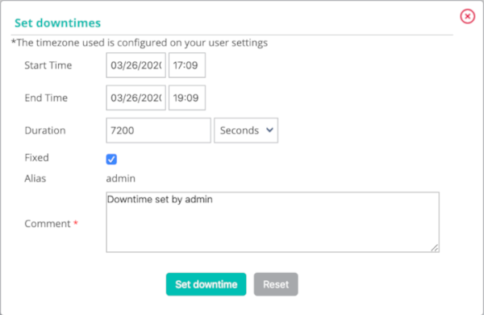
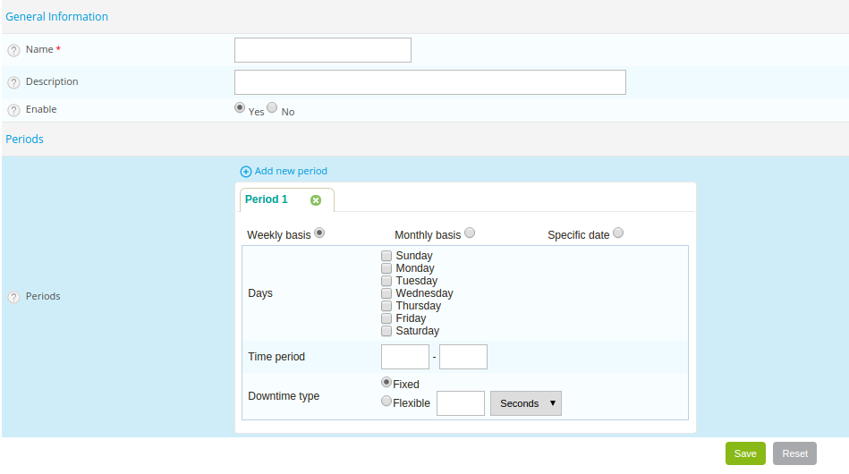

## Ajouter un temps d'arrêt

### Principe

Un temps d'arrêt est une période de temps durant laquelle les
notifications sont désactivées pour une ressource. Les temps d'arrêts
sont utilisés lors d'opération d'une maintenance programmée; ils
permettent d'éviter de recevoir des alertes de type faux-positif.

> Il est important de sélectionner l'ensemble des ressources nécessaires
> afin d'éviter les faux-positifs comme les faux-négatifs. De plus, le
> temps passé dans cet état est pris en compte lors de la génération des
> données de disponibilité.

Il existe deux types de temps d'arrêts :

-   Le temps d'arrêt **fixe** : démarre et s'arrête aux heures prévues
    de début et de fin.
-   Le temps d'arrêt **flexible** : démarre pendant la fenêtre de temps
    prévue, dès la détection d'un incident. Il prend fin lorsque la
    durée prévue en secondes est écoulée.

### En pratique

Il y a trois possibilités différentes de définir un temps d'arrêt :

-   Depuis la page de détails d'un hôte ou du service
-   Depuis l'interface de supervision temps réel
-   Depuis le menu **Downtime**

<!--DOCUSAURUS_CODE_TABS-->
<!--Page de détails d'un objet-->

1.  Accédez à la page de détails d'un objet
2.  Dans la catégorie **Commands**, cliquez sur **Schedule downtime for
    this host/service**

<!--Interface temps réel-->

1.  Rendez-vous dans le menu **Monitoring > Status Details > Hosts** (ou
    **Services**)
2.  Sélectionnez le(s) objet(s) sur lesquels vous souhaitez planifier un
    temps d'arrêt
3.  Dans le menu **More actions…**, cliquez sur **Hosts : Set Downtime**
    ou **Services : Set Downtime**

<!--Depuis le menu Downtime-->

1.  Rendez-vous dans le menu **Monitoring > Downtimes > Downtimes**
2.  Cliquez sur **Add a service downtime** ou **Add a host downtime**

<!--END_DOCUSAURUS_CODE_TABS-->

La fenêtre suivante s'affiche :

-   Le champ **Host Name** définit l'hôte concerné par le temps d'arrêt
-   Le champ **Service** définit le service concerné par le temps
    d'arrêt
-   Si la case **Fixed** est cochée alors le temps d'arrêt est fixe.
    Sinon, il est flexible
-   Si le temps d'arrêt est flexible, le champ **Duration** définit la
    durée du temps d'arrêt
-   Les champs **Start Time** et **End Time** définissent les dates de
    début et de fin du temps d'arrêt. Les temps d'arrêt ne peuvent pas débuter ni se finir après le 31 décembre 2099 à 23:59.
-   Le champ **Comments** sert à indiquer pourquoi le temps d'arrêt est
    programmé

## Les temps d'arrêts récurrents

### Principe

Un temps d'arrêt est une période de temps durant laquelle les
notifications sont désactivées pour un hôte ou un service. Les temps
d'arrêts sont pratiques lors d'opérations de maintenance sur un hôte ou
un service : ils permettent d'éviter de recevoir des alertes de type
faux-positif.

Les temps d'arrêts récurrents sont des temps d'arrêts qui reviennent de
manière répétitive.

Exemple : Une sauvegarde des machines virtuelles est effectuée tous les
jours de 20h00 à minuit. Ce type de sauvegarde a tendance à saturer
l'utilisation CPU de toutes les machines virtuelles. Il est nécessaire
de programmer des temps d'arrêts récurrents sur les services concernés
afin d'éviter de recevoir des notifications de 20h00 à minuit.

> Les temps d'arrêts sont pris en comptes dans le calcul du taux de
> disponibilité de la ressource.

### En pratique

Il existe deux types de temps d'arrêts :

-   Les temps d'arrêts **fixe** : C'est à dire que le temps d'arrêt a
    lieu exactement pendant la période de temps définie.
-   Les temps d'arrêts **flexible** : C'est à dire que si pendant la
    période de temps définie, le service ou l'hôte retourne un statut
    non-OK alors le temps d'arrêt démare et dure le nombre de secondes
    défini dans le formulaire.

Pour ajouter un temps d'arrêt récurrent, rendez-vous dans le menu
`Monitoring > Downtimes > Recurrent Downtimes` et cliquez sur **Add**.

#### Configuration des temps d'arrêts

-   Les champs **Name** et **Description** permettent de donner un nom
    et de décrire le temps d'arrêt récurrent.
-   Le champ **Enable** permet d'activer ou de désactiver le temps
    d'arrêt.
-   Le champ **Periods** permet de définir une ou plusieurs périodes de
    temps d'arrêt récurrent. Pour ajouter une période, cliquez sur le
    symbole 

Il est possible de choisir trois types de périodes :

-   Weekly : Permet de choisir les jours de semaine
-   Monthly : Permet de choisir les jours dans un mois
-   Specific date : Permet de choisir des dates spécifiques

-   Le champ **Days** définit le (ou les) jour(s) concerné(s).
-   Le champ **Time period** contient la période de temps concernée
    (exprimée en HH:MM - HH:MM).
-   Le champ **Downtime type** définit le type de temps d'arrêt
    souhaité.

> Il est possible de combiner plusieurs types de périodes au sein d'un
> seul temps d'arrêt.

#### Relations

-   La liste **Linked with Hosts** permet de choisir le ou les hôtes
    concernés par le temps d'arrêt récurrent.
-   Si un groupe d'hôte est choisi avec la liste **Linked with Host
    Groups** tous les hôtes appartenant à ce groupe sont concernés par
    le temps d'arrêt récurrent.
-   La liste **Linked with Services** permet de choisir le ou les
    services concernés par le temps d'arrêt récurrent.
-   Si un groupe de services est choisi avec la liste **Linked with
    Service Groups** tous les services appartenant à ce groupe sont
    concernés par le temps d'arrêt récurrent.

