> Certaines de ces interfaces sont **dépréciées** et remplacées par la page
> [Status des ressources](resources-status.html)
>
> Cette nouvelle page a pour but de regrouper les expériences que vous
> pouvez retrouver dans ces interfaces.
>
> Pour les nouvelles installations, les pages dépréciées sont automatiquement
> masquées. Il est possible de les afficher en sélectionnant l'option
> *Afficher les pages dépréciées* dans les préférences propres à chaque
> utilisateur depuis le menu `Administration > Paramètres > Mon compte`.

Ce chapitre présente les différentes interfaces permettant de visualiser
l'état des ressources.

### Actions génériques

Par défaut, lors de la visualisation des statuts des hôtes ou des
services, les données de supervision sont rafraîchies automatiquement
(15 secondes par défaut). Cependant, plusieurs icônes permettent de
contrôler le rafraichissement des données. Le tableau ci-dessous résume
les différentes fonctions de ces icônes :

| Icon                                   | Description                                                           |
|----------------------------------------|-----------------------------------------------------------------------|
|  | Permet de rafraîchir manuellement les résultats                       |
|    | Permet de mettre en pause le rafraîchissement automatique des données |
|   | Permet de reprendre le rafraîchissement automatique des données       |

## Hôtes (dépréciée)

> Cette interface est **dépréciée** et remplacée par la page
> `Statut des ressources` et la [liste des
> évènements](resources-status.html#lister-les-evenements).

Pour visualiser le statut des hôtes, rendez-vous dans le menu
`Monitoring > Status Details > Hosts`.

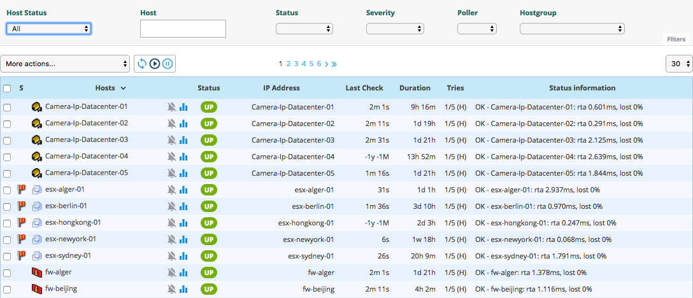

### Description des colonnes

-   **S** : Affiche le niveau de criticité de l'hôte
-   **Hosts** : Affiche le nom de l'hôte
    -   L'icône suivante indique que les notifications pour cet hôte
        sont désactivées : 
    -   L'icône suivante peut être utilisée pour afficher tous les
        graphiques de performances pour cet hôte : 
    -   L'icône suivante permet d'accéder à une URL prédéfinie
        configurée : 
-   **Status** : Sert à visualiser le statut de l'hôte
-   **IP Address** : Indique l'adresse IP de l'hôte
-   **Last Check** : Affiche la date et l'heure de la dernière
    vérification
-   **Duration** : Affiche la durée pendant laquelle l'hôte a conservé
    son état actuel
-   **Hard State Duration** : Affiche la durée pendant laquelle l'hôte a
    conservé son état dur actuel (n'apparaît pas lorsque visualisation
    de tous les hôtes)
-   **Tries** : Affiche le nombre d'essais avant de confirmer l'état
-   **Status information** : Affiche le message expliquant l'état de
    l'hôte

> La colonne de criticité et le filtre associé apparaissent si au moins
> un objet affiché a un niveau de criticité défini.

### Filtres disponibles

Vous pouvez filtrer le résultat présenté via les filtres suivants :

-   **Host Status** :
    -   Pour afficher les hôtes avec un problème mais non reconnu ou non
        en temps d'arrêt, choisissez **Unhandled Problems**.
    -   Pour afficher tous les hôtes avec un problème, choisissez **Host
        Problems**.
    -   Pour voir tous les hôtes, choisissez **All**.
-   **Host** : Peut être utilisé pour filtrer par nom d'hôte via une
    recherche de type SQL LIKE.
-   **Status** : Peut être utilisé pour filtrer par le statut des hôtes.
-   **Severity** : Peut être utilisé pour filtrer par criticité.
-   **Poller** : Peut être utilisé pour filtrer les hôtes par
    collecteur. Seuls les hôtes du collecteur sélectionné seront
    affichés.
-   **Hostgroup** : Peut être utilisé pour filtrer par groupe d'hôtes.
    Seuls les hôtes du groupe d'hôtes sélectionné seront affichés.

> La recherche dans les champs de texte ne démarre qu'après la saisie
> d'au moins 3 caractères.

## Groupes d'hôtes

Pour visualiser le statut des groupes d'hôtes, rendez-vous dans le menu
`Monitoring > Status Details > Hostgroups Summary`.

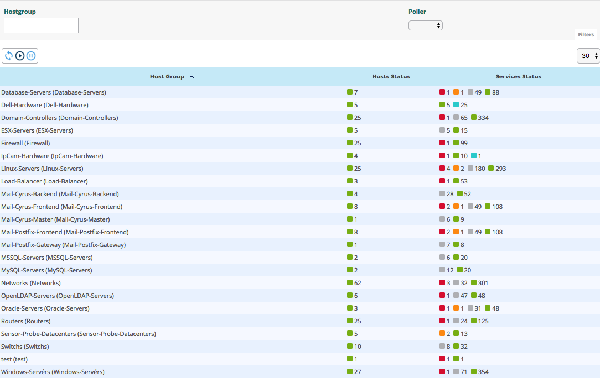

### Description des colonnes

-   **Host Group** : Liste des groupes d'hôtes disponibles
-   **Hosts Status** : Permet d'afficher le nombre d'hôtes en UP, DOWN,
    UNREACHABLE ou PENDING
-   **Services Status** : Permet d'afficher le nombre de services en
    état OK, AVERTISSEMENT, CRITIQUE ou PENDING

### Filtres disponibles

-   **Hostgroup** : Peut être utilisé pour filtrer par nom de groupe
    d'hôtes via une recherche de type SQL LIKE.
-   **Poller** : Peut être utilisé pour filtrer les hôtes par poller.
    Seuls les hôtes du scrutateur sélectionné seront affichés.

## Détails d'un hôte (dépréciée)

> Cette interface est **dépréciée** et remplacée par la page
> `Statut des ressources` et la [panneau
> d'hôte](resources-status.html#panneau-dhote).

Lorsque vous cliquez sur le nom d'un hôte, vous accédez à la page de
détails de la ressource.

4 onglets sont disponibles:

-   **Service Status** : Liste des services hôtes et de leur état
    associé
-   **Performances** : Liste des graphiques de performances pour chaque
    service
-   **Host Informations** : Détails sur l'hôte
-   **Comments** : Commentaires de l'hôte disponibles

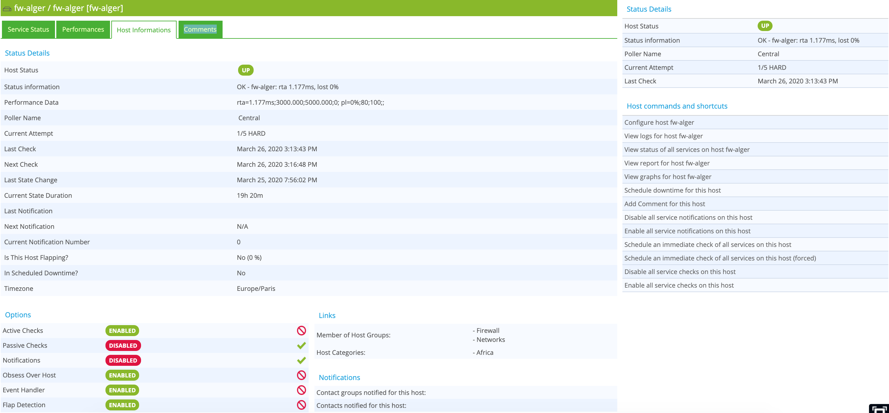

### Détails du statut

Description des attributs disponibles pour les détails de l'hôte :

-   **Host Status** : Affiche l'état de l'hôte.
-   **Status information** : Affiche les informations sur l'état de
    l'hôte.
-   **Performance Data** : Affiche les données de performances associées
    à la vérification.
-   **Poller Name** : Nom du serveur supervisant l'hôte.
-   **Current Attempt** : Affiche le nombre de tentatives avant la
    validation de l'état.
-   **State Type** : Affiche le type d'état (‘SOFT' ou ‘HARD').
-   **Last Check** : Affiche la dernière vérification de l'hôte.
-   **Next Check** : Affiche la prochaine vérification planifiée de
    l'hôte.
-   **Last State Change** : Affiche la date et l'heure du dernier
    changement de statut.
-   **Current State Duration** : Affiche la date et l'heure à partir
    desquelles l'hôte se trouve dans l'état actuel.
-   **Last Notification** : Affiche la date et l'heure d'envoi de la
    dernière notification.
-   **Next Notification** : Affiche la date et l'heure d'envoi de la
    prochaine notification
-   **Current Notification Number** : Affiche le nombre de notifications
    envoyées.
-   **Is This Host Flapping?** : Indique si l'hôte est en FLAPPING
-   **In Scheduled Downtime?** : Indique si l'hôte est en temps d'arrêt
    planifié.
-   **Timezone** : Le fuseau horaire de l'hôte.

### Options

L'option permet d'activer / désactiver les propriétés de l'hôte :

-   **Active Checks** : La méthode de vérification active de l'hôte.
-   **Passive Checks** : La méthode de vérification passive de l'hôte.
-   **Notifications** : Le processus de notification de l'hôte.
-   **Obsess Over Host** : Lprocessus Obsess Over Host de l'hôte
-   **Event Handler** : Le processus de réactions automatisé de l'hôte.
-   **Flap Detection** :Le processus de détection de battement de
    l'hôte.

### Links

Le conteneur **Links** permet d'afficher l'appartenance de l'hôte aux groupes
et catégories d'hôtes.

### Notifications

Le conteneur **Notifications** permet d'afficher les contacts et groupes de
contacts liés à l'hôte qui recevront notifications.

## Services (dépréciée)

> Cette interface est **dépréciée** et remplacée par la page
> `Statut des ressources` et la [liste des
> évènements](resources-status.html#lister-les-evenements).

Pour visualiser le statut des services, rendez-vous dans le menu
`Monitoring > Status Details > Services`.

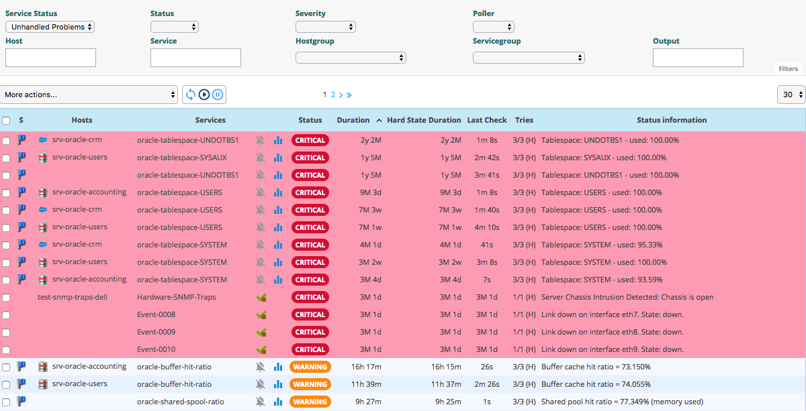

### Description des colonnes

-   **S** : Affiche le niveau de criticité du service.
-   **Host** : Affiche le nom de l'hôtet.
-   **Services** : Affiche le nom du service
    -   L'icône suivante indique que les notifications pour ce service
        sont désactivées : 
    -   L'icône suivante peut être utilisée pour afficher le graphique
        de performances de ce service : 
    -   L'icône suivante permet d'accéder à une URL prédéfinie
        configurée : 
-   **Duration** : Affiche la durée du statut réel.
-   **Hard State Duration** : Affiche la durée du statut non-ok validé.
-   **Last Check** : Affiche la date et l'heure de la dernière
    vérification.
-   **Tries** : Affiche le nombre de tentatives avant la validation de
    l'état.
-   **Status information** : Affiche le message expliquant l'état du
    service.

> La colonne de criticité et le filtre associé apparaissent si au moins
> un objet affiché a un niveau de criticité défini.

> La colonne **Hard State Duration** n'appraît pas si vous sélectionnez
> la valeur **All** pour le filtre **Service Status**.

### Filtres disponibles

-   **Service Status**:
    -   Pour afficher les services avec un problème mais non reconnu ou
        non en temps d'arrêt, choisissez **Unhandled Problems**.
    -   Pour afficher tous les services présentant un problème,
        choisissez **Host Problems**.
    -   Pour voir tous les services, choisissez **All**.
-   **Status** : Peut être utilisé pour filtrer par le statut des
    services.
-   **Severity** : Ppeut être utilisé pour filtrer par criticité.
-   **Poller** : Peut être utilisé pour filtrer les services par
    collecteur. Seuls les services du collecteur sélectionné seront
    affichés.
-   **Host** : Peut être utilisé pour filtrer par nom d'hôte via une
    recherche de type SQL LIKE.
-   **Service** : Peut être utilisé pour filtrer par nom de service via
    une recherche de type SQL LIKE.
-   **Hostgroup** : Peut être utilisé pour filtrer par groupe d'hôtes.
    Seuls les hôtes du groupe d'hôtes sélectionné seront affichés.
-   **Servicegroup** : Peut être utilisé pour filtrer par groupe de
    services. Seuls les services du groupe de services sélectionné
    seront affichés.
-   **Output** : Peut être utilisé pour filtrer par le résultat de la
    vérification.

## Services Grid

Pour voir tous les services (regroupés par hôte) dans n'importe quel
état, rendez-vous dans le menu
`Monitoring > Status Details > Services Grid` et choississez l'option
**Details** pour le filtre **Display** :

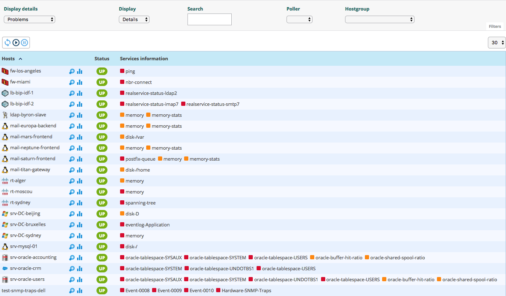

Pour afficher le nombre de services (regroupés par hôte et par statut),
choisissez l'option **Summary** pour le filtre **Display** :

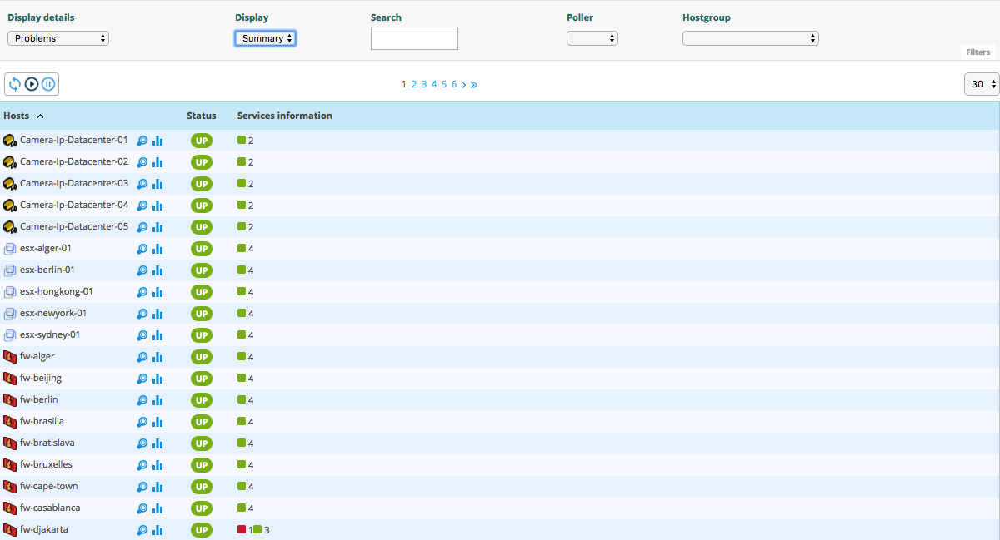

## Services by Hostgroup

Pour voir tous les services (regroupés par groupe d'hôtes) dans
n'importe quel état, rendez-vous dans le menu
`Monitoring > Status Details > Services by Hostgroup` et choississez
l'option **Details** pour le filtre **Display** :

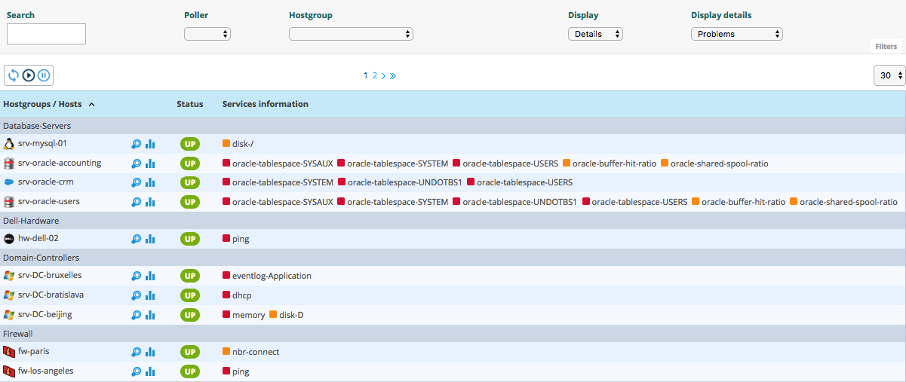

Pour afficher le nombre de services (regroupés par groupe d'hôtes et par
statut), choisissez l'option **Summary** pour le filtre **Display** :

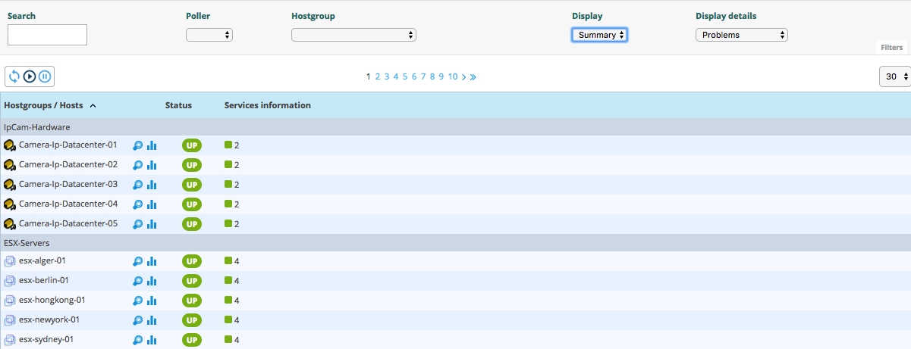

## Services by Servicegroup

Pour voir tous les services (regroupés par groupe de services) dans
n'importe quel état, rendez-vous dans le menu
`Monitoring > Status Details > Services by Servicegroup` et choississez
l'option **Details** pour le filtre **Display** :

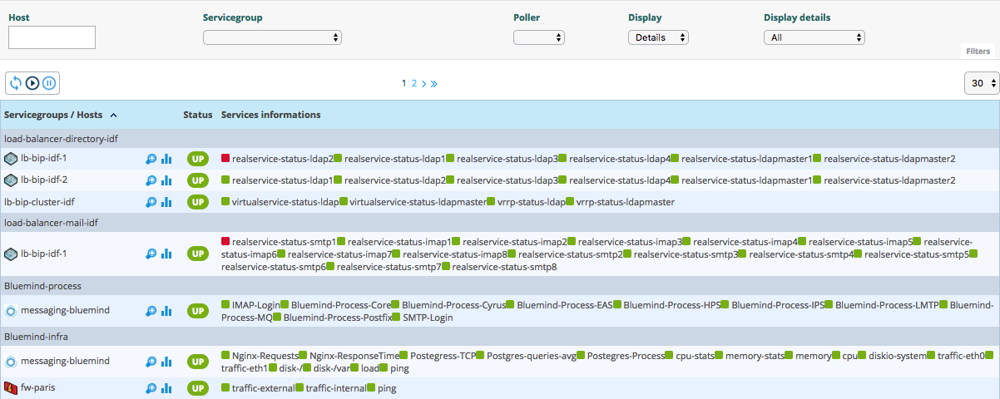

Pour afficher le nombre de services (regroupés par groupe de services),
choisissez l'option **Summary** pour le filtre **Display** :

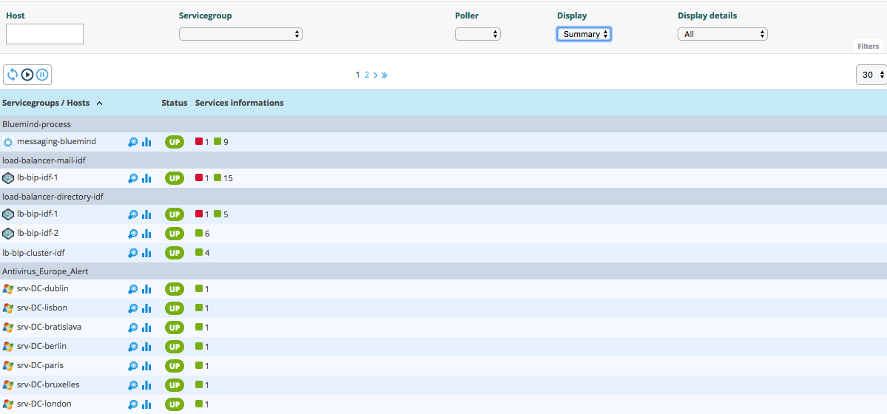

## Service Details (dépréciée)

> Cette interface est **dépréciée** et remplacée par la page
> `Statut des ressources` et la [panneau de
> service](resources-status.html#panneau-de-service).

Lorsque vous cliquez sur un service, l'écran suivant apparaît:

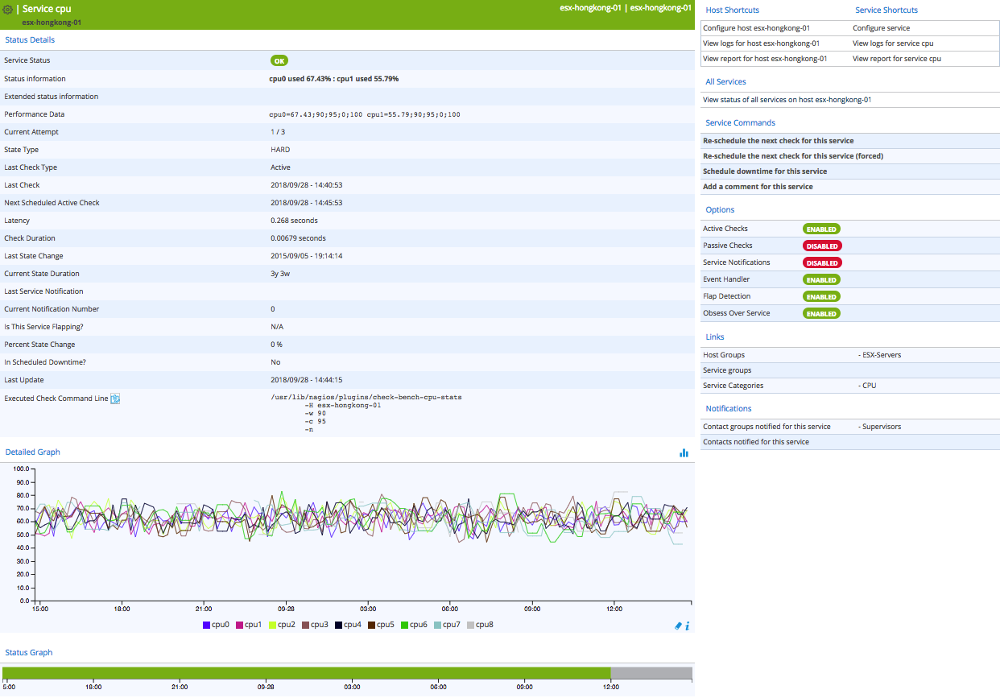

### Détails du statut

Description des attributs disponibles pour les détails du service :

-   **Service Status** : Affiche l'état du service.  
-   **Status information** : Affiche les informations sur l'état du
    service.  
-   **Extended status information** : Affiche la sortie longue du
    service.  
-   **Performance Data** : Affiche les données de performances associées
    à la vérification.  
-   **Current Attempt** : Affiche le nombre de tentatives avant la
    validation de l'état.  
-   **State Type** : Affiche le type d'état (‘SOFT' ou ‘HARD').  
-   **Last Check Type** : Indique si le dernier type de contrôle est
    “actif” ou “passif”.  
-   **Last Check** : Affiche la dernière vérification du service.  
-   **Next Scheduled Active Check** : Affiche la prochaine vérification
    planifiée du service.  
-   **Latency** : Affiche la latence en secondes entre la vérification
    planifiée et l'exécution réelle de la vérification.  
-   **Check Duration** : Affiche la durée d'exécution de la
    vérification.  
-   **Last State Change** : Affiche la date et l'heure à partir
    desquelles l'hôte se trouve dans l'état actuel.  
-   **Current State Duration** : Affiche la date et l'heure à partir
    desquelles l'hôte se trouve dans l'état actuel.  
-   **Last Service Notification** : Affiche la date et l'heure d'envoi
    de la dernière notification.  
-   **Current Notification Number** : Affiche le nombre de notifications
    envoyées.  
-   **Is This Service Flapping?** : Indique si l'hôte est en FLAPPING  
-   **Percent State Change** : Affiche le pourcentage de changement
    d'état.  
-   **In Scheduled Downtime?** : Indique si l'hôte est en temps d'arrêt
    planifié.  
-   **Last Update** : Affiche la date et l'heure de la dernière mise à
    jour des informations.
-   **Executed Check Command Line** : En ce qui concerne vos droits ACL,
    vous pouvez avoir accès à la ligne de commande exécutée. Les mots de
    passe sera remplacé par **\***

### Graphique détaillé et graphique d'état

Les **Detailed Graph** et **Status Graph** permettent d'afficher des
graphiques de performances et les statuts des graphiques historiques
pour ce service.

### Raccourcis d'hôte et de service

-   **View host status page** : Permet d'accéder à la page des détails
    de l'hôte.
-   **Configure host <value>** : Permet d'accéder à la page de
    configuration de l'hôte.
-   **View logs for host <value>** : Permet d'accéder aux journaux des
    événements de l'hôte.
-   **View report for host <value>** : Permet d'accéder au rapport de
    taux de disponibilité de l'hôte.
-   **View graphs for host <value>** : Permet d'accéder à tous les
    graphiques de performances des services de l'hôte.
-   **Configure service** : Permet d'accéder à la page de configuration
    du service.
-   **View logs for service <value>** : permet d'accéder aux journaux
    des événements du service.
-   **View report for service <value>** : Permet d'accéder au rapport de
    taux de disponibilité du service.

### Commandes de service

-   **Re-schedule the next check for this service** : Permet de
    reprogrammer la prochaine vérification du service.
-   **Re-schedule the next check for this service (forced)** : Permet de
    reprogrammer la prochaine vérification du service, même si la
    période de vérification n'est pas valide.
-   **Schedule downtime for this service** : Permet de planifier des
    temps d'arrêt pour le service. 
-   **Add a comment for this service** : Permet d'ajouter un commentaire
    pour le service.

### Options

L'option permet d'activer / désactiver les propriétés du service :

-   **Active Checks** : La méthode de vérification active du service.
-   **Passive Checks** : La méthode de contrôle passif du service.
-   **Notifications** : Le processus de notification du service.
-   **Event Handler** : Le processus de réactions automatisé du service.
-   **Flap Detection** : Le processus de détection de battement du
    service.
-   **Obsess Over Service** : Le processus Obsess Over Service service.

### Links

Le conteneur **Links** permet d'afficher :

-   Les groupes d'hôtes auxquels ce service est lié.
-   Les groupes de services auxquels ce service est lié.
-   Les catégories de services auxquels ce service est lié.

### Notifications

Le conteneur **Notifications** permet d'afficher les contacts et groupes de
contacts liés à l'hôte qui recevra les notifications.
