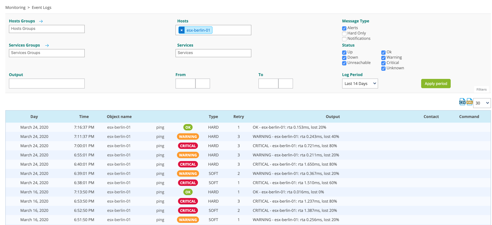
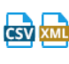

Le journal d'évènements permet de :

-   Voir les changements de statut et d'état des objets surveillés
-   Voir les notifications envoyées et leurs destinataires

Pour afficher le journal d'évènements, allez à la page
**Supervision > Journaux d'évènements**.

- Dans le menu supérieur, sélectionnez les hôtes et/ou
les services désirés pour afficher les journaux d'événements correspondants. Vous pouvez également filtrer par
**Groupes de services** ou **Groupes d'hôtes**.

- Cochez les options désirées dans les sections **Type de message** et **statut** afin d'afficher les évènements
correspondants.

- Utilisez les champs suivants pour définir la période de temps pour laquelle afficher des évènements :
    - **Période de visualisation** : sélectionnez une période prédéfinie
    - **Du/Au** : saisissez des dates manuellement.

- Vous pouvez exporter le résultat au format CSV ou XML à l'aide des
boutons au-dessus à droite de la liste : 