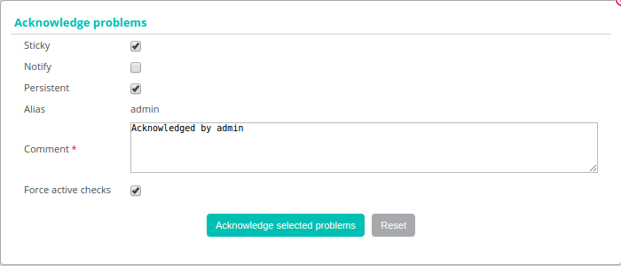

Ce chapitre présente les différentes méthodes de gestion des alertes.

## Acquitter un problème

### Principe

Lorsqu'un hôte ou un service présente un incident et que ce dernier est
validé, le processus de notification est enclenché, pouvant générer une
notification envoyée à un contact. Si le problème persiste et suivant la
configuration réalisée (relancer une notification à intervalle de temps
régulier, escalade de notification) il est possible que d'autres alertes
soient émises.

L'acquittement d'un incident permet de stopper le processus de
notification (envoi de notifications), jusqu'à ce que l'hôte ou le
service retrouve un statut nominal.

Exemple d'utilisation :

Un service est chargé de vérifier la santé des disques durs d'une baie
de disque. Un disque dur physique tombe en panne sur une baie de disque,
une notification est envoyée. L'opérateur de supervision acquitte le
service en précisant qu'une équipe est en train de régler le problème.
Les notifications ne sont plus envoyées. Le service reprendra son état
nominal après changement du disque.

> L'acquittement d'un incident signifie la prise en compte du problème
> par un utilisateur de la supervision (et non la résolution de ce
> dernier qui ne pourra être effective que lorsque le contrôle sera
> revenu dans son état nominal).

### En pratique

Pour acquitter un incident, deux solutions sont possibles :

<!--DOCUSAURUS_CODE_TABS-->
<!--From real time monitoring-->

1.  Rendez-vous dans le menu `Monitoring > Status Details > Hosts` (or
    `Services`) menu
2.  Select the object(s) that you want acknowledge
3.  In the menu: **More actions** click on **Hosts: Acknowledge** or on
    **Services: Acknowledge**

<!--From the detailed sheet of an object-->

A partir de la page de détail d'un objet, cliquez sur l'icône activé
associé au champ **Acknowledged** dans le cadre **Options**

<!--END_DOCUSAURUS_CODE_TABS-->

La fenêtre suivante s'affiche :

-   Si la case **Sticky** est cochée, alors l'acquittement sera conservé
    en cas de changement de statut non-OK (Exemple DOWN à UNREACHABLE ou
    bien WARNING à CRITICAL). Sinon, l'acquittement disparait et le
    processus de notification est réactivé.
-   Si la case **Notify** est cochée, alors une notification est envoyée
    aux contacts liés à l'objet pour les avertir que l'incident sur la
    ressource a été acquitté (dans le cas où le contact possède le
    filtre de notification d'acquittement d'activé).
-   Si la case **Persistent** est cochée, alors l'acquittement sera
    conservé en cas de redémarrage de l'ordonnanceur. Sinon,
    l'acquittement disparait et le processus de notification est
    réactivé.
-   Le champ **Comment** est généralement utilisé pour fournir la raison
    de l'acquittement et est obligatoire.
-   Si la casee **Acknowledge services attached to hosts** est cochée,
    alors tous les services liés à l'hôte seront acquittés (option
    visible uniquement si vous acquittez un hôte).
-   Si la case **Force active checks** est cochée, alors une commande
    sera envoyée à l'ordonnanceur pour recontrôler dans les plus brefs
    délais la ressource.

Pour supprimer l'acquittement d'un incident sur un objet :

1.  Rendez-vous dans le menu `Monitoring > Status Details > Hosts` (or
    `Services`) menu
2.  Sélectionnez les objets auxquels vous souhaitez supprimer
    l'acquittement
3.  Dans le menu **More actions**, cliquez sur **Hosts: Disacknowledge**
    ou sur **Services: Disacknowledge**

## Ajouter un temps d'arrêt

### Principe

Un temps d'arrêt est une période de temps durant laquelle les
notifications sont désactivées pour une ressource. Les temps d'arrêts
sont utilisés lors d'opération d'une maintenance programmée; ils
permettent d'éviter de recevoir des alertes de type faux-positif.

> Il est important de sélectionner l'ensemble des ressources nécessaires
> afin d'éviter les faux-positifs comme les faux-négatifs. De plus, le
> temps passé dans cet état est pris en compte lors de la génération des
> données de disponibilité.

Il existe deux types de temps d'arrêts :

-   Le temps d'arrêt **fixe** : démarre et s'arrête aux heures prévues
    de début et de fin.
-   Le temps d'arrêt **flexible** : démarre pendant la fenêtre de temps
    prévue, dès la détection d'un incident. Il prend fin lorsque la
    durée prévue en secondes est écoulée.

### En pratique

Il y a trois possibilités différentes de définir un temps d'arrêt :

-   Depuis la page de détails d'un hôte ou du service
-   Depuis l'interface de supervision temps réelle
-   Depuis le menu **Downtime**

<!--DOCUSAURUS_CODE_TABS-->
<!--Page de détails d'un objet-->

1.  Accédez à la page de détails d'un objet
2.  Dans la catégorie **Commands**, cliquez sur **Schedule downtime for
    this host/service**

<!--Interface temps réelle-->

1.  Rendez-vous dans le menu `Monitoring > Status Details > Hosts` (ou
    `Services`)
2.  Sélectionnez le(s) objet(s) sur lesquels vous souhaitez planifier un
    temps d'arrêt
3.  Dans le menu **More actions…**, cliquez sur **Hosts : Set Downtime**
    ou **Services : Set Downtime**

<!--Depuis le menu Downtime-->

1.  Rendez-vous dans le menu `Monitoring > Downtimes > Downtimes`
2.  Cliquez sur **Add a service downtime** ou **Add a host downtime**

<!--END_DOCUSAURUS_CODE_TABS-->

La fenêtre suivante s'affiche :

-   Le champ **Host Name** définit l'hôte concerné par le temps d'arrêt
-   Le champ **Service** définit le service concerné par le temps
    d'arrêt
-   Si la case **Fixed** est cochée alors le temps d'arrêt est fixe.
    Sinon, il est flexible
-   Si le temps d'arrêt est flexible, le champ **Duration** définit la
    durée du temps d'arrêt
-   Les champs **Start Time** et **End Time** définissent les dates de
    début et de fin du temps d'arrêt
-   Le champ **Comments** sert à indiquer pourquoi le temps d'arrêt est
    programmé

## Les temps d'arrêts récurrents

### Principe

Un temps d'arrêt est une période de temps durant laquelle les
notifications sont désactivées pour un hôte ou un service. Les temps
d'arrêts sont pratiques lors d'opérations de maintenance sur un hôte ou
un service : ils permettent d'éviter de recevoir des alertes de type
faux-positif.

Les temps d'arrêts récurrents sont des temps d'arrêts qui reviennent de
manière répétitive.

Exemple : Une sauvegarde des machines virtuelles est effectuée tous les
jours de 20h00 à minuit. Ce type de sauvegarde a tendance à saturer
l'utilisation CPU de toutes les machines virtuelles. Il est nécessaire
de programmer des temps d'arrêts récurrents sur les services concernés
afin d'éviter de recevoir des notifications de 20h00 à minuit.

> Les temps d'arrêts sont pris en comptes dans le calcul du taux de
> disponibilité de la ressource.

### En pratique

Il existe deux types de temps d'arrêts :

-   Les temps d'arrêts **fixe** : C'est à dire que le temps d'arrêt a
    lieu exactement pendant la période de temps définie.
-   Les temps d'arrêts **flexible** : C'est à dire que si pendant la
    période de temps définie, le service ou l'hôte retourne un statut
    non-OK alors le temps d'arrêt démare et dure le nombre de secondes
    défini dans le formulaire.

Pour ajouter un temps d'arrêt récurrent, rendez-vous dans le menu
`Monitoring > Downtimes > Recurrent Downtimes` et cliquez sur **Add**.

#### Configuration des temps d'arrêts

-   Les champs **Name** et **Description** permettent de donner un nom
    et de décrire le temps d'arrêt récurrent.
-   Le champ **Enable** permet d'activer ou de désactiver le temps
    d'arrêt.
-   Le champ **Periods** permet de définir une ou plusieurs périodes de
    temps d'arrêt récurrent. Pour ajouter une période, cliquez sur le
    symbole 

Il est possible de choisir trois types de périodes :

-   Weekly : Permet de choisir les jours de semaine
-   Monthly : Permet de choisir les jours dans un mois
-   Specific date : Permet de choisir des dates spécifiques

-   Le champ **Days** définit le (ou les) jour(s) concerné(s).
-   Le champ **Time period** contient la période de temps concernée
    (exprimée en HH:MM - HH:MM).
-   Le champ **Downtime type** définit le type de temps d'arrêt
    souhaité.

> Il est possible de combiner plusieurs types de périodes au sein d'un
> seul temps d'arrêt.

#### Relations

-   La liste **Linked with Hosts** permet de choisir le ou les hôtes
    concernés par le temps d'arrêt récurrent.
-   Si un groupe d'hôte est choisi avec la liste **Linked with Host
    Groups** tous les hôtes appartenant à ce groupe sont concernés par
    le temps d'arrêt récurrent.
-   La liste **Linked with Services** permet de choisir le ou les
    services concernés par le temps d'arrêt récurrent.
-   Si un groupe de services est choisi avec la liste **Linked with
    Service Groups** tous les services appartenant à ce groupe sont
    concernés par le temps d'arrêt récurrent.

## Ajouter un commentaire

### Principe

Centreon permet d'ajouter des commentaires à un objet. Ce commentaire
est visible par toute personne ayant accès à la ressource (hôte ou
service). Un commentaire possède les propriétés suivantes :

-   Nom de l'hôte
-   Nom du service si le commentaire est associé à un service
-   Date de saisie du commentaire
-   Auteur du commentaire
-   Le contenu du commentaire
-   La validité du commentaire face à un redémarrage de l'ordonnanceur

### En pratique

Pour ajouter un commentaire, deux solutions sont possibles :

<!--DOCUSAURUS_CODE_TABS-->
<!--Page de détails d'un objet-->

1.  Accédez à la page de détails de l'objet
2.  Dans la catégorie **Host/Service Commands**, cliquez sur **Add a
    comment for this host/this service**

<!--Depuis le menu commentaires-->

1.  Rendez-vous dans le menu `Monitoring > Downtimes > Comments`
2.  Cliquez sur **Add a Service Comment** ou **Add a Host Comment**

<!--END_DOCUSAURUS_CODE_TABS-->

La fenêtre suivante s'affiche :

-   Le champ **Host Name** définit l'hôte concerné par le commentaire
-   Si vous avez choisi d'ajouter un commentaire pour un service, le
    champ **Service** vous permet de sélectionner le service concerné
    par le commentaire.
-   Si la case **Persistent** en cas de redémarrage de l'ordonnanceur
    est cochée, alors le commentaire sera conservé en cas de redémarrage
    de l'ordonnanceur.
-   Le champ **Comments** contient le commentaire lui-même.

## Gestion des vérifications

### Principe

Il est possible d'activer ou de désactiver momentanément la vérification
d'un hôte ou d'un service.

> La modification des paramètres de vérifications n'impacte pas la
> configuration de l'objet en base de données. Ces modifications sont
> réalisées sur la supervision en temps-réel; elles seront annulées lors
> du redémarrage de l'ordonnanceur.

### En pratique

<!--DOCUSAURUS_CODE_TABS-->
<!--Page de détails d'un objet-->

1.  Accédez à la page de détails de l'objet
2.  Dans la catégorie **Options** rendez-vous à la ligne **Active
    checks** pour vérifier l'état des contrôles.

Pour :

-   Activer la vérification, cliquez sur 
-   Désactiver la vérification, cliquez sur 

<!--Interface temps réelle-->

1.  Rendez-vous dans le menu `Monitoring > Status Details > Hosts` (ou
    `Services`)
2.  Sélectionnez le(s) objet(s) sur lesquels vous souhaitez activer ou
    de désactiver la vérification
3.  Dans le menu **More actions…** cliquez sur :

-   **Hosts : Disable Check** ou **Services: Disable Check** pour
    arrêter la vérification d'un hôte ou d'un service
-   **Hosts: Enable Check** ou **Services: Enable Check** pour activer
    la vérification d'un hôte ou d'un service

<!--END_DOCUSAURUS_CODE_TABS-->

## Soumettre un résultat

### Principe

Pour les services ayant la propriété de contrôle passif, il est possible
d'envoyer manuellement un résultat à l'ordonnanceur afin que celui-ci
soit pris en compte par l'ordonnanceur.

### En pratique

Pour soumettre un résultat, accédez à la page de détails de l'objet.
Dans la catégorie **Service Commands** cliquez sur **Submit result for
this service**

La fenêtre suivante s'affiche :

-   Les champs **Host Name** et **Service** définissent l'hôte et le
    service pour lequel le résultat sera soumis
-   Le champ **Check result**définit le statut du service
-   Le champ **Check output** définit le message à afficher pour le
    service
-   Le champ **Performance data** permet de définir des données de
    performances pour la génération des graphiques

## Gestion des notifications

### Principe

Il est possible d'activer ou de désactiver momentanément la notification
d'un hôte ou d'un service.

> La modification des paramètres de notifications n'impacte pas la
> configuration de l'objet en base de données. Ces modifications sont
> réalisées sur la supervision en temps-réel; elles seront annulées lors
> du redémarrage de l'ordonnanceur.

### En pratique

Il y a deux moyens de gérer les notifications :

<!--DOCUSAURUS_CODE_TABS-->
<!--Page de détails d'un objet-->

1.  Accédez à la page de détails de l'objet
2.  Dans la catégorie **Options** rendez-vous à la ligne : **Service
    Notifications**

Pour :

-   Activer la notification, cliquez sur 
-   Désactiver la notification, cliquez sur 

<!--Interface temps réelle-->

1.  Rendez-vous dans le menu `Monitoring > Status Details > Hosts` (ou
    `Services`)
2.  Sélectionnez le ou les hôtes/services pour lesquels vous souhaitez
    activer ou de désactiver la notification
3.  Dans le menu **More actions…** cliquez sur:

-   **Hosts: Disable Notification** ou **Services: Disable
    Notification** pour arrêter la notification d'un hôte ou d'un
    service
-   **Hosts: Enable Notification** ou **Services: Enable Notification**
    pour activer la notification d'un hôte ou d'un service

<!--END_DOCUSAURUS_CODE_TABS-->

## Reprogrammation des contrôles

### Principe

Par défaut, les contrôles (vérifications d'un service) sont exécutés à
intervalle régulier suivant la configuration définie par l'utilisateur.
Il est possible d'interagir sur la pile d'ordonnancement des contrôles
afin de modifier la programmation de ces derniers.

Il existe deux types de programmation :

-   La programmation classique : la vérification du service est mise en
    priorité dans la file d'attente de l'ordonnanceur (dès que
    possible).
-   La programmation forcée : la vérification du service est mise en
    priorité dans la file d'attente de l'ordonnacneur (dès que possible)
    et cela même si l'heure de la demande d'exécution est en dehors de
    la période contrôle ou si le service n'est pas de type actif.

### En pratique

Il y a deux moyens de forcer la vérification d'un service :

<!--DOCUSAURUS_CODE_TABS-->
<!--Page de détails d'un objet-->

1.  Accédez à la page de détail de l’objet
2.  Dans la catégorie **Host Commands** (ou **Service Commands**),
    cliquez sur **Re-schedule the next check for this host / service**
    ou **Re-schedule the next check for this host / service (forced)**

<!--Interface temps réelle-->

1.  Rendez-vous dans le menu `Monitoring > Status Details > Hosts` (ou
    `Services`)
2.  Sélectionnez le ou les objets pour lesquels vous souhaitez forcer la
    vérification
3.  Dans le menu **More actions…** cliquez sur **Schedule immediate
    check** ou **Schedule immediate check (Forced)**

<!--END_DOCUSAURUS_CODE_TABS-->
