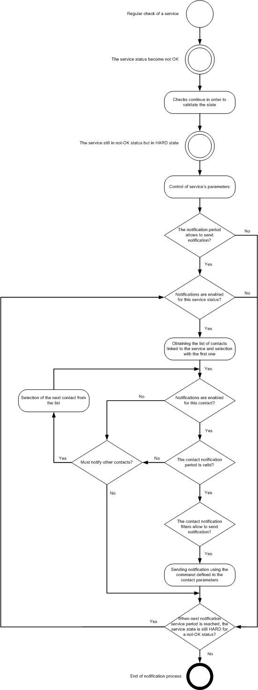

Avant qu'un contact soit notifié au sein de Centreon, il est nécessaire
de respecter plusieurs étapes. Si aucune escalade de notification n'est
définie, le processus de gestion des notifications est standard.
Celui-ci est décrit ci-dessous :

1.  Un service (ou un hôte) est vérifié à intervalle régulier en
    fonction de la période temporelle de vérifications définie pour lui
    (Dans le cas d'un service passif, on attend que le statut du service
    change d'état)
2.  Lorsqu'une anomalie survient (statut non-OK), le service (ou l'hôte)
    passe en état SOFT
3.  Après que le nombre maximum de vérifications avant validation de
    l'état ait eu lieu et si le service (ou l'hôte) persiste en
    conservant son statut non-OK son état passe de SOFT à HARD. Le
    moteur de supervision met en cache le numéro de la notification pour
    le service (ou l'hôte) : c'est à dire 0.

A chaque intervalle d'envoi de notification pour le service (ou l'hôte)
et jusqu'à la fin du statut non-OK, le moteur de supervision réalise les
opérations suivantes :

4.  Le moteur de supervision vérifie que la période temporelle de
    notifications définie pour le service (ou l'hôte) permet la
    notification à l'instant où le service (ou l'hôte) est passé en état
    HARD. Si oui, alors on passe à l'étape suivante sinon, on attend que
    la période temporelle définie pour le service (ou l'hôte) permette
    la notification.
5.  Le moteur de supervision vérifie que la notification est activée
    pour le statut actuel du service (ou de l'hôte)

Pour chaque contact associé au service (ou à l'hôte) :

6.  Le moteur de supervision vérifie plusieurs paramètres :

    -   Est-ce que les notifications sont activées pour ce contact ?
    -   Est-ce que la période temporelle de notifications définie pour
        le contact permet la notification ?
    -   Est-ce que le contact est configuré pour être notifié pour le
        statut actuel du service (ou l'hôte) ?

7.  Si ces trois conditions sont validées, alors le moteur de
    supervision alerte le contact en utilisant le script de
    notifications définit pour le service ou l'hôte.

8.  Le moteur de supervision incrémente le numéro de notification de 1

Le schéma ci-dessous résume la gestion des notifications au sein de
Centreon :

