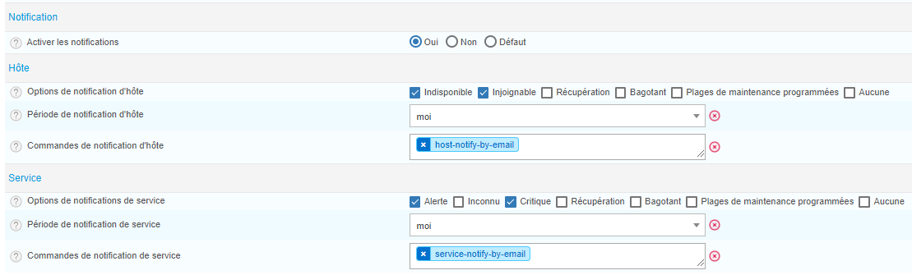
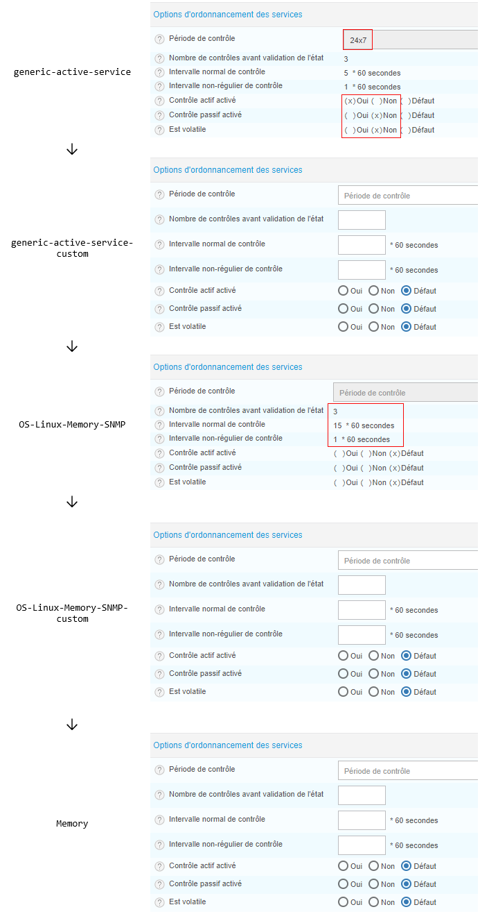

## Prérequis

1. Vérifiez que le moteur de supervision est programmé pour envoyer des notifications.

    1. Allez à la page **Configuration > Collecteurs > Configuration du moteur de collecte**.

    2. Cliquez sur le collecteur désiré.

    3. Dans l'onglet **Options de contrôle**, dans la section **Autres options**, sélectionnez **Oui** pour l'option **Notification**. 

    4. Cliquez sur **Sauvegarder**.

2. Assurez-vous que votre Centreon peut envoyer des notifications, par exemple, [des emails](../administration/postfix.html).

    Les commandes de notifications sont exécutées par le collecteur qui supervise la ressource : configurez la capacité à envoyer des notifications sur tous les collecteurs.

## Configurer des notifications

### Étape 1 : Définir quand les contrôles doivent être faits

1. Allez à la page **Configuration > Hôtes > Hôtes** ou **Configuration > Services > Services par hôte** et sélectionnez un hôte ou un service.

2. Dans le premier onglet (**Configuration de l'hôte** ou **Informations générales**), remplissez la section **Options d'ordonnancement/Options d'ordonnancement des services**. 
    
    Si aucune valeur n'est définie sur l'hôte ou le service, celui-ci héritera des valeurs de son modèle parent (voir [Règles d'héritage des modèles](#règles-dhéritage-des-modèles)).


| Action                                                                                                                                                                                                                                                                                                       | Option à renseigner                                          |
|--------------------------------------------------------------------------------------------------------------------------------------------------------------------------------------------------------------------------------------------------------------------------------------------------------------|--------------------------------------------------|
| Activez les contrôles actifs.                                                                                                                                                                                                                                                                                   | Mettre **Contrôle actif activé** à **Oui**         |
| Définissez pendant quelle [période de temps](../monitoring/basic-objects/timeperiods.html) les contrôles actifs doivent être réalisés. En-dehors de cette période de temps, aucun contrôle n'aura lieu, ce qui signifie qu'aucune notification ne sera envoyée.                                                                                                                                                                                                | **Période de contrôle**                                 |
| Définissez la fréquence à laquelle les contrôles actifs doivent avoir lieu quand l'hôte est dans un état **OK**.                                                                                                                                                                                                                           | **Intervalle normal de contrôle**                        |
| Définissez ce qui doit se produire lorsqu'un hôte ou service entre dans un état non-DISPONIBLE ou non-OK (SOFT) :<ul><li>combien de contrôles doivent être faites sur l'hôte ou le service avant que celui-ci entre dans un état HARD (c'est-à-dire quand les notifications commenceront à être envoyées). </li><li>à quel intervalle de temps ces contôles SOFT doivent être faits</li></ul> | <br/><ul><li>**Nombre de contrôles avant validation de l'état**</li><li>**Intervalle non-régulier de contrôle**</li></ul> |
| Quand l'hôte ou le service entre dans un état HARD, les notifications commencent à être envoyées.                                                                                                                                                                                                             | Les contrôles sont faits selon l'**Intervalle normal de contrôle**, et une notification peut être envoyée uniquement suite à un contrôle                          |

### Étape 2 : Configurer les notifications sur l'hôte ou le service

> Pour rendre la configuration des notifications plus rapide, vous pouvez ajuster les paramètres sur un modèle d'hôte ou de service. Tous les hôtes/services qui héritent de ce modèle hériteront également de ces paramètres. (Voir [Règles d'héritage des modèles](#règles-dhéritage-des-modèles).)

1. Allez à la page **Configuration > Hôtes > Hôtes** ou **Configuration > Services > Services par hôte** et sélectionnez un hôte ou un service.

2. Dans l'onglet **Notification** :
    - Mettez l'option **Notification activée** à **Oui**.
    
        Si l'option est à **Défaut**, la valeur appliquée sera celle définie sur le modèle de l'hôte ou du service (voir [Règles d'héritage des modèles](#règles-dhéritage-des-modèles)). Si aucune valeur n'est définie sur aucun modèle parent, la valeur par défaut est **Non**.

    - Dans le champ **Contacts liés/Groupes de contacts liés**, définissez quels contacts recevront les notifications. Les notifications doivent être activées pour ces contacts (voir [Étape 3](#étape-3-activer-les-notifications-pour-les-contacts-choisis)).

        > Si les notifications sont activées pour un hôte et un contact est défini, alors les notifications seront également activées pour les services liés à cet hôte (sauf si l'option **Notification activée** du service est à **Non**).

    - **Options de notification** : Définissez pour quels statuts les notifications doivent être envoyées. Si aucune valeur n'est définie ici, la valeur sera héritée d'un modèle parent (voir [Règles d'héritage des modèles](#règles-dhéritage-des-modèles)). Si aucune valeur n'est définie sur aucun modèle parent, des notifications seront envoyées pour tous les statuts, sauf pour **Aucune**.

    - **Intervalle de notification** : Définissez le nombre d'unités de temps qui doivent s'écouler avant de notifier à nouveau un contact dans le cas où l'hôte est toujours dans un état non-DISPONIBLE/dans le cas où le service est toujours dans un état non-OK.
        - Avec l'unité de temps par défaut de 60s, ce nombre sera des minutes.
        - Entrez 0 pour envoyer 1 seule notification.
        - Gardez à l'esprit qu'une notification ne peut être envoyée que si un contrôle a eu lieu. Pour obtenir le résultat attendu, la valeur définie dans ce champ doit être un multiple de l'option **Intervalle normal de contrôle** définie dans le premier onglet.
        - Si aucune valeur n'est définie sur l'hôte/le service, la valeur sera héritée d'un modèle parent (voir [Règles d'héritage des modèles](#règles-dhéritage-des-modèles)).
        - Si aucune valeur n'est définie sur l'hôte/le service ni sur aucun de ses modèles parents, la valeur par défaut est de 30 minutes. 

    - **Période de notification** : Spécifiez la [période de temps](../monitoring/basic-objects/timeperiods.html) pendant laquelle des notifications peuvent être envoyées au contact pour cet hôte ou service.
        - Si un changement d'état survient en-dehors de cette période de temps, aucune notification ne sera envoyée.
        - Si aucune valeur n'est définie sur l'hôte/le service ni sur aucun de ses modèles parents, la valeur par défaut est 24x7.

    - **Délai de première notification** : Définissez le nombre d'unités de temps à attendre avant d'envoyer la première notification lorsque l'hôte entre dans un état HARD non-DISPONIBLE/lorsque le service entre dans un état HARD non-OK. L'hôte ou le service entre dans un état HARD après que la valeur du **Nombre de contrôles avant validation de l'état** a été atteinte (définie dans le premier onglet).
        - Avec l'unité de temps par défaut de 60s, ce nombre sera des minutes.
        - Si la valeur est à 0, le moteur de supervision commencera à envoyer des notifications immédiatement.
        - Si aucune valeur n'est définie sur l'hôte/le service ni sur aucun de ses modèles parents, la valeur par défaut est 0.

    - **Délai de première notification de recouvrement** : Définissez le nombre d'unités de temps à attendre avant d'envoyer une notification de type récupération lorsque l'hôte entre dans un état DISPONIBLE/quand le service entre dans un état OK. 
        - Avec l'unité de temps par défaut de 60s, ce nombre sera des minutes. 
        - Si la valeur est à 0, le moteur de supervision commencera à envoyer des notifications immédiatement.
        - Si aucune valeur n'est définie sur l'hôte/le service ni sur aucun de ses modèles parents, la valeur par défaut est 0.

4. [Déployez](../monitoring/monitoring-servers/deploying-a-configuration.html) la configuration.


### Étape 3 : Activer les notifications pour les contacts choisis

1. Allez à la page **Configuration > Utilisateurs > Contacts/Utilisateurs**, puis cliquez sur le contact à qui vous voulez que les notifications soient envoyées.

2. Dans l'onglet **Informations générales**, dans la section **Notification**, mettez l'option **Activer les notifications** à **Oui**. 
    
    Si l'option est à **Défaut**, Centreon utilisera la valeur définie sur le plus proche modèle parent. Si aucune valeur n'est définie sur aucun modèle parent, **Défaut** correspond à **Non**, sauf si le contact a été configuré pour recevoir des notifications au niveau de l'hôte.

3. Dans les sections **Hôte** et **Service**, vérifiez que les [options](#réference) sont cohérentes avec les valeurs définies sur l'hôte/le service :

    - Par exemple, si vous avez mis **Options de notification d'hôte** à **Aucune** sur le contact, celui-ci ne recevra aucune notification pour cet hôte, même si vous avez activé tous les types de notifications sur l'hôte. Si vous avez activé tous les types de notifications sur le contact mais seulement celles de type **Critique** sur un service, le contact recevra uniquement des notification de type **Critique** pour ce service.        
    - Si vous n'avez défini aucune règle sur le contact, les règles appliquées sont celles définies sur le plus proche modèle parent.
    - Si vous avez défini des règles sur le contact, celles-ci prendront le pas sur les règles définies sur le modèle de contact. 

6. Cliquez sur **Sauvegarder**.

7. [Déployez](../monitoring/monitoring-servers/deploying-a-configuration.html) la configuration.

#### Réference



- **Options de notification d'hôte/de service** : définissez dans quels cas le contact doit recevoir des notifications. Si vous sélectionnez **Aucune**, le contact ne recevra aucune notification d'aucun type pour les hôtes ou les services. 

- **Période de notification d'hôte/de service** : définissez pendant quelle [période de temps](../monitoring/basic-objects/timeperiods.html) le contact recevra des notifications. Si un changement d'état survient hors de cette période, aucune notification ne sera envoyée (même si la période de temps correspond à celle définie sur l'hôte ou le service). N'oubliez pas que cette période de temps correspondra à celle du fuseau horaire définie dans le profil de l'utilisateur (par exemple, si la période de notification est de 9h à 5h, l'utilisateur recevra des notifications entre 9h et 5h dans son fuseau horaire, qui n'est pas nécessairement le même que le vôtre).

- **Commandes de notification d'hôte/de service** : définissez par quel moyen le contact doit être notifié (email, pager, jabber).

## Règles d'héritage des modèles

Pour les hôtes et les services, la section **Options d'ordonnancement/Options d'ordonnancement des services** dans le premier onglet, et la section **Options de Notification** dans le deuxième onglet, fonctionnent de la même manière.

- Si vous renseignez une option au niveau de l'hôte ou du service, sa valeur prendra le pas sur la valeur définie dans tout modèle parent de l'hôte ou du service. 
- Si aucune valeur n'est définie sur l'hôte ou le service, les valeurs appliquées seront celles définies dans le modèle de l'hôte ou du service, dans son modèle parent, dans le modèle parent du modèle parent, etc. La valeur qui prend le pas est toujours celle définie sur l'objet lui-même ou le plus proche de lui.

Exemple :

Un service **Memory** a les modèles parents suivants : Memory < OS-Linux-Memory-SNMP-custom < OS-Linux-Memory-SNMP < generic-active-service-custom < generic-active-service.

- **Memory** n'a aucune valeur définie dans **Options d'ordonnancement des services**. 
- Son modèle parent deux niveaux au-dessus, **OS-Linux-Memory-SNMP**, a des valeurs définies pour **Nombre de contrôles avant validation de l'état**, **Intervalle normal de contrôle** et **Intervalle non-régulier de contrôle** : celles-ci seront appliqués à **Memory**.
- Cependant, le modèle **OS-Linux-Memory-SNMP** n'a aucune valeur définie pour **Période de contrôle**, **Contrôle actif activé**, **Contrôle passif activé** et **Est volatile**. Nous devons donc remonter de deux niveaux : ces valeurs sont définies sur le modèle **generic-active-service**.



## Méthode de calcul pour les contacts et groupes de contacts

Depuis la version Centreon **19.10**, 3 méthodes de détermination des
contacts et groupes de contacts qui seront notifiés sont disponibles :

-   **Vertical Inheritance Only** : récupère les contacts et les groupes
    de contacts des ressources et de modèles liés, en utilisant l'option
    d'héritage additif activée (méthode héritée, conserver pour la mise
    à niveau)
-   **Closest Value** : récupère les contacts et groupes de contacts les
    plus proche des ressources, y compris des modèles
-   **Cumulative inheritance** : Cumulez tous les contacts et groupes de
    contacts des ressources et des modèles liés (méthode utilisée pour
    la nouvelle installation)

> L'option **Cumulative inheritance** est la plus simple à configurer.

## Troubleshooting

### Les contacts ne reçoivent pas d'emails de notification

Vérifiez les points suivants :

- Le service postfix est-il démarré ? Utilisez la commande suivante :

    ```
    systemctl status postfix
    ```

- Le fichier suivant est-il configuré correctement ?

    ```
    /etc/postfix/main.cf
    ```

- Les notifications sont-elles activées pour le contact ? Les notifications sont-elles configurées correctement sur le contact ?

- Les notifications sont-elles configurées correctement sur l'hôte ou le service ?

### Mes notifications n'arrivent pas suivant l'intervalle spécifié

Vérifiez que la valeur que vous avez définie dans **Intervalle de notification** (dans le 2è onglet) est bien un multiple de la valeur définie dans **Intervalle normal de contrôle** (dans le 1er onglet).

En effet, une notification ne peut être envoyée que suite à un contrôle. Par exemple, si vous décidez que les contrôles ont lieu toutes les heures mais que les notifications doivent être envoyées toutes les 10 minutes, les notifications seront en réalité envoyées toutes les heures, car les contrôles ont lieu toutes les heures et non toutes les 10 minutes. 

### Des notifications ont été envoyées en-dehors de la période temporelle définie

Vérifiez le fuseau horaire de l'utilisateur à qui sont envoyées les notifications :

1. Allez à la page **Configuration > Utilisateurs > Contacts/Utilisateurs**, puis cliquez sur le contact à qui vous voulez que les notifications soient envoyées. 

2. Vérifiez le champ **Fuseau horaire/Localisation**. La période de temps pendant laquelle les notifications seront envoyées à l'utilisateur est la période de temps dans son fuseau horaire.